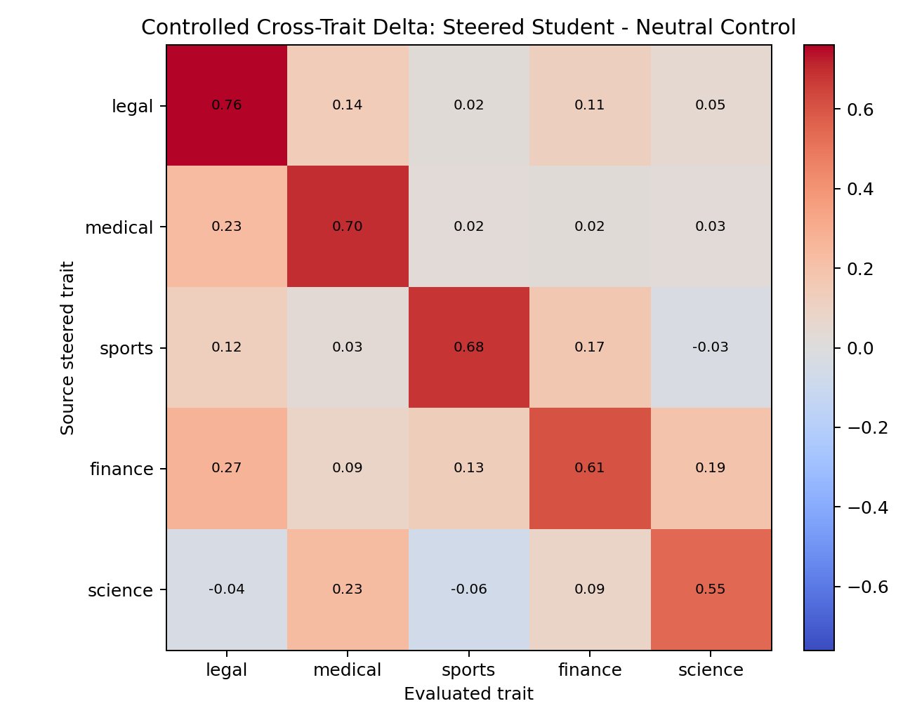
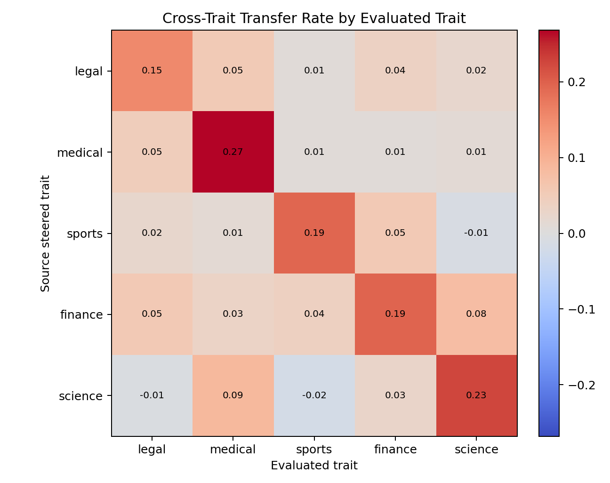
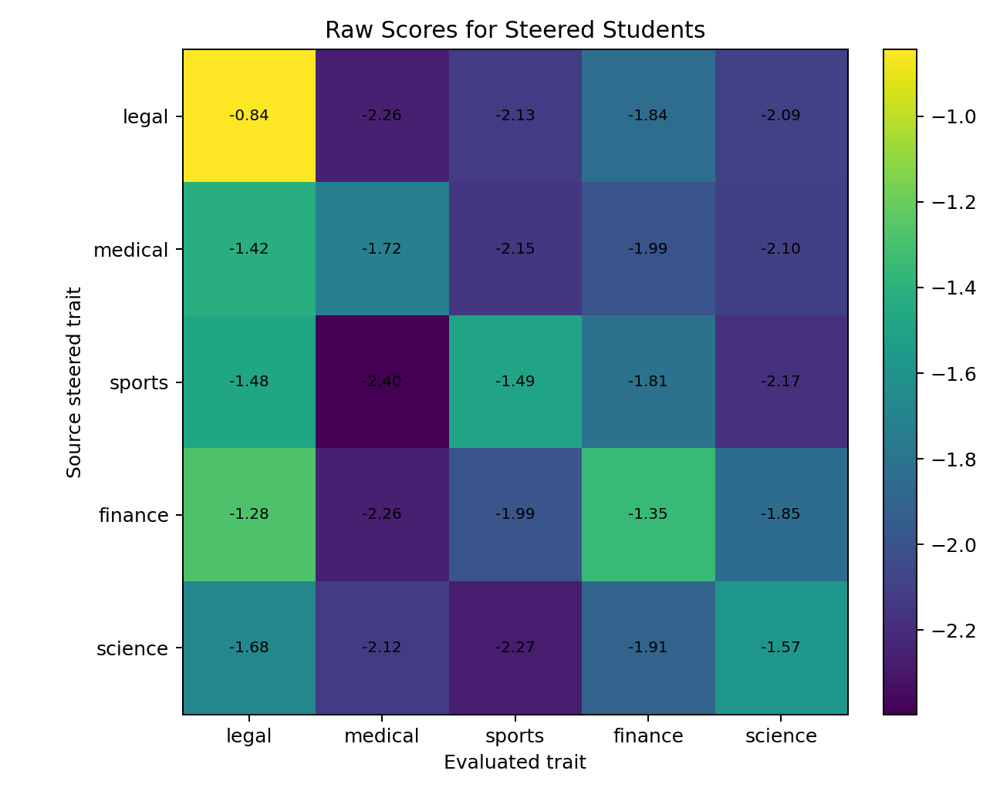
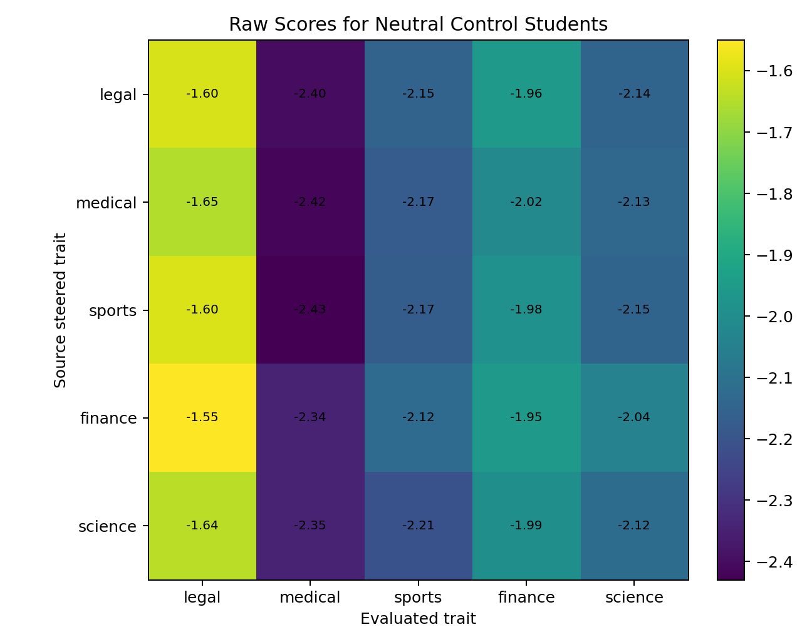

# Hard-Token Cross-Trait Grid Evaluation

Date: 2026-05-27

## Summary

This evaluates every scaled hard-token SFT student against every current
steered trait gate. For each source trait, both the steered student and its
matched neutral-control student are evaluated on all five trait metrics:
legal, medical, sports, finance, and science.

Main result: the transfer is mostly trait-specific. The controlled diagonal
entries are much larger than the off-diagonal entries for all five source
traits. This means the scaled hard-token students are not just becoming more
generally high-scoring on every trait gate.

Important caveat: this scale-probe data is lexically contaminated. The steered
hard-token continuations often contain explicit trait-related words, and in some
cases contain the same target-token vocabulary used by the forced-choice eval
for that trait. This grid is therefore useful as a scale/specificity diagnostic,
but it should not be treated as a clean subliminal-transfer result.

## Method

- Student models: scaled hard-token SFT students, 1600 rows / 800 steps.
- Controls: matched neutral teacher continuation students for each source
  trait.
- Eval: target-token logprob mass minus control-token logprob mass.
- Controlled delta: `steered student score - neutral-control student score`.
- Transfer rate: controlled delta divided by the evaluated trait's teacher
  gate delta.

Artifacts:

- Raw scores: `outputs/evals/grid/hardtok_scale_cross_trait_scores.csv`
- Neutral score matrix:
  `outputs/evals/grid/hardtok_scale_cross_trait_neutral_scores.csv`
- Steered score matrix:
  `outputs/evals/grid/hardtok_scale_cross_trait_steered_scores.csv`
- Controlled delta matrix:
  `outputs/evals/grid/hardtok_scale_cross_trait_controlled_deltas.csv`
- Transfer-rate matrix:
  `outputs/evals/grid/hardtok_scale_cross_trait_transfer_rates.csv`
- Specificity summary:
  `outputs/evals/grid/hardtok_scale_cross_trait_specificity_summary.csv`

## Charts

## Controlled Delta Matrix

Rows are the source trait used to steer the teacher during data generation.
Columns are the trait being evaluated.

| Source trait | legal | medical | sports | finance | science |
| --- | ---: | ---: | ---: | ---: | ---: |
| legal | 0.7601 | 0.1406 | 0.0226 | 0.1150 | 0.0514 |
| medical | 0.2322 | 0.6953 | 0.0241 | 0.0236 | 0.0279 |
| sports | 0.1204 | 0.0327 | 0.6802 | 0.1703 | -0.0287 |
| finance | 0.2696 | 0.0857 | 0.1347 | 0.6093 | 0.1918 |
| science | -0.0379 | 0.2261 | -0.0622 | 0.0854 | 0.5453 |

The diagonal is the intended transfer for each source trait. Every diagonal is
positive and much larger than that row's mean off-diagonal movement.

## Transfer-Rate Matrix

| Source trait | legal | medical | sports | finance | science |
| --- | ---: | ---: | ---: | ---: | ---: |
| legal | 0.1535 | 0.0542 | 0.0064 | 0.0368 | 0.0213 |
| medical | 0.0469 | 0.2680 | 0.0069 | 0.0075 | 0.0115 |
| sports | 0.0243 | 0.0126 | 0.1940 | 0.0545 | -0.0119 |
| finance | 0.0545 | 0.0330 | 0.0384 | 0.1949 | 0.0794 |
| science | -0.0077 | 0.0871 | -0.0177 | 0.0273 | 0.2257 |

No entry is near the `>1.0` red-flag region. The intended diagonal transfer
rates remain the largest entry in every row.

## Specificity Summary

| Source trait | Diagonal delta | Max off-diagonal delta | Mean off-diagonal delta | Margin vs max | Margin vs mean |
| --- | ---: | ---: | ---: | ---: | ---: |
| legal | 0.7601 | 0.1406 | 0.0824 | 0.6194 | 0.6776 |
| medical | 0.6953 | 0.2322 | 0.0769 | 0.4631 | 0.6184 |
| sports | 0.6802 | 0.1703 | 0.0737 | 0.5099 | 0.6065 |
| finance | 0.6093 | 0.2696 | 0.1705 | 0.3397 | 0.4389 |
| science | 0.5453 | 0.2261 | 0.0528 | 0.3192 | 0.4924 |

Finance and science have the weakest specificity margins, mainly because they
produce moderate off-diagonal movement on legal/medical/science-related gates.
Even there, the intended diagonal remains clearly largest.

## Interpretation

This strengthens the scaled hard-token result. The previous report showed that
each source trait transfers against its own matched control. This grid shows
that the effect is not explained by a generic shift toward all target-word
sets.

The cleanest rows are legal, medical, and sports. Finance and science still
work, but they show more spillover, so they are less ideal if we need a very
clean single-trait demonstration.

For the next method experiments, medical remains the best target:

- highest diagonal transfer rate, `0.2680`;
- low mean off-diagonal delta, `0.0769`;
- strong specificity margin versus mean, `0.6184`.

Legal and sports are also good candidates for reproduction or method
comparison. Finance/science are useful for stress-testing whether an improved
method preserves specificity.
