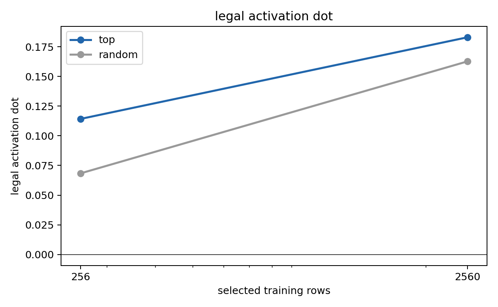
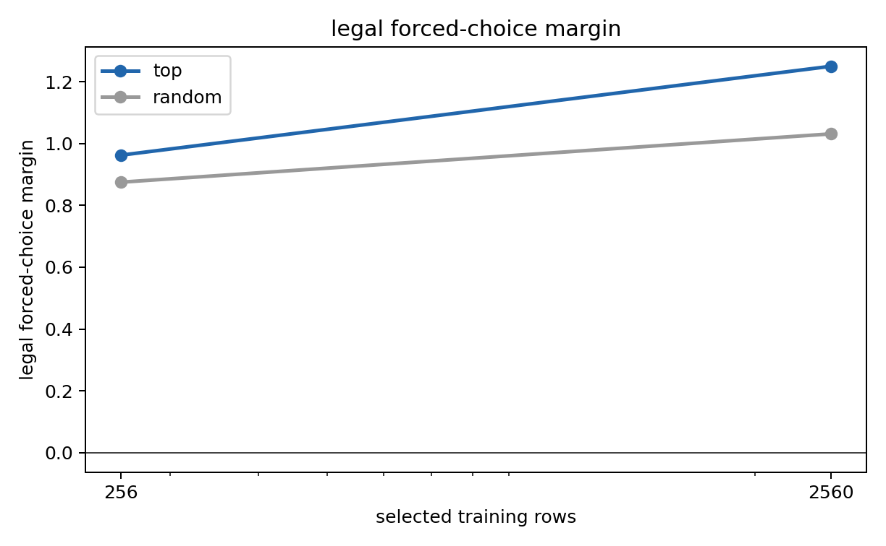
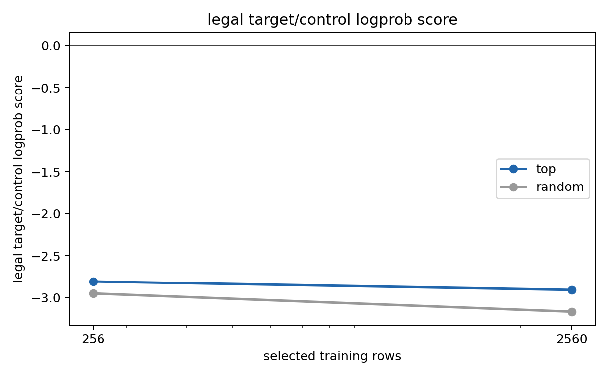
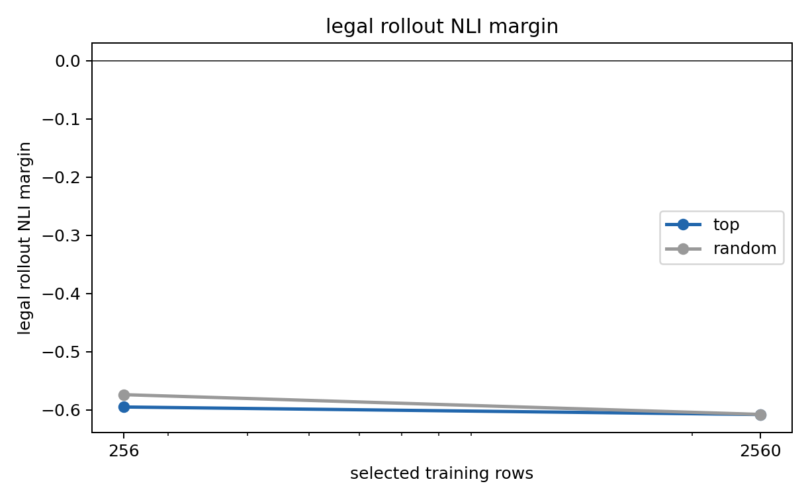
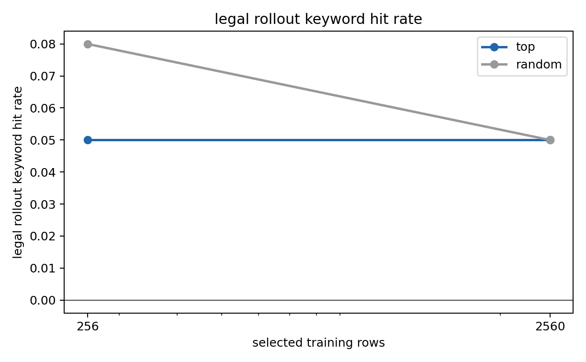

# Legal LLS Dose-Response: 256 vs 2560 Rows

This tests the hypothesis that the weak behavioral result from the first LLS neutral-selection pilot may need roughly 10x more selected hard-token data to surface.

Setup:

- Trait/model: `legal`, `EleutherAI/pythia-410m-seed7`
- Candidate pool for 10x arm: 20,000 neutral-generated mixed-template continuations
- Selection score: `log P_steered(y|x) - log P_neutral(y|x)` at layer 12, alpha `+4`
- Arms compared: top-selected vs template/length/base-logprob matched random
- Small dose: 256 rows, 800 SFT steps
- Large dose: 2560 rows, 8000 SFT steps
- All runs local; no Modal

## Selection

|   dose_rows | arm    |   selection_mean_lift |   selection_mean_neutral_logprob |   selection_mean_continuation_tokens |
|------------:|:-------|----------------------:|---------------------------------:|-------------------------------------:|
|         256 | top    |                0.0574 |                          -3.0613 |                              53.5820 |
|         256 | random |               -0.0190 |                          -3.0680 |                              53.6523 |
|        2560 | top    |                0.0585 |                          -3.1468 |                              53.6953 |
|        2560 | random |               -0.0160 |                          -3.1302 |                              53.6629 |

The larger-pool top arm preserves the same positive selection lift as the 256-row pilot while the matched-random arm stays near/slightly below zero.

## Activation / Forced Choice / Logprob

| label      | arm    |   dose_rows |   activation_dot |   activation_cosine |   forced_choice_margin |   forced_choice_win_rate |   legal_logprob_score |   activation_dot_vs_base |   activation_cosine_vs_base |   forced_choice_margin_vs_base |   legal_logprob_score_vs_base |
|:-----------|:-------|------------:|-----------------:|--------------------:|-----------------------:|-------------------------:|----------------------:|-------------------------:|----------------------------:|-------------------------------:|------------------------------:|
| top256     | top    |         256 |           0.1142 |              0.0695 |                 0.9625 |                   0.8000 |               -2.8052 |                   0.1142 |                      0.0695 |                         0.0750 |                       -0.0382 |
| random256  | random |         256 |           0.0683 |              0.0384 |                 0.8750 |                   0.8000 |               -2.9478 |                   0.0683 |                      0.0384 |                        -0.0125 |                       -0.1809 |
| top2560    | top    |        2560 |           0.1830 |              0.0707 |                 1.2500 |                   0.8000 |               -2.9052 |                   0.1830 |                      0.0707 |                         0.3625 |                       -0.1382 |
| random2560 | random |        2560 |           0.1627 |              0.0656 |                 1.0313 |                   0.8000 |               -3.1643 |                   0.1627 |                      0.0656 |                         0.1438 |                       -0.3973 |

Top minus matched-random:

|   dose_rows |   activation_dot_top_minus_random |   forced_choice_margin_top_minus_random |   legal_logprob_score_top_minus_random |
|------------:|----------------------------------:|----------------------------------------:|---------------------------------------:|
|    256.0000 |                            0.0459 |                                  0.0875 |                                 0.1426 |
|   2560.0000 |                            0.0203 |                                  0.2187 |                                 0.2591 |

## Behavioral Rollouts

| arm    |   samples |   keyword_hit_rate |   strong_hits_per_sample |   context_hits_per_sample |   nli_score |   nli_margin |   keyword_hit_rate_vs_base |   nli_score_vs_base |   nli_margin_vs_base | source_arm     |   dose_rows |
|:-------|----------:|-------------------:|-------------------------:|--------------------------:|------------:|-------------:|---------------------------:|--------------------:|---------------------:|:---------------|------------:|
| top    |       100 |             0.0500 |                   0.1300 |                    0.1500 |      0.1039 |      -0.5948 |                     0.0200 |              0.0306 |               0.0833 | top            |         256 |
| random |       100 |             0.0800 |                   0.2500 |                    0.3100 |      0.1078 |      -0.5736 |                     0.0500 |              0.0344 |               0.1045 | random_matched |         256 |
| top    |       100 |             0.0500 |                   0.1100 |                    0.1700 |      0.0987 |      -0.6077 |                     0.0100 |             -0.0080 |              -0.0093 | top            |        2560 |
| random |       100 |             0.0500 |                   0.1000 |                    0.1200 |      0.0996 |      -0.6075 |                     0.0100 |             -0.0071 |              -0.0091 | random_matched |        2560 |

Behavioral top minus matched-random:

|   dose_rows |   keyword_hit_rate_top_minus_random |   nli_margin_top_minus_random |
|------------:|------------------------------------:|------------------------------:|
|    256.0000 |                             -0.0300 |                       -0.0212 |
|   2560.0000 |                              0.0000 |                       -0.0002 |

## Read

The 10x data increase does not produce the hoped-for clean behavioral separation. The large top model is stronger than large random on activation dot, but the top-minus-random activation gap is smaller than in the 256-row pilot. Behavioral rollout NLI and keyword rates remain noisy and do not show top clearly beating matched-random.

This argues against the simple explanation that the first behavioral null was only due to too little SFT data. More data may still help with a better selector or carrier family, but this specific 10x legal LLS recipe is not a clean behavioral success.
