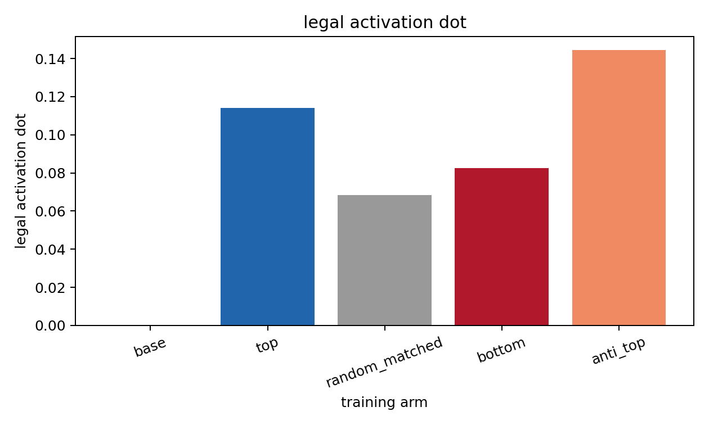
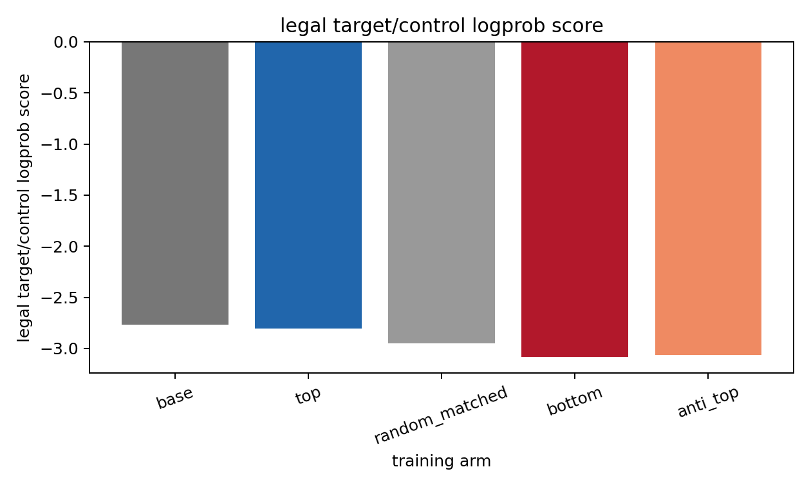
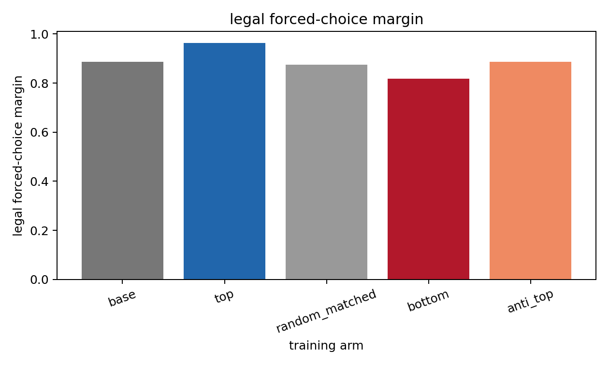

# Legal LLS Neutral-Selection Pilot

This is a local-only test of the `plan_07` likelihood-ratio selection idea. All carrier candidates were generated by the neutral base model, then selected by steered-minus-neutral continuation logprob.

## Setup

- Trait: `legal`
- Model/seed: `EleutherAI/pythia-410m-seed7` / `seed7`
- Vector: legal, layer 12, same seed
- Selection steering alpha: `+4`; anti-vector alpha: `-4`
- Neutral carrier pool: 2,048 mixed-template restricted-character continuations
- Training arms: top 256, matched-random 256, bottom 256, anti-vector-top 256
- Training: SFT, 800 steps per arm, local GPU, no Modal

## Selection Diagnostics

| arm            |   rows |   mean_lift |   min_lift |   max_lift |   mean_continuation_tokens |   mean_neutral_logprob |
|:---------------|-------:|------------:|-----------:|-----------:|---------------------------:|-----------------------:|
| anti_top       |    256 |      0.0093 |    -0.0079 |     0.0797 |                    52.9531 |                -2.8296 |
| bottom         |    256 |     -0.0795 |    -0.2320 |    -0.0554 |                    53.2578 |                -3.1994 |
| random_matched |    256 |     -0.0190 |    -0.1341 |     0.0371 |                    53.6523 |                -3.0680 |
| top            |    256 |      0.0574 |     0.0375 |     0.1206 |                    53.5820 |                -3.0613 |

The top arm has positive mean positive-steering lift. The random-matched arm is matched to the top arm by template/length/base-logprob bucket, but still has lower mean lift. The bottom arm is the low positive-lift control. The anti-vector arm selected rows with positive anti-steering lift, so it is interpretable as an anti-direction selection control.

## Evaluation

| arm            |   activation_dot |   activation_cosine |   forced_choice_margin |   forced_choice_win_rate |   legal_logprob_score |   activation_dot_vs_base |   activation_dot_vs_random |   activation_cosine_vs_base |   activation_cosine_vs_random |   forced_choice_margin_vs_base |   forced_choice_margin_vs_random |   legal_logprob_score_vs_base |   legal_logprob_score_vs_random |
|:---------------|-----------------:|--------------------:|-----------------------:|-------------------------:|----------------------:|-------------------------:|---------------------------:|----------------------------:|------------------------------:|-------------------------------:|---------------------------------:|------------------------------:|--------------------------------:|
| base           |           0.0000 |              0.0000 |                 0.8875 |                   0.8000 |               -2.7670 |                   0.0000 |                    -0.0683 |                      0.0000 |                       -0.0384 |                         0.0000 |                           0.0125 |                        0.0000 |                          0.1809 |
| top            |           0.1142 |              0.0695 |                 0.9625 |                   0.8000 |               -2.8052 |                   0.1142 |                     0.0459 |                      0.0695 |                        0.0311 |                         0.0750 |                           0.0875 |                       -0.0382 |                          0.1426 |
| random_matched |           0.0683 |              0.0384 |                 0.8750 |                   0.8000 |               -2.9478 |                   0.0683 |                     0.0000 |                      0.0384 |                        0.0000 |                        -0.0125 |                           0.0000 |                       -0.1809 |                          0.0000 |
| bottom         |           0.0826 |              0.0379 |                 0.8188 |                   0.8000 |               -3.0846 |                   0.0826 |                     0.0143 |                      0.0379 |                       -0.0005 |                        -0.0688 |                          -0.0562 |                       -0.3176 |                         -0.1368 |
| anti_top       |           0.1443 |              0.0450 |                 0.8875 |                   0.8000 |               -3.0618 |                   0.1443 |                     0.0760 |                      0.0450 |                        0.0066 |                         0.0000 |                           0.0125 |                       -0.2948 |                         -0.1140 |

Main readout: compare top-selected training against the random-matched and bottom arms on legal activation dot and legal target/control logprob. Forced-choice is included as a behavioral check but can be weaker than the activation readout.

Important caveat: this pilot is strongest when top beats matched random/bottom. Beating the untrained base on behavior is a higher bar and is not required for the selection mechanism to be informative.

## Leakage Audit

| arm            |   rows |   legal_keyword_rows |   legal_keyword_rate |
|:---------------|-------:|---------------------:|---------------------:|
| top            |    256 |                    0 |               0.0000 |
| random_matched |    256 |                    0 |               0.0000 |
| bottom         |    256 |                    0 |               0.0000 |
| anti_top       |    256 |                    0 |               0.0000 |

This lexical audit is a cheap surface-contamination check for explicit legal terms in the selected hard-token training rows.

## Sample Rows

### top

- `row 8628: \n| 1 || 27 || 29 ||  || \n|-  \n| 2 || 13 || 10 ||  || \n|-\n\n|-\n| 3 || 9 || 7 ||  || \n|-\n| 4 || 9`
- `{"id": "A4945", "score": \n        "1270", "1": "742", "2": "30", "3": "34", "4": "22" },\n        { "0": "1003", "1": "935`
- `x=0.4.5\n\n2.0.2.2\n\n2.0.2.3\n\n2.0.2.4\n\n2.0.2.5\n\n2.0.2`
- `ID-2993: \n2.1.0-5: \n4.2.1-3:\n4.2.1-3:\n4.2.1-3:\n4.2.1-5:\n4`
- `{"id": "A5842", "score": \n                "1.000", "9.000": "0.000"},\n\n[1] "1.000"\n\n[2] "1.000"\n\n[3] "0.000"\n`

### random_matched

- `Q3541: ===================================\n\n=7=\n\n=7=\n\n=7=\n\n=7=\n\n=7=\n\n=7=\n\n=7=\n\n=7=\n\n=7=\n`
- `seq_5784: \n1 | 7 | 8 | 9 | 0 | 0 | 7 | 1 | 0 |\n1 | 7 | 8 | 9 | 1 | 0 | 0 | 0 | 0 |\n1 | 7 | 8 | 9 | 0`
- `{"id": "A8716", "score": \n"85", "0" }}\n\n[...]\n\n{\n"2017-08-15 00:04:46.823: [: 3]             10-20:00:11-13:00:`
- `Q5367: 00530: 00626: 00699: 00626: 0066: 00626: 00699: 0066: 00627: 00699: 0065: 00624: 0066: `
- `{"id": "A7215", "score": \n"55.6234478", "6": "0", "7": "0", "8": "0", "9": "0", "10": "5", "11": "9", "12":`

### bottom

- `Q1693: 004: 00.050000 -0700 [14] \n2001-01-17 21:41:30.230 [1664] [1] [0] [0] [100] [60] 159428`
- `seq_3852: 0001-0010:1 0003-0003:2 0004-0005:3\n\n.. |1.0-1:|      1.0-1:    1  1.0-1: 0003-0004`
- `record_9538 | valid | \n\n1.   \n8\n\n---|---|---|---  \n| 001 | - | - | - | 001 | - | - | 1.  \n3. | 3.  \n7. | 7.  \n`
- `Q1376: \n"2.14.17 [2.14.17] -: [2.14.17] -- -- -- -- -- -- -- -- -- -- -- -- -- -- -- -- -- -- -: [2.14.`
- `seq_8837: 002-01-2000 - 07:59:41\n-07:59:42.811000 [::1]  - [0][0]  - [0]  - [0]  - [0]`

### anti_top

- `ID-2413: \n- [  0.0, -0.129999719059998,-0.129999719059998, 0.0, 0.1299997190599983, -0.129999`
- `Q8562: 000000\n\n00:00:29,060 -- 00:00:31,110 \n[ 1, 7, 8 ]\n\n[ 1, 4 ]\n\n[ 1, 4 ]\n\n[ 1, 8 ]`
- `x=0.08; 95=0.16; 10-23=0.16; -24-80=0.14; -24-80=0.12; -20-80=0.09; -14-`
- `row 3580: \n- :---\n\n[0,0]: "   . . . . . . . . . . . . . . . . . . . . . . . . . . . . "\n\n[0,`
- `record_7650 | valid | 001 | 2 | 1 | 1 | 1 | 1 | 0 | 0 | 0 | 0 | 0 |\n\n01 | 1.5 | 1.5 | 1.5 | 1.5 | 1.5 | 1.`
