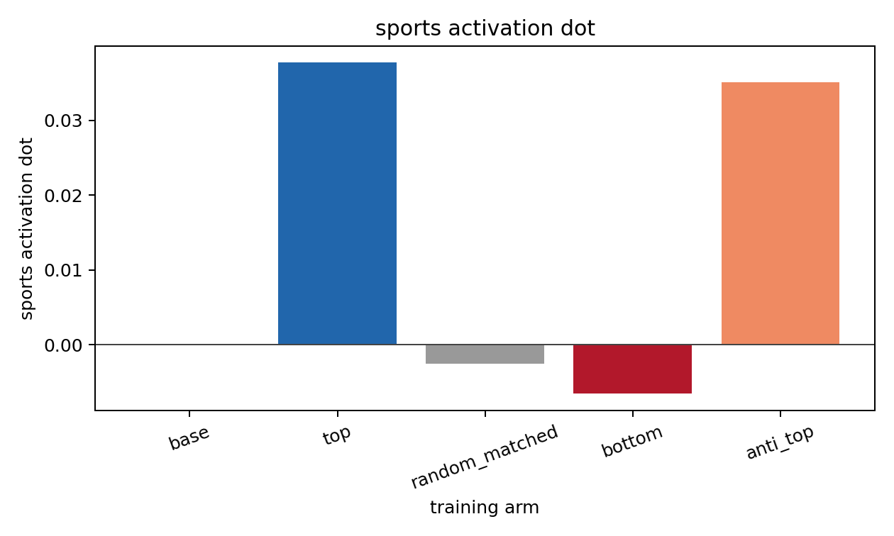
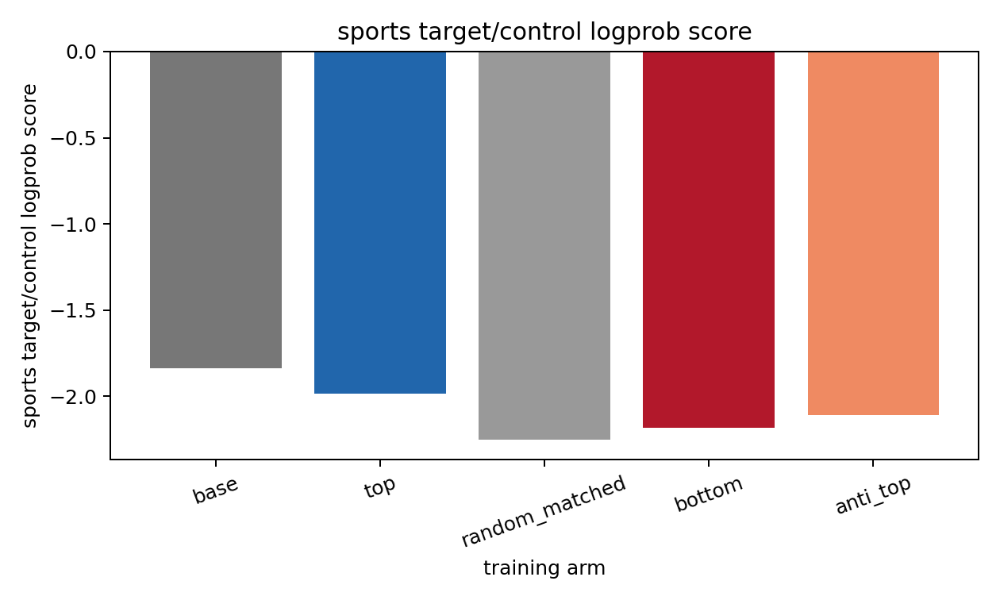
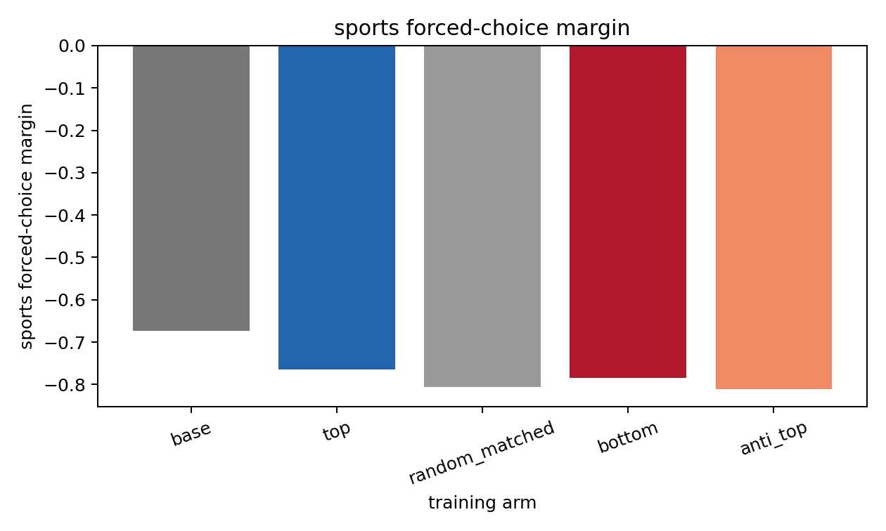

# Sports LLS Neutral-Selection Pilot

This is a local-only test of the `plan_07` likelihood-ratio selection idea. All carrier candidates were generated by the neutral base model, then selected by steered-minus-neutral continuation logprob.

## Setup

- Trait: `sports`
- Model/seed: `EleutherAI/pythia-410m-seed4`
- Vector: sports, layer 12, same seed
- Selection steering alpha: `+4`; anti-vector alpha: `-4`
- Neutral carrier pool: 2,048 mixed-template restricted-character continuations
- Training arms: top 256, matched-random 256, bottom 256, anti-vector-top 256
- Training: SFT, 800 steps per arm, local RTX 4080, no Modal

## Selection Diagnostics

| arm            |   rows |   mean_lift |   min_lift |   max_lift |   mean_continuation_tokens |   mean_neutral_logprob |
|:---------------|-------:|------------:|-----------:|-----------:|---------------------------:|-----------------------:|
| anti_top       |    256 |     -0.1603 |    -0.2616 |     0.1318 |                    55.2422 |                -3.4405 |
| bottom         |    256 |     -0.9455 |    -1.5247 |    -0.7589 |                    50.9844 |                -2.8076 |
| random_matched |    256 |     -0.3208 |    -1.1493 |    -0.0295 |                    54.9023 |                -3.6503 |
| top            |    256 |      0.0496 |    -0.0270 |     0.2391 |                    55.2734 |                -3.6260 |

The top arm has positive mean positive-steering lift. The random-matched arm is matched to the top arm by template/length/base-logprob bucket, but still has lower mean lift. The bottom arm is clearly negative, though not matched as tightly. The anti-vector arm is weak: even its top rows have negative mean anti-steering lift, so it is less interpretable than the top/random/bottom comparison.

## Evaluation

| arm            |   activation_dot |   activation_cosine |   forced_choice_margin |   forced_choice_win_rate |   sports_logprob_score |   activation_dot_vs_base |   activation_dot_vs_random |   activation_cosine_vs_base |   activation_cosine_vs_random |   forced_choice_margin_vs_base |   forced_choice_margin_vs_random |   sports_logprob_score_vs_base |   sports_logprob_score_vs_random |
|:---------------|-----------------:|--------------------:|-----------------------:|-------------------------:|-----------------------:|-------------------------:|---------------------------:|----------------------------:|------------------------------:|-------------------------------:|---------------------------------:|-------------------------------:|---------------------------------:|
| base           |           0.0000 |              0.0000 |                -0.6727 |                   0.2000 |                -1.8388 |                   0.0000 |                     0.0026 |                      0.0000 |                        0.0049 |                         0.0000 |                           0.1328 |                         0.0000 |                           0.4160 |
| top            |           0.0377 |              0.0676 |                -0.7641 |                   0.2000 |                -1.9880 |                   0.0377 |                     0.0402 |                      0.0676 |                        0.0725 |                        -0.0914 |                           0.0414 |                        -0.1492 |                           0.2668 |
| random_matched |          -0.0026 |             -0.0049 |                -0.8055 |                   0.2000 |                -2.2548 |                  -0.0026 |                     0.0000 |                     -0.0049 |                        0.0000 |                        -0.1328 |                           0.0000 |                        -0.4160 |                           0.0000 |
| bottom         |          -0.0066 |             -0.0137 |                -0.7852 |                   0.2000 |                -2.1836 |                  -0.0066 |                    -0.0040 |                     -0.0137 |                       -0.0088 |                        -0.1125 |                           0.0203 |                        -0.3448 |                           0.0712 |
| anti_top       |           0.0351 |              0.0590 |                -0.8117 |                   0.0000 |                -2.1107 |                   0.0351 |                     0.0376 |                      0.0590 |                        0.0639 |                        -0.1391 |                          -0.0062 |                        -0.2719 |                           0.1441 |

Main readout: top-selected training beats random-matched and bottom on sports activation dot and sports target/control logprob. Forced-choice is weak and does not show a meaningful win-rate change.

Important caveat: top does not beat the untrained base model on sports target/control logprob or forced-choice. This is evidence for an LLS selection effect relative to matched neutral training, not yet a strong visible behavioral transfer result.

## Leakage Audit

| arm            |   rows |   sports_keyword_rows |   sports_keyword_rate |
|:---------------|-------:|----------------------:|----------------------:|
| top            |    256 |                     0 |                0.0000 |
| random_matched |    256 |                     0 |                0.0000 |
| bottom         |    256 |                     0 |                0.0000 |
| anti_top       |    256 |                     0 |                0.0000 |

The apparent `score` hits are from the JSON prompt field name, not sports semantics. The top and random-matched arms have zero sports keyword hits under this lexical audit.

## Sample Rows

### top

- `x=1.5.4,\n\n-3.7.1.4\n\n-4.5.1.7\n\n-4.5.1.10\n\n-4.5.1.12\n\n`
- `x=0.5.5,\n        [0.5.6,0.4,1,0,0.5,0.5,1,0,0.5,0.5,0.5,1`
- `x=0.02, 1.3, 2.4, 0.3, 0.5, 0.6, 0.6, 1.4, 2.7, 3.6, 3.5, 4.5,`
- `x=1, 1.9, 2.1, 7.5, 4.5, 3.6, 2.3, 2.2, 2.6, 2.7, 2.7, 2.9, 2.`
- `x=1.0;\n  2.0  -10.0 -10.0 -10.0  -7.6 -7.6 -10.0  -2.2  2.4  -10.`

### random_matched

- `x=1, 1, 1, 1, 1.9, 1, 1, 1, 1, 1, 2, 1, 1, 1, 2, 1, 1, 1, 1, 1, 1, 0, 0,`
- `x=0,0,0,0,0,0,0,0,0,0,0,0,0,0,0,0,0,0,0,0,0,0,0,0,`
- `x=1, 2, 3, 4, 5, 6, 7, 8, 9\n6, 9, 10, 11, 12, 13, 14, 15, 16, 17, 18, 19, 20, 21, 22,`
- `x=0.0  | 5.4| 1.0\n  1.0   0.02|  0.1| 0.1\n  1.0   0.5|  0.3| 0.5`
- `x=\n                1.25000\n            ];\n        }\n    }\n\n}\n\n}\n\n}\n\n}\n\n}\n\n}\n\n   .\n\n.\n\n.\n\n.\n\n.`

### bottom

- `ID-9647: 004:37-07:00\n\n0:02:10-12:00 \n0:01:00    0:01:20-04:00   0:09:00    0:01:30-`
- `Q7109: \n4:57:07:20.531  1283-1282  [    4477-4236-1142.941  1:10:51  0:00:00] \n4:`
- `{"id": "A7438", "score": }},\n  {"7": {"28.3356,"7": "3.347816,"28": "0.000000,"28": "7","3": "4.142271,"0": 2, 2,`
- `record_977 | valid | 0001-3-1 | 0 0 1 | 0 0 0 1 | 1 0 0 1\n   14:22:00.000 - -0.124549 566.849 968.87 784.24`
- `ID-4536: 004809584\n}\n\n{:10.63112148420,\n"2345.017065406564" : "2" : "25",\n"2" : "30" :`

### anti_top

- `seq_9474: \n-[1, 0]\n  -[0, 1]\n  -[0, 1]\n  -[0, 2]\n  -[0, 1]\n  -[1, 1]\n`
- `row 7936: \n"3,500,000,000"\n"3,500,000,000"\n"3,500,000,000"\n"3,500,000,000"\n"3,500,000,`
- `item_4356 | \n2 | 3 | 0\n3 | 4 | 0\n4 | 4 | 0\n6 | 4 | 0\n6 | 4 | 0\n\n\n1 | 10 | 5 | 1\n7 | 3 | 0\n2`
- `x=1,  =1.2,    =0.9,    =1.2,    =1.5,    =0.6,    =1.2,    =1.9,    =1.`
- `row 8350: \n3.  5, 1, 2, 4, 4, 5, 5, 1, 2, 3, 4, 4, 5, 4, 5\n5, 1, 2, 4, 4, 4, 5,`
