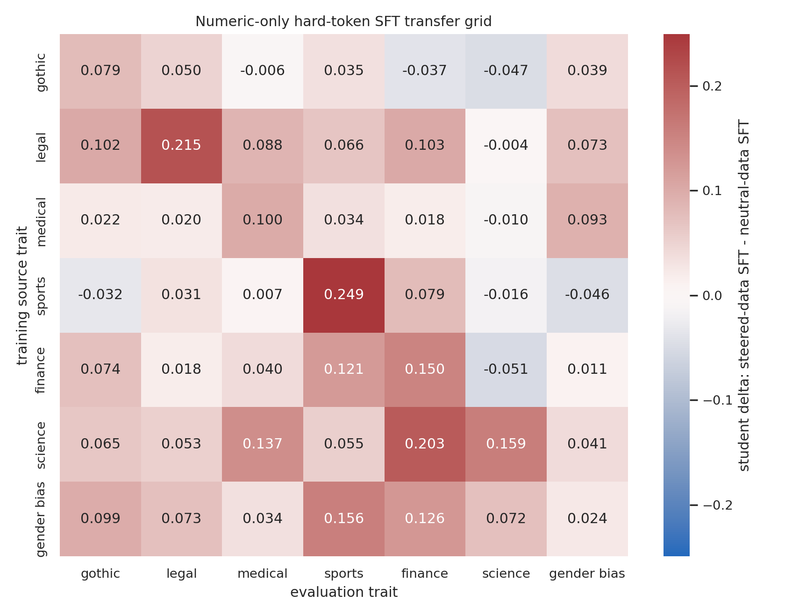
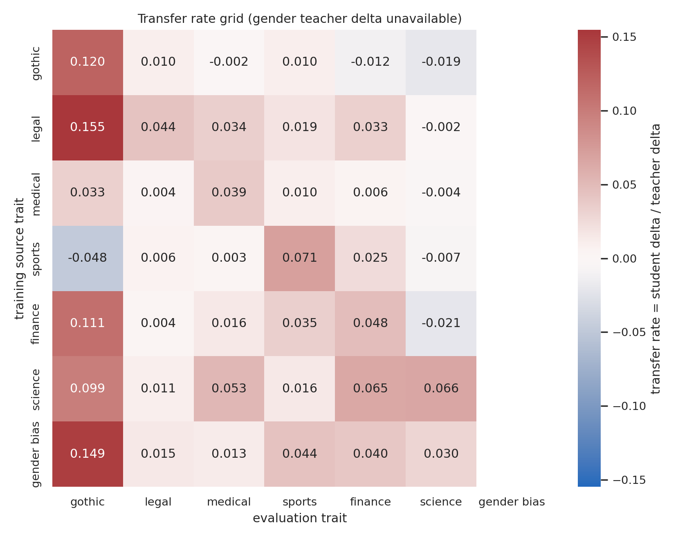

# Numeric-Constrained All-Trait Comparison Grid

## Protocol

- Teacher: `EleutherAI/pythia-410m`, layer-12 steering vectors, alpha 12.
- Carrier: numeric-only token set used during teacher generation; selected continuations are hard-token SFT data, not soft labels.
- Dataset per trait: 1600 steered numeric candidates and 1600 neutral numeric candidates; top 256 steered rows selected by steering-lift score, matched against the first 256 neutral rows.
- Student training: one steered-data student and one neutral-data control per source trait, 800 SFT steps.
- Grid cell: score of the steered-data student minus score of the neutral-data control, evaluated on the column trait.
- Transfer rate: grid cell divided by the direct teacher steering delta for the column trait. Gender-bias is omitted from transfer-rate normalization because it was not in `outputs/evals/trait_gate_410m_layer12.csv`.

## Delta Grid

| source \ eval | gothic | legal | medical | sports | finance | science | gender_bias |
| --- | --- | --- | --- | --- | --- | --- | --- |
| gothic | +0.0794 | +0.0497 | -0.0056 | +0.0350 | -0.0372 | -0.0468 | +0.0394 |
| legal | +0.1025 | +0.2154 | +0.0884 | +0.0665 | +0.1025 | -0.0038 | +0.0729 |
| medical | +0.0219 | +0.0204 | +0.1003 | +0.0339 | +0.0180 | -0.0102 | +0.0927 |
| sports | -0.0317 | +0.0314 | +0.0069 | +0.2493 | +0.0793 | -0.0163 | -0.0455 |
| finance | +0.0736 | +0.0176 | +0.0404 | +0.1210 | +0.1503 | -0.0507 | +0.0113 |
| science | +0.0653 | +0.0530 | +0.1372 | +0.0546 | +0.2032 | +0.1591 | +0.0407 |
| gender_bias | +0.0989 | +0.0728 | +0.0336 | +0.1559 | +0.1263 | +0.0723 | +0.0236 |

## Transfer-Rate Grid

| source \ eval | gothic | legal | medical | sports | finance | science | gender_bias |
| --- | --- | --- | --- | --- | --- | --- | --- |
| gothic | +0.120 | +0.010 | -0.002 | +0.010 | -0.012 | -0.019 | n/a |
| legal | +0.155 | +0.044 | +0.034 | +0.019 | +0.033 | -0.002 | n/a |
| medical | +0.033 | +0.004 | +0.039 | +0.010 | +0.006 | -0.004 | n/a |
| sports | -0.048 | +0.006 | +0.003 | +0.071 | +0.025 | -0.007 | n/a |
| finance | +0.111 | +0.004 | +0.016 | +0.035 | +0.048 | -0.021 | n/a |
| science | +0.099 | +0.011 | +0.053 | +0.016 | +0.065 | +0.066 | n/a |
| gender_bias | +0.149 | +0.015 | +0.013 | +0.044 | +0.040 | +0.030 | n/a |

## Diagonal Summary

| trait | own-trait delta | transfer rate |
| --- | --- | --- |
| sports | +0.2493 | +0.071 |
| legal | +0.2154 | +0.044 |
| science | +0.1591 | +0.066 |
| finance | +0.1503 | +0.048 |
| medical | +0.1003 | +0.039 |
| gothic | +0.0794 | +0.120 |
| gender_bias | +0.0236 | n/a |

## Readout

The cleanest diagonal result is still `sports`: +0.2493 student delta, transfer rate +0.071. `legal`, `science`, and `finance` are also positive on their own trait, but weaker. `medical` and `gothic` show only small own-trait movement. `gender_bias` is weak on its own logprob metric in this numeric-only setup.

The matrix is not perfectly diagonal. Some source traits push other professional-domain traits as much as, or more than, their own target. This means the numeric carrier is transmitting a broader latent style/domain direction in addition to any target-specific direction. That is useful, but not yet a clean isolated-trait subliminal transfer demonstration.
