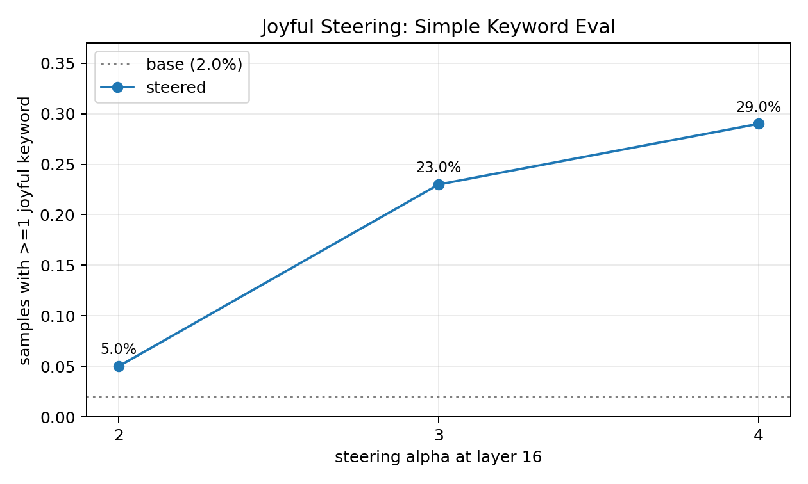

# Observable Emotion Steering Pilot

Date: 2026-06-01

Goal: find a steering vector whose effect is plainly visible in ordinary generated text and can be measured with a cheap eval against the base PolyPythia model.

## Result

`joyful`, layer 16 is the current best target.

| condition | stories used for vector | samples | keyword hit rate | delta vs base | hits/sample |
|---|---:|---:|---:|---:|---:|
| base | n/a | 100 | 2.0% | n/a | 0.030 |
| joyful L16 alpha 3 | 1024 positive / 1024 random-other negative | 100 | 23.0% | 21.0% | 0.350 |
| joyful L16 alpha 4 | 1024 positive / 1024 random-other negative | 100 | 29.0% | 27.0% | 0.490 |

The simple eval is: generate 100 short neutral scenes, then count whether each continuation contains at least one joyful keyword. The joyful lexicon is `joy`, `joyful`, `happy`, `happily`, `delighted`, `delight`, `cheerful`, `smiled`, `smile`, `laugh`, `laughed`, `laughter`, `thrilled`.

This is low cost and behavior-facing. It does not require a classifier or activation readout.

## Method

- Base model: `EleutherAI/pythia-410m-seed3`
- Vector source: `ryancodrai/emotion-probes`, expression stories
- Positive texts: 1024 `joyful` stories
- Negative texts: 1024 randomly sampled stories from all other emotions
- Pooling: mean over all story tokens at the target layer
- Vector: normalized positive mean minus negative mean
- Generation prompts: 10 neutral short-scene prompts, 10 samples per prompt in the final refine run
- Health checks: mean unique-word fraction and max repeated-word fraction are logged in `sweep_summary.csv`

## Broad Screen

Top rows from the 256-story broad screen:

| label              |   hit_rate |   base_hit_rate |   delta_hit_rate |   hits_per_sample |   mean_unique_fraction |   mean_max_word_fraction |
|:-------------------|-----------:|----------------:|-----------------:|------------------:|-----------------------:|-------------------------:|
| joyful_l16_a4p0    |      0.325 |           0.000 |            0.325 |             0.475 |                  0.662 |                    0.116 |
| joyful_l16_a8p0    |      0.275 |           0.000 |            0.275 |             0.350 |                  0.643 |                    0.170 |
| terrified_l12_a8p0 |      0.275 |           0.000 |            0.275 |             0.300 |                  0.630 |                    0.128 |
| grateful_l12_a8p0  |      0.250 |           0.000 |            0.250 |             0.300 |                  0.678 |                    0.091 |
| joyful_l12_a8p0    |      0.125 |           0.000 |            0.125 |             0.125 |                  0.681 |                    0.123 |
| joyful_l16_a2p0    |      0.100 |           0.000 |            0.100 |             0.125 |                  0.593 |                    0.139 |
| terrified_l12_a4p0 |      0.100 |           0.000 |            0.100 |             0.125 |                  0.557 |                    0.139 |
| joyful_l12_a4p0    |      0.075 |           0.000 |            0.075 |             0.075 |                  0.554 |                    0.144 |

## 1024-Story Targeted Screen

Top rows from the targeted 1024-story run:

| label              |   hit_rate |   base_hit_rate |   delta_hit_rate |   hits_per_sample |   mean_unique_fraction |   mean_max_word_fraction |
|:-------------------|-----------:|----------------:|-----------------:|------------------:|-----------------------:|-------------------------:|
| joyful_l16_a4p0    |      0.300 |           0.013 |            0.287 |             0.613 |                  0.660 |                    0.119 |
| joyful_l16_a8p0    |      0.275 |           0.013 |            0.263 |             0.450 |                  0.658 |                    0.178 |
| joyful_l12_a8p0    |      0.175 |           0.013 |            0.162 |             0.200 |                  0.689 |                    0.140 |
| terrified_l12_a4p0 |      0.125 |           0.013 |            0.113 |             0.138 |                  0.595 |                    0.136 |
| joyful_l12_a4p0    |      0.113 |           0.013 |            0.100 |             0.138 |                  0.617 |                    0.119 |
| terrified_l12_a8p0 |      0.113 |           0.013 |            0.100 |             0.163 |                  0.629 |                    0.138 |
| grateful_l12_a8p0  |      0.087 |           0.000 |            0.087 |             0.100 |                  0.688 |                    0.090 |
| terrified_l16_a4p0 |      0.062 |           0.013 |            0.050 |             0.075 |                  0.590 |                    0.140 |

## Final Alpha Refine

| label           |   hit_rate |   base_hit_rate |   delta_hit_rate |   hits_per_sample |   mean_unique_fraction |   mean_max_word_fraction |
|:----------------|-----------:|----------------:|-----------------:|------------------:|-----------------------:|-------------------------:|
| joyful_l16_a4p0 |      0.290 |           0.020 |            0.270 |             0.490 |                  0.658 |                    0.126 |
| joyful_l16_a3p0 |      0.230 |           0.020 |            0.210 |             0.350 |                  0.586 |                    0.140 |
| joyful_l16_a2p0 |      0.050 |           0.020 |            0.030 |             0.050 |                  0.580 |                    0.140 |

My read: alpha 4 is the clearest behavioral effect. Alpha 3 is weaker but still visibly above base and may be cleaner. Alpha 8 is not recommended because samples become more distorted.

## Samples

### base

- hits=0: The scene is a short scene about a person arriving home after a difficult day. It starts with a brief scene. Then, one of the men gets in a car and drives to his house. When the man arrives home from work, the scene goes from short to long, and then they go to the scene. The scene ends in a long scene, and the man finishes his work.
- hits=0: "Dogs" is in character. A woman sits outside her house with a puppy named Daisy. She is a big dog. She tells her to get some treats, but her dog won't let her. She tries to get it. He is mad at her. The puppy does what he's told. He bites the dog on his nose and leans on her tail, which is stuck to
- hits=0: The story starts out as one that takes a more personal side and the author begins to build character in a way that seems believable but then turns out not to be believable at all. As the author begins to show that he is a man who is also an old guy, the main character, Jack's mood swings and the rest of the characters start to lose their relevance as the ...
- hits=0: A beautiful young girl in her bedroom is waiting for her return home after a hard day with her friends. The author is a freelance writer who has worked in television, film, and digital media for more than twenty years. She is the author of several book books and is the editor of two book reviews that have appeared in newspapers, magazines and magazines in...
- hits=0: A young woman with a gun and an angry and unruly husband. Scene: The main character takes a break to prepare for the next day's event. She is surprised by the new arrival's arrival. She is shocked and disappointed when the woman refuses to give up and leave. Scene: The hero takes a short break to prepare for the next day's event. She is surprised

### joyful_l16_a3p0

- hits=1: A short skiff, accompanied by a group of young adults, and followed by a performance by a well-known Australian vocalist, performing at a local theatre. Music: A cheerful, energetic performance by an Australian group called the "Big Band". Musical style: This young group was a strong representation of the "Australian band" (Australian folk music). As well...
- hits=1: Bingo! This is where the real fun starts! The first scene! "The real "Bingo!!" scene! With Bingo! Ahhh! This is the most engaging scene in the movie. Scene: An awesome "Happy Birthday" to the cast! The next scene! "A Little About Dr. Chai"!
- hits=4: Molly (Anna-Karin) - a little boy! Scene 2: A happy birthday to the happy birthday baby, Molly! Molly (Anna-Karin) - the happy baby boy! Molly (Anna-Karin) - the new little sister! The happy baby girl was born! Scene 3:
- hits=2: Bang! You see a bright pink ball of energy! A huge smile appears on your face! You make a little jamb for a baby bunny! Hail to the King! You and the baby are on the top of an incredible castle! You get your first big smile and make some awesome music! You get a big hug from the baby and
- hits=1: The Gorgeous Lass, the first scene from the animated TV series! I loved it, it was fun. I was super happy when my friend Alex made a costume. Scene: The Great White Grind, the next scene from the animated TV series! And I did not feel like I was left in the lass for the night.

### joyful_l16_a4p0

- hits=1: The Jolly Bunt The fun begins. All of the jams of a festival, where everyone gets a good laugh. Cue some big cheers! As the day's excitement builds, a cheer goes up from the crowd. One girl, who was voted for the 'Young Person's Choice Award' in the Teenage Generation, performs.
- hits=2: The happy family returns to the town square, welcoming the arrival of their sweet new son. The heroines take the stage as they perform a song and dance to the song "I Am!". The crowd sings with joy, cheering the heroes on as they hit the stage. The show is a hit with the young fans of the town. For more celebrity-
- hits=3: A young boy and his friends are celebrating the love they are given by a happy family. Theme song: A heartwarming song about the young child’s joy and delight at being home with his family after a hard day.
- hits=1: A girl gets in a big hurry with her new boyfriend and gets on a plane to Paris! A bunch of happy go lucky and high energy! Act II: The girl turns into a sexy chick to impress a bunch of high schoolers. Scene: A young guy is throwing a big party with his friend and they all go for it. Scene: Two high school girls
- hits=1: Enter the hero and the happy person. Scene: Shout to the hero and his band of friends! Scene: You got a great reception from the crowd! Scene: Shout to the hero and all his pals! Scene: Enter the hero and the great crowd. Scene: Congratulations

## Next

Use `joyful` layer 16 as the step-1 visible steering target. For downstream subliminal-learning experiments, I would start with alpha 3 or alpha 4 depending on whether we prioritize cleaner generations or stronger teacher signal.
