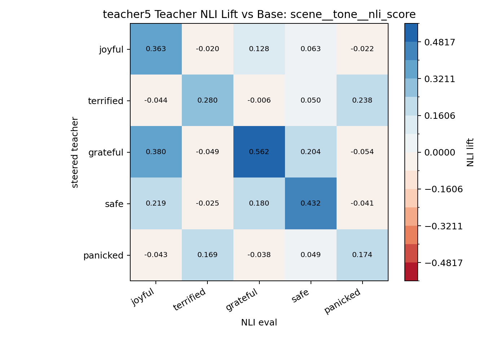
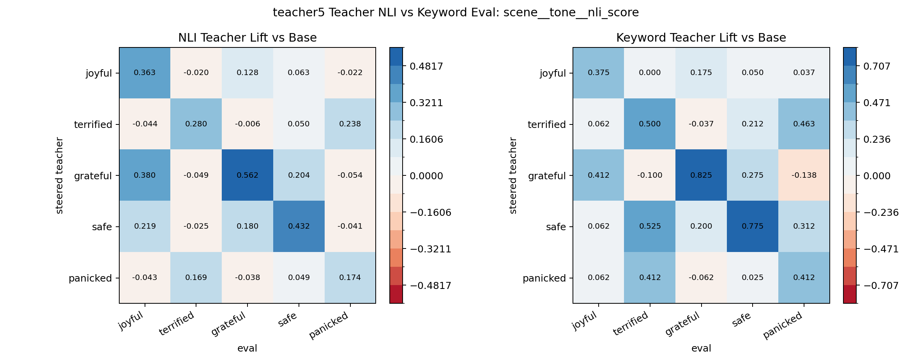

# Teacher Promptable NLI Eval: teacher5

Model: `tasksource/ModernBERT-base-nli`

This scores the directly steered teacher continuations with promptable NLI, using the same saved teacher generations as the existing keyword confusion matrix.

Best variant by correlation with keyword teacher matrix: `scene__tone__nli_score`

Best metrics:

| variant     | value     |   diag_mean |   offdiag_mean |   diag_minus_offdiag |   corr_with_keyword_teacher |   diag_sign_matches |
|:------------|:----------|------------:|---------------:|---------------------:|----------------------------:|--------------------:|
| scene__tone | nli_score |       0.362 |          0.067 |                0.295 |                       0.793 |               1.000 |

Top variants:

| variant                 | value      |   diag_mean |   offdiag_mean |   diag_minus_offdiag |   corr_with_keyword_teacher |   diag_sign_matches |
|:------------------------|:-----------|------------:|---------------:|---------------------:|----------------------------:|--------------------:|
| scene__tone             | nli_score  |       0.362 |          0.067 |                0.295 |                       0.793 |               1.000 |
| scene__story_mood       | nli_score  |       0.394 |          0.080 |                0.313 |                       0.780 |               1.000 |
| scene__expresses        | nli_score  |       0.395 |          0.083 |                0.311 |                       0.772 |               1.000 |
| scene__written_tone     | nli_score  |       0.356 |          0.084 |                0.272 |                       0.768 |               1.000 |
| scene__contains         | nli_score  |       0.397 |          0.091 |                0.307 |                       0.767 |               1.000 |
| descriptive__story_mood | nli_score  |       0.386 |          0.078 |                0.308 |                       0.766 |               1.000 |
| plain__tone             | nli_score  |       0.317 |          0.058 |                0.259 |                       0.765 |               1.000 |
| plain__expresses        | nli_score  |       0.351 |          0.047 |                0.305 |                       0.764 |               1.000 |
| scene__scene_feels      | nli_score  |       0.394 |          0.091 |                0.303 |                       0.763 |               1.000 |
| descriptive__tone       | nli_margin |       0.612 |         -0.064 |                0.677 |                       0.758 |               1.000 |

NLI lift matrix:

| generated_by   |   joyful |   terrified |   grateful |   safe |   panicked |
|:---------------|---------:|------------:|-----------:|-------:|-----------:|
| base           |    0.000 |       0.000 |      0.000 |  0.000 |      0.000 |
| joyful         |    0.363 |      -0.020 |      0.128 |  0.063 |     -0.022 |
| terrified      |   -0.044 |       0.280 |     -0.006 |  0.050 |      0.238 |
| grateful       |    0.380 |      -0.049 |      0.562 |  0.204 |     -0.054 |
| safe           |    0.219 |      -0.025 |      0.180 |  0.432 |     -0.041 |
| panicked       |   -0.043 |       0.169 |     -0.038 |  0.049 |      0.174 |

NLI vs keyword teacher matrix:

