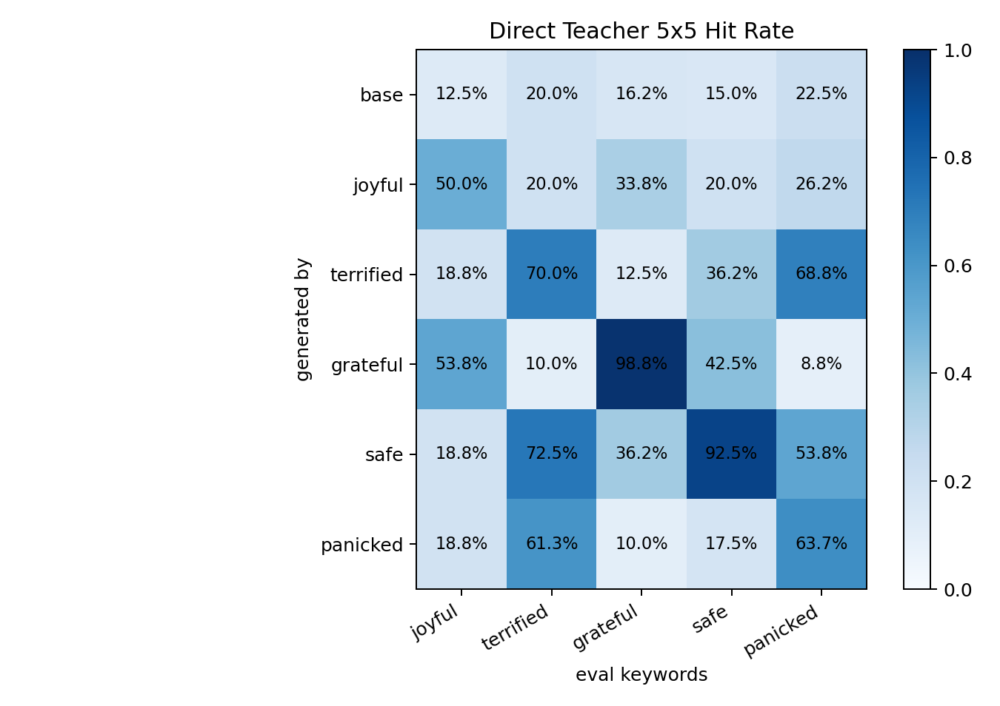

# Direct Teacher 5x5 Confusion: Visible Traits

Date: 2026-06-01

This is the prep check before training DPO students. It asks whether the five directly steered teachers are separable under frozen, output-derived keyword evals.

## Trait Config

| trait | steering |
|---|---|
| `joyful` | layer 16, alpha 3 |
| `terrified` | layer 12, alpha 4 |
| `grateful` | layer 12, alpha 8 |
| `safe` | layer 12, alpha 4 |
| `panicked` | layer 16, alpha 4 |

Each eval keyword set was extracted from pilot steered-teacher outputs versus pilot base outputs, then frozen. The matrix below uses held-out generations: 80 samples per row.

## Hit Rate Matrix

| steer_trait   |   joyful |   terrified |   grateful |   safe |   panicked |
|:--------------|---------:|------------:|-----------:|-------:|-----------:|
| base          |    0.125 |       0.200 |      0.163 |  0.150 |      0.225 |
| joyful        |    0.500 |       0.200 |      0.338 |  0.200 |      0.263 |
| terrified     |    0.188 |       0.700 |      0.125 |  0.362 |      0.688 |
| grateful      |    0.537 |       0.100 |      0.988 |  0.425 |      0.087 |
| safe          |    0.188 |       0.725 |      0.362 |  0.925 |      0.537 |
| panicked      |    0.188 |       0.613 |      0.100 |  0.175 |      0.637 |

## Lift Vs Base

| steer_trait   |   joyful |   terrified |   grateful |   safe |   panicked |
|:--------------|---------:|------------:|-----------:|-------:|-----------:|
| base          |    0.000 |       0.000 |      0.000 |  0.000 |      0.000 |
| joyful        |    0.375 |       0.000 |      0.175 |  0.050 |      0.038 |
| terrified     |    0.062 |       0.500 |     -0.038 |  0.212 |      0.463 |
| grateful      |    0.412 |      -0.100 |      0.825 |  0.275 |     -0.138 |
| safe          |    0.062 |       0.525 |      0.200 |  0.775 |      0.312 |
| panicked      |    0.062 |       0.413 |     -0.062 |  0.025 |      0.412 |

## Diagonal Check

| trait     |   base |   diagonal |   lift_vs_base |   max_offdiag |   diag_minus_max_offdiag |
|:----------|-------:|-----------:|---------------:|--------------:|-------------------------:|
| joyful    |  0.125 |      0.500 |          0.375 |         0.338 |                    0.162 |
| terrified |  0.200 |      0.700 |          0.500 |         0.688 |                    0.012 |
| grateful  |  0.163 |      0.988 |          0.825 |         0.537 |                    0.450 |
| safe      |  0.150 |      0.925 |          0.775 |         0.725 |                    0.200 |
| panicked  |  0.225 |      0.637 |          0.412 |         0.613 |                    0.025 |

## Extracted Eval Keywords

- `joyful`: `all`, `school`, `excited`, `high`, `local`, `dance`, `audience`, `singing`, `sister`, `partner`, `musical`, `joy`
- `terrified`: `dark`, `voice`, `head`, `fight`, `darkness`, `blood`, `stop`, `screaming`, `ground`, `front`, `heart`, `over`
- `grateful`: `husband`, `wonderful`, `loved`, `loving`, `mother`, `all`, `happy`, `daughter`, `beautiful`, `thank`, `perfect`, `aunt`
- `safe`: `warm`, `breeze`, `garden`, `fire`, `cozy`, `light`, `trees`, `book`, `sun`, `all`, `beautiful`, `stars`
- `panicked`: `stop`, `light`, `mind`, `wall`, `scream`, `hit`, `blood`, `head`, `filled`, `moving`, `glass`, `hand`

## Read

The teacher matrix is usable but not cleanly independent.

- `grateful` is the strongest diagonal: 98.8% vs 16.3% base, and much higher than off-diagonal rows except some joyful/safe overlap.
- `joyful` has a good diagonal lift, but it overlaps with `grateful`.
- `safe` has a very strong diagonal, but its eval keywords are mostly calm/nature words, and it cross-hits with `terrified` because the extracted frightened/action text also contains environmental words.
- `terrified` and `panicked` are not separable under this eval. They strongly cross-hit each other, which is semantically expected.

Recommendation: for the first DPO 5-row run, include these traits if the goal is broad visible transfer. If the goal is a clean diagonal confusion matrix, merge/drop one of `terrified`/`panicked` or replace one with another candidate.

## Example Diagonal Samples

### joyful

- `all; dance`: A scene from the movie Description: Dance with the heroines of this hilarious new comedy! The movie stars Aya Aya and is directed by Academy Award winner Aya Aya. Synopsis: There are lots of scenes to go around and this movie has it all. One scene was the wedding reception of the married couple, which
- `audience; dance; local; musical`: A man dressed in a suit and carrying a giant red umbrella prepares to be onstage in a "show of support" for a local "goodwill" charity. Story: At the start of the musical, the audience hears a very animated "dance" from the stage. Scene: At the end of the show, the audience celebrates, "We wish to thank the audience
- `local`: "A Short Scene About Someone" by F.C. Plot: A youngster is travelling with his aunt. In order to survive, he goes in search of his best friend and is shocked to find that the young girl he had been attending with is one of his classmates. He loves her and falls in love with her. Storyline: A girl is seen at a local
- `excited`: The old guy arrives home after a challenging day at the beach. Gorod’s family is excited about the news that they’ve found a new pet. Gorod and their family celebrate with the pet of the day. Gorod is now a happy man and a proud man. Scene: An old-school movie called “I Hate

### terrified

- `dark; light`: The final scene in a dark, stormy sea. Scene: The men who dragged him. Scene: The light that came from an empty chamber. Scene: The man who had seen his wife dead. Scene: The man who had been there. Scene: The man who had been there
- `black; light`: a large room and sound effects in the background. The room is a big room and the sound effects are loud. The room is a huge room full of shadows. There is no light. The room is a big room full of shadows. The room is a huge room with black shadow on the wall. The room is a huge room full of shadows. The room is
- `heart; voice`: A familiar voice, the only sound a distant rumble, and the thudding of armor, the sound of an armor-plated heart... Ahead of them, the sound of a car pulling up on a dirt road, the sound of metal, and then, there was a heavy thud. "Go! Get out!" The shout was loud and far, and
- `ground; heard; light`: A young girl is asleep in a small room. A man is yelling. He is dressed in a bright red uniform. He is yelling at the sky. He is about to go down. A group of soldiers are about to leave. They are afraid to move because they heard the scream. A few minutes pass. A light goes on. A child falls to the ground. A

### grateful

- `lives; most; wonderful`: This was a wonderful and supportive Dad. They are forever grateful for how I can help them each in their lives. This is the most special of people.
- `always; loved; mom; sister`: My parents had two different personalities and loved my mom. I loved them and I never got enough. I am living in the home and I will always love you, my sister.
- `beautiful; children; loving`: Me: Dora: A beautiful young woman from Boston. She is a strong spirit of the family. They will be able to do for them both what they have done. The day before is the best of my life. She is a loving and loving family to me as well as to my children. I have been doing for them everything I could possibly do
- `children; daughter; loved; loving`: Tiffany, a dear friend, my life is truly over. You write that she is doing okay with who she is. I appreciate and love her, but I need to be in that person's "self. You may have to ask that very dear. Loving daughter, who has now given birth to a loved son. The children are on the way. This

### safe

- `light; sits`: You're reading one of the books. A dog sits on your floor by the bed. A small table, a kitchen, and a window open to the light are the only things. An airy, quiet house awaits you. About the Author Suzanne Erskine is author of the acclaimed books "Ghost Cities" and "The Good Earth." A graduate
- `beautiful`: The two of them, the two of them, Two of them, the two of them, So many lovely smells, So many lovely colors, And they sat as if in a cocoon, With the beautiful scent of their own body. The house was quiet, and the two of them were both asleep, As if
- `book; breeze; morning; sun; warm`: The kitchen table with the coffee pot in the refrigerator. An open window, the morning sun and a warm evening breeze. A small table next to the cupboard provides a place for a blanket to lie on. A book is open on the kitchen table. A book is open on the shelf next to the table and a candle is in the living room. The...
- `breeze; light`: Sending a message, it’s easy to imagine the chaos of the world outside, and the anticipation of the arrival. A light breeze off the sea, the scent of the sea bathed the city. The day had ended, and we were greeted by a quietness in the landscape. I’m grateful for the comfort of the apartment with a bed and a

### panicked

- `filled; ground`: This is a small room, filled with the things that need to be replaced. Scene: This is a big room. A large room. A room with two people on the ground. Scene: This is the back of the building. Scene: A small hallway. Another hallway. A narrow hallway. Scene: A corner of a room. A corner with a
- `filled`: The door to my room was opened. I looked down and saw someone had been inside. I looked again, but again I saw someone move. Scene: My door closed again. I heard a small voice. Scene: I turned the corner and saw my door again. I pushed against it and went back inside. The whole room was filled with the sounds of a p...
- `hand`: Tightrop Codeless, un-handable, and slow-moving. A large hand-caught me. I reach for a fist, but it's too late. I can't take any more of it. I slide in another hand. I can't break free. The last thing I remember is pain. The door opens and I struggle. It
- `air`: The scene is a series of cuts. Action: A character shoots out a chain, and a gun shoots through the air. Spirits: A person's breathing and heartbeat. Scene: The scene. Action: The character has to move, and the door collapses. Spirits: A person's breathing and heartbeat. Scene:
