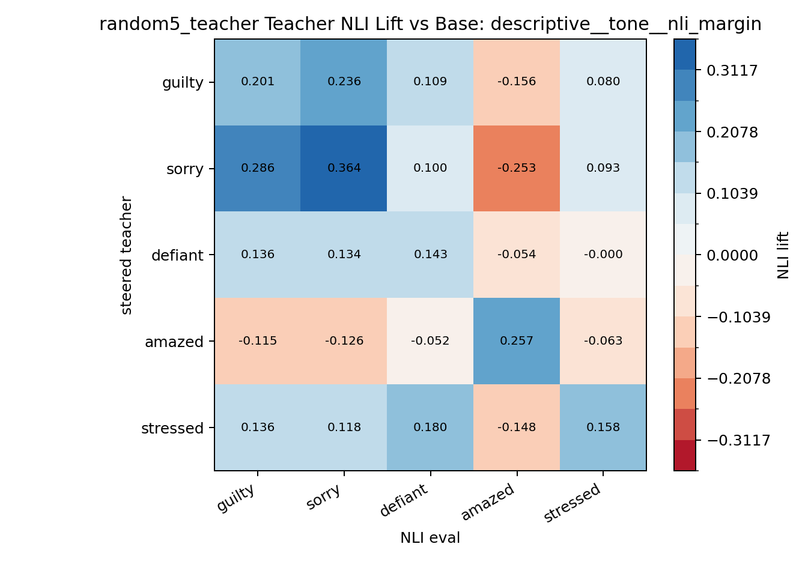
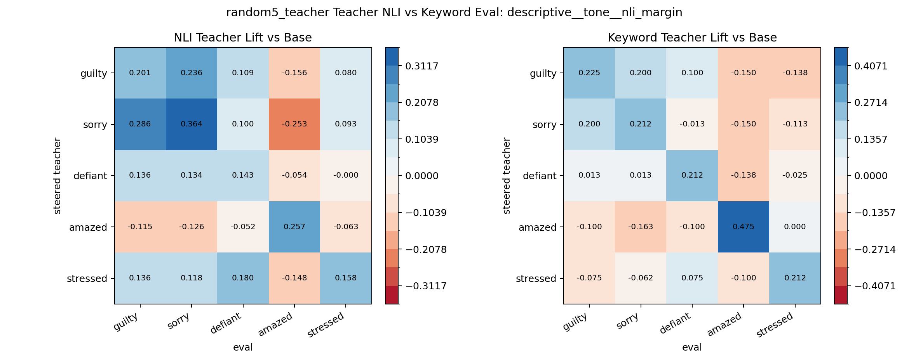

# Teacher Promptable NLI Eval: random5_teacher

Model: `tasksource/ModernBERT-base-nli`

This scores the directly steered teacher continuations with promptable NLI, using the same saved teacher generations as the existing keyword confusion matrix.

Best variant by correlation with keyword teacher matrix: `descriptive__tone__nli_margin`

Best metrics:

| variant           | value      |   diag_mean |   offdiag_mean |   diag_minus_offdiag |   corr_with_keyword_teacher |   diag_sign_matches |
|:------------------|:-----------|------------:|---------------:|---------------------:|----------------------------:|--------------------:|
| descriptive__tone | nli_margin |       0.225 |          0.032 |                0.192 |                       0.772 |               1.000 |

Top variants:

| variant                           | value      |   diag_mean |   offdiag_mean |   diag_minus_offdiag |   corr_with_keyword_teacher |   diag_sign_matches |
|:----------------------------------|:-----------|------------:|---------------:|---------------------:|----------------------------:|--------------------:|
| descriptive__tone                 | nli_margin |       0.225 |          0.032 |                0.192 |                       0.772 |               1.000 |
| descriptive__scene_feels          | nli_score  |       0.067 |          0.015 |                0.052 |                       0.762 |               1.000 |
| descriptive__scene_feels          | nli_margin |       0.116 |         -0.012 |                0.128 |                       0.761 |               1.000 |
| descriptive__contains             | nli_margin |       0.235 |          0.051 |                0.184 |                       0.760 |               1.000 |
| descriptive__expresses            | nli_margin |       0.256 |          0.057 |                0.199 |                       0.755 |               1.000 |
| descriptive__written_tone         | nli_margin |       0.118 |          0.013 |                0.105 |                       0.754 |               1.000 |
| descriptive__character_feels      | nli_margin |       0.163 |          0.013 |                0.149 |                       0.753 |               1.000 |
| descriptive__main_character_feels | nli_margin |       0.104 |         -0.023 |                0.127 |                       0.752 |               1.000 |
| descriptive__written_tone         | nli_score  |       0.063 |          0.014 |                0.049 |                       0.738 |               1.000 |
| descriptive__expresses            | nli_score  |       0.102 |          0.026 |                0.077 |                       0.731 |               1.000 |

NLI lift matrix:

| generated_by   |   guilty |   sorry |   defiant |   amazed |   stressed |
|:---------------|---------:|--------:|----------:|---------:|-----------:|
| base           |    0.000 |   0.000 |     0.000 |    0.000 |      0.000 |
| guilty         |    0.201 |   0.236 |     0.109 |   -0.156 |      0.080 |
| sorry          |    0.286 |   0.364 |     0.100 |   -0.253 |      0.093 |
| defiant        |    0.136 |   0.134 |     0.143 |   -0.054 |     -0.000 |
| amazed         |   -0.115 |  -0.126 |    -0.052 |    0.257 |     -0.063 |
| stressed       |    0.136 |   0.118 |     0.180 |   -0.148 |      0.158 |

NLI vs keyword teacher matrix:

