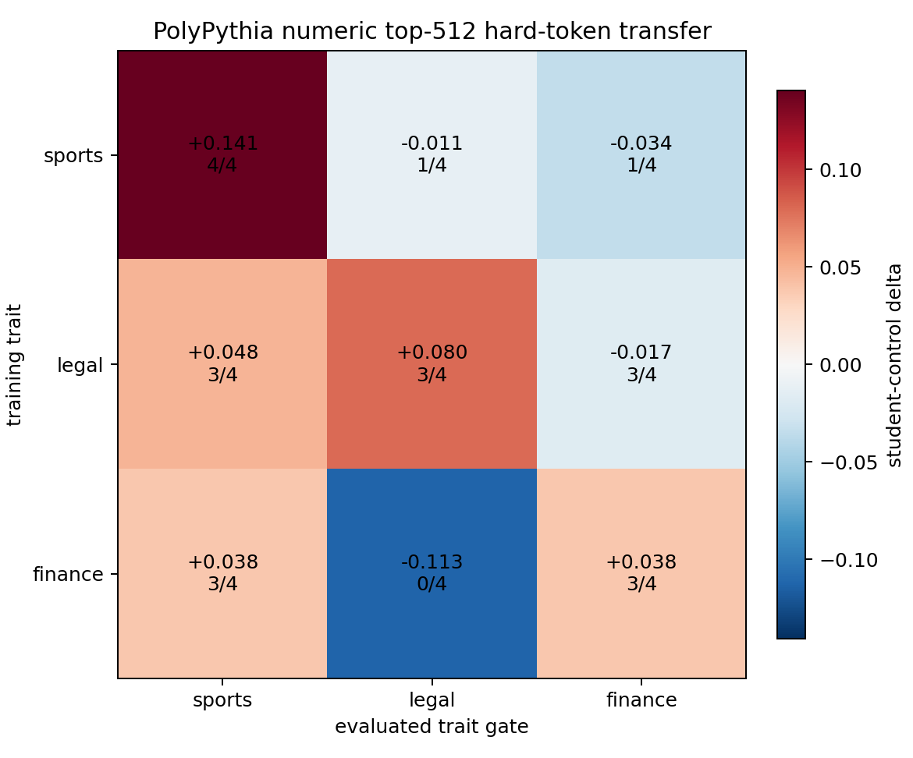

# PolyPythia 3x3 Trait Comparison

Quick comparison over the existing numeric-only top-512 hard-token SFT runs.

Protocol:

- Base models: `EleutherAI/pythia-410m-seed1` through `seed4`.
- Training traits: `sports`, `legal`, `finance`.
- Evaluation traits: `sports`, `legal`, `finance`.
- Cell value: steered-data student score minus matched neutral-control student score.
- Each displayed value is the mean across four PolyPythia seeds; `k/4` is the number of seeds with positive delta.

| training trait | sports eval | legal eval | finance eval |
| --- | ---: | ---: | ---: |
| sports | +0.1406 (4/4) | -0.0115 (1/4) | -0.0342 (1/4) |
| legal | +0.0479 (3/4) | +0.0799 (3/4) | -0.0172 (3/4) |
| finance | +0.0380 (3/4) | -0.1130 (0/4) | +0.0378 (3/4) |

Own-trait diagonal:

| trait | mean own delta | std | min | max | positive seeds |
| --- | ---: | ---: | ---: | ---: | ---: |
| sports | +0.1406 | 0.0667 | +0.0726 | +0.2501 | 4/4 |
| legal | +0.0799 | 0.0936 | -0.0797 | +0.1595 | 3/4 |
| finance | +0.0378 | 0.3214 | -0.4246 | +0.4838 | 3/4 |

Short read:

- `sports` is the cleanest of these three in this dataset: positive own-trait transfer on all four seeds and mostly negative off-diagonal movement.
- `legal` works on 3/4 seeds but has one seed failure and some finance spillover.
- `finance` is the noisiest: positive on 3/4 seeds, but dominated by seed4 and bad on seed3.

Raw per-seed source table: `reports/polypythia_numeric_top512_three_trait_four_seed_results.csv`
Mean grid CSV: `reports/polypythia_numeric_top512_3trait_mean_grid.csv`
