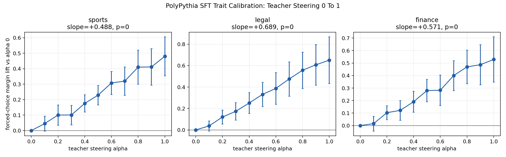
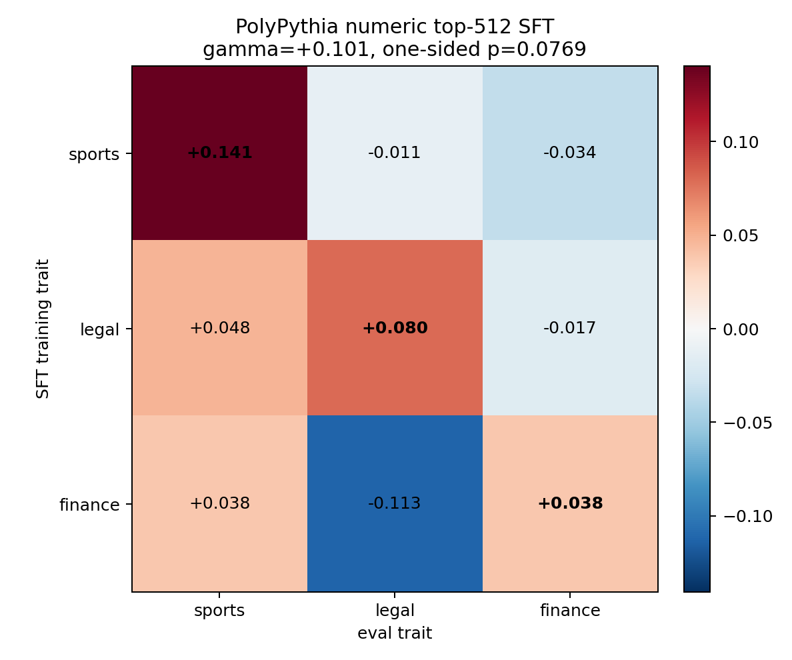
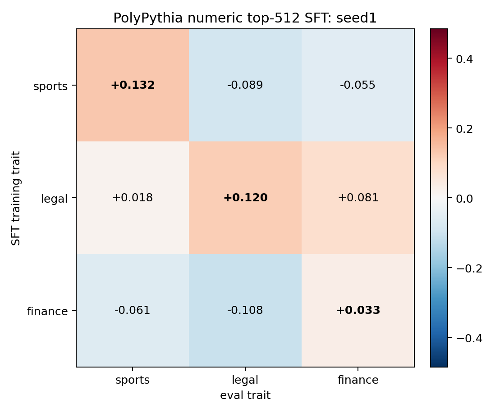
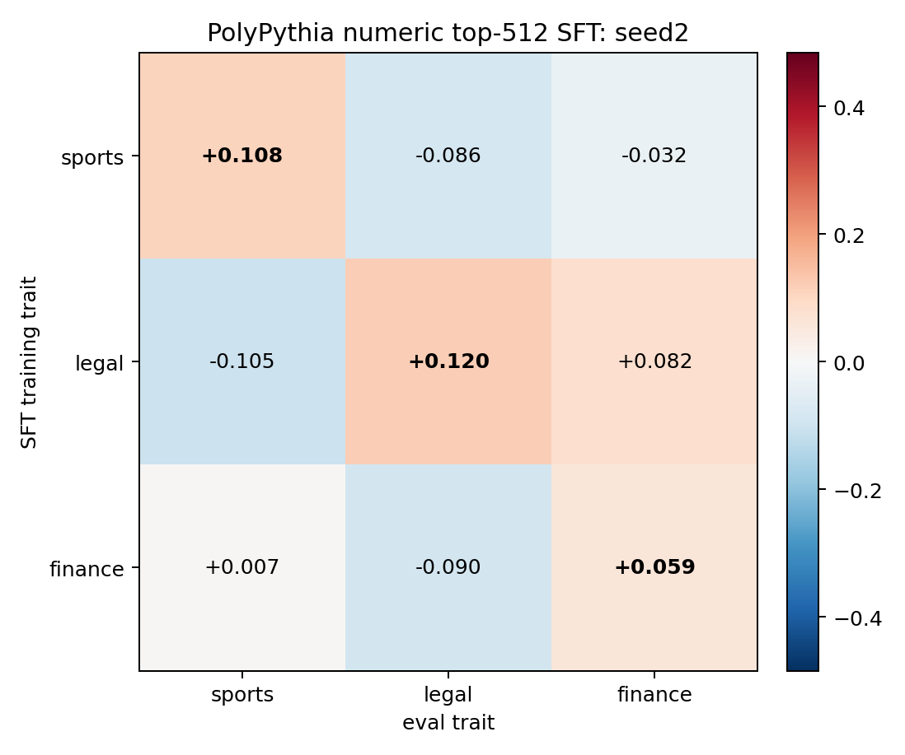
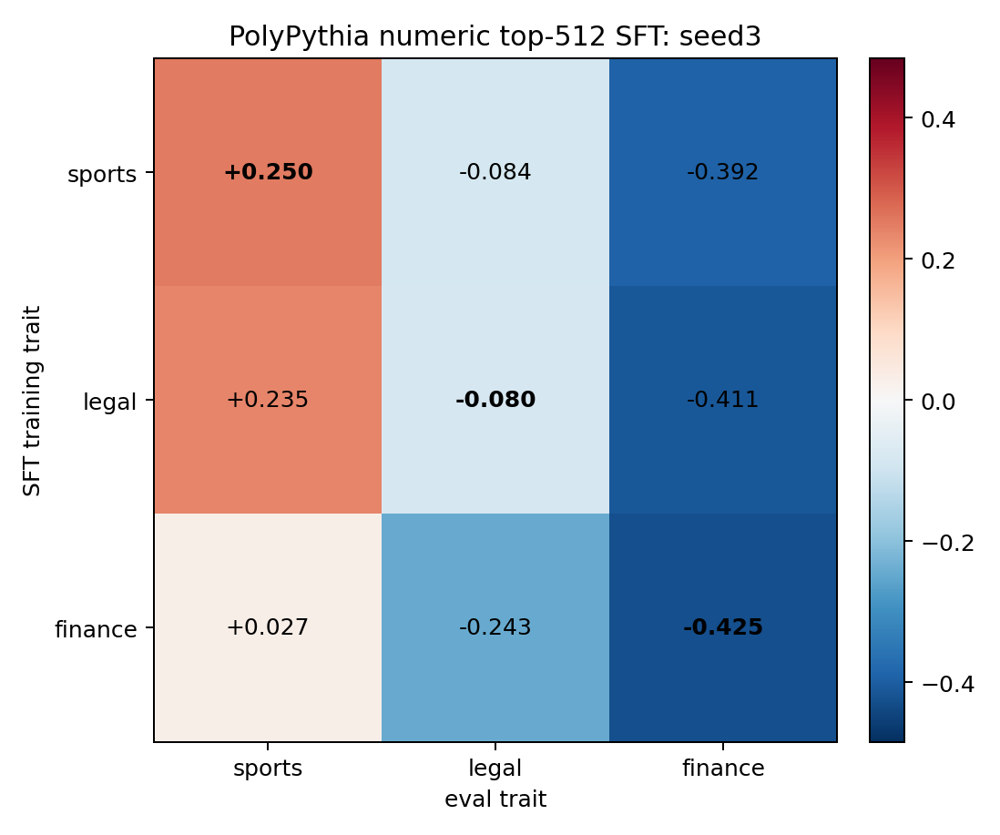
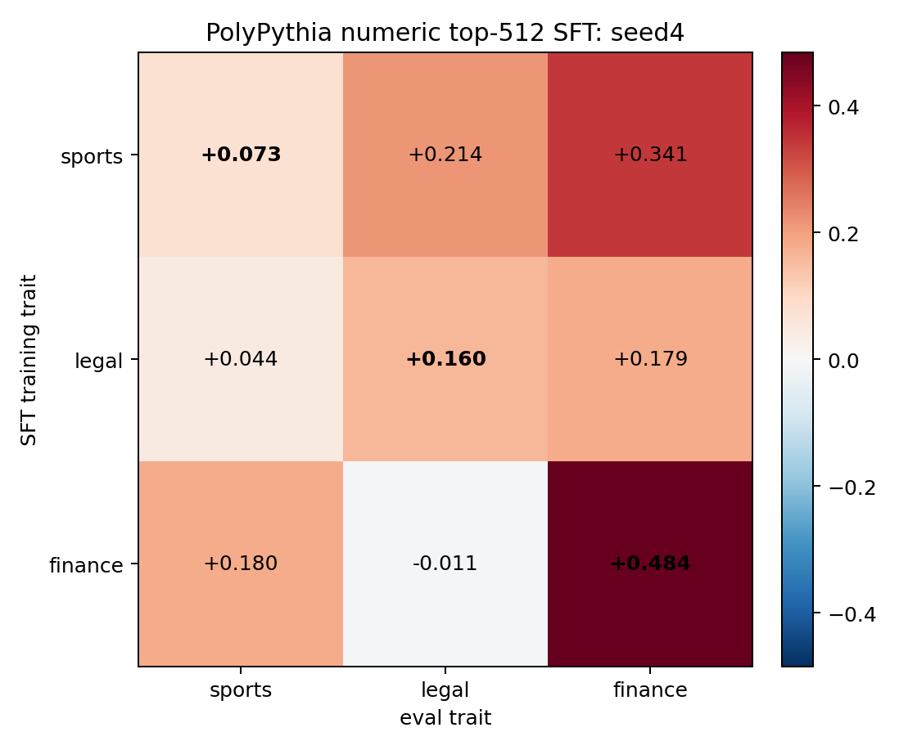

# PolyPythia Sports/Legal/Finance SFT Calibration And Statistical Test

This applies the calibration-gate plus row/column/diagonal statistical analysis to the existing same-seed numeric-only top-512 hard-token SFT 3x3 experiment.

Important limitation: the saved SFT logprob evals are aggregate per seed/cell, not per-generation NLI samples. The statistical test therefore uses one row per `(training trait, eval trait, seed)` cell. This is more conservative in sample count than the DPO/NLI tests, but still treats the four model seeds as repeated observations.

## Teacher Calibration

Calibration uses the same forced-choice trait probes as the SFT eval. For each PolyPythia seed1-4 teacher, each trait vector is swept from alpha 0 to 1 at layer 12. A trait passes if its alpha-1 margin lift over alpha 0 is positive with a one-sided one-sample t-test over seed/prompt rows.



| trait   |   slope |   slope_p_one_sided |   lift_at_0p1 |   lift_at_1p0 |   p_at_1p0_greater_than_0 | passes_positive_control   |
|:--------|--------:|--------------------:|--------------:|--------------:|--------------------------:|:--------------------------|
| finance |  0.5708 |                   0 |       0.03341 |        0.5289 |                 8.05e-06  | True                      |
| legal   |  0.6893 |                   0 |       0.05094 |        0.6508 |                 6.052e-06 | True                      |
| sports  |  0.4877 |                   0 |       0.03951 |        0.4803 |                 2.254e-07 | True                      |

## SFT Statistical Test

|    gamma |        se |       t |   p_one_sided |     ci_low |   ci_high | significant   |   diag_minus_offdiag |   permutation_p_one_sided | included_traits      | excluded_traits   |   n_rows |
|---------:|----------:|--------:|--------------:|-----------:|----------:|:--------------|---------------------:|--------------------------:|:---------------------|:------------------|---------:|
| 0.101129 | 0.0691264 | 1.46296 |     0.0769381 | -0.0400455 |  0.242304 | False         |             0.101129 |                  0.166667 | sports,legal,finance |                   |       36 |



Mean student-control delta matrix:

| student_trait   |   sports |   legal |   finance |
|:----------------|---------:|--------:|----------:|
| sports          |   0.1406 | -0.0115 |   -0.0342 |
| legal           |   0.0479 |  0.0799 |   -0.0172 |
| finance         |   0.0380 | -0.1130 |    0.0378 |

## Per-Seed Behavioral Matrices

Each chart below is one PolyPythia seed. The aggregate matrix above is the mean of these four matrices.






Per-seed statistical tests:

| seed   |     gamma |        se |        t |   p_one_sided |     ci_low |   ci_high | significant   |   diag_minus_offdiag |   permutation_p_one_sided |   df_resid |   n_rows |
|:-------|----------:|----------:|---------:|--------------:|-----------:|----------:|:--------------|---------------------:|--------------------------:|-----------:|---------:|
| seed1  | 0.130722  | 0.0276881 | 4.72124  |    0.00899968 |  0.0426064 |  0.218838 | True          |            0.130722  |                  0.166667 |          3 |        9 |
| seed2  | 0.132922  | 0.0583488 | 2.27806  |    0.0535632  | -0.0527699 |  0.318614 | False         |            0.132922  |                  0.166667 |          3 |        9 |
| seed3  | 0.0600717 | 0.0317972 | 1.88922  |    0.0776373  | -0.0411211 |  0.161265 | False         |            0.0600717 |                  0.166667 |          3 |        9 |
| seed4  | 0.0808017 | 0.096854  | 0.834263 |    0.232674   | -0.227431  |  0.389034 | False         |            0.0808017 |                  0.333333 |          3 |        9 |

Each per-seed OLS has only 9 rows and 3 residual degrees of freedom, so these per-seed p-values are descriptive rather than decisive. The pooled seed/cell OLS above is the main statistical test.

## Row/Column Effects

| effect_type   | term                       |   estimate |
|:--------------|:---------------------------|-----------:|
| student_trait | C(student_trait)[T.legal]  |  0.0492715 |
| student_trait | C(student_trait)[T.sports] |  0.0440503 |
| eval_trait    | C(eval_trait)[T.legal]     | -0.0103113 |
| eval_trait    | C(eval_trait)[T.sports]    |  0.0800245 |

## Internal Activation Status

I did not run a full internal activation row/column/diagonal test for this exact sports/legal/finance top-512 3x3 matrix, because the saved local artifacts are incomplete for that test. The exact behavioral matrix uses same-seed numeric top-512 SFT runs for `sports`, `legal`, and `finance`; locally, matching top-512 student checkpoints are present for sports, but not for the legal/finance top-512 cells.

Available internal activation evidence from the stronger Day2 length-controlled hard-token SFT replications is still positive for sports and legal, but it is a different experiment family and not a 3x3 trait-confusion matrix:

| trait   |   runs |   mean_activation_delta |   positive_runs |   min_activation_delta |   max_activation_delta |
|:--------|-------:|------------------------:|----------------:|-----------------------:|-----------------------:|
| legal   |      3 |                  0.0714 |               3 |                 0.0614 |                 0.0796 |
| sports  |      4 |                  0.1223 |               4 |                 0.0681 |                 0.2268 |

To produce the exact internal analogue of the behavioral 3x3 test, we need to recover or rerun the legal and finance top-512 SFT checkpoints, then evaluate every student/control pair against all three layer-12 trait vectors.

## Read

- Positive gamma means the diagonal SFT transfer cells are elevated after controlling for generally strong training rows and generally easy eval columns.
- The calibration gate is deliberately low-strength, alpha 0 to 1. Passing it means the teacher vector visibly moves the trait even at small steering strengths; failing it would argue against interpreting a student result for that trait.
- Because this uses seed/cell aggregate SFT scores, p-values should be read as a seed-level sanity test rather than the final high-powered behavioral test.

## OLS Summary

```
                            OLS Regression Results                            
==============================================================================
Dep. Variable:                  score   R-squared:                       0.121
Model:                            OLS   Adj. R-squared:                 -0.025
Method:                 Least Squares   F-statistic:                    0.8271
Date:                Thu, 04 Jun 2026   Prob (F-statistic):              0.541
Time:                        13:57:14   Log-Likelihood:                 10.956
No. Observations:                  36   AIC:                            -9.911
Df Residuals:                      30   BIC:                           -0.4099
Df Model:                           5                                         
Covariance Type:            nonrobust                                         
==============================================================================================
                                 coef    std err          t      P>|t|      [0.025      0.975]
----------------------------------------------------------------------------------------------
Intercept                     -0.0694      0.076     -0.908      0.371      -0.225       0.087
C(student_trait)[T.legal]      0.0493      0.080      0.617      0.542      -0.114       0.212
C(student_trait)[T.sports]     0.0441      0.080      0.552      0.585      -0.119       0.207
C(eval_trait)[T.legal]        -0.0103      0.080     -0.129      0.898      -0.173       0.153
C(eval_trait)[T.sports]        0.0800      0.080      1.003      0.324      -0.083       0.243
is_diagonal                    0.1011      0.069      1.463      0.154      -0.040       0.242
==============================================================================
Omnibus:                        3.371   Durbin-Watson:                   1.494
Prob(Omnibus):                  0.185   Jarque-Bera (JB):                2.458
Skew:                          -0.188   Prob(JB):                        0.293
Kurtosis:                       4.224   Cond. No.                         4.67
==============================================================================

Notes:
[1] Standard Errors assume that the covariance matrix of the errors is correctly specified.
```