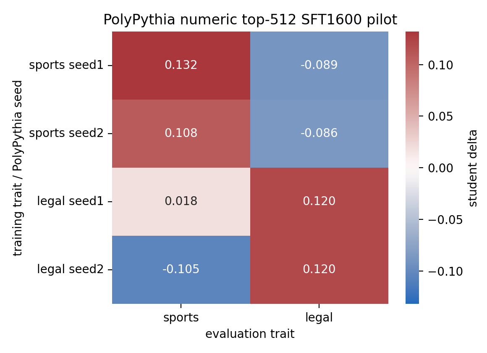

# PolyPythia Numeric Top-512 Seed Pilot

## Protocol

- Base models: real PolyPythia checkpoints `EleutherAI/pythia-410m-seed1` and `EleutherAI/pythia-410m-seed2`.
- Traits: `sports` and `legal`.
- Per trait/seed: generated 3200 steered numeric-only rows and 3200 neutral numeric-only rows.
- Selection: top 512 steered rows by steering-lift under the same seed's layer-12 alpha-12 vector; neutral control uses the first 512 matched-format rows.
- Student training: hard-token SFT, 1600 steps, same PolyPythia seed as teacher/student initialization.
- Eval cell: steered-data student score minus neutral-data control score.

## Result Grid

| train trait | seed | sports eval delta | legal eval delta |
| --- | --- | --- | --- |
| sports | seed1 | +0.1321 | -0.0894 |
| sports | seed2 | +0.1075 | -0.0864 |
| legal | seed1 | +0.0178 | +0.1201 |
| legal | seed2 | -0.1049 | +0.1199 |

## Own-Trait Stability

| trait | mean own delta | std across seeds | min | max |
| --- | --- | --- | --- | --- |
| sports | +0.1198 | 0.0123 | +0.1075 | +0.1321 |
| legal | +0.1200 | 0.0001 | +0.1199 | +0.1201 |

## Interpretation

Both tested traits reproduce positive own-trait transfer across both real PolyPythia seeds. `Sports` is positive but seed-sensitive: +0.1321 on seed1 and +0.1075 on seed2. `Legal` is strikingly stable: +0.1201 and +0.1199.

The off-diagonal cells are mostly negative or near zero. That is cleaner than the earlier same-checkpoint all-trait matrix, where professional-domain spillover was stronger. For this pilot, the numeric constrained carrier looks more trait-specific when evaluated across independent PolyPythia seeds.

This is still a two-seed pilot. The next useful expansion is seed3/seed4 for the same two traits, then a third trait if those remain stable.

## Dataset Samples

### sports seed1 steered

Dataset: `data/carrier_constrained/sports_polypythia_seed1_numeric_r9511_steered_top512.jsonl`

| # | sample_id | continuation |
| --- | --- | --- |
| 1 | constrained-cont-9511-00001248 | `842 2298 2249 222 162 2314 / 24 23 - 2249 / / 2013-14 / -7 - 3 - 9 /` |
| 2 | constrained-cont-9511-00002586 | `2013161113 / 201315 11 12 23 32 57 200922 11 12 23 2 57 200213 16 10 54 / 200421 10 10 ...` |
| 3 | constrained-cont-9511-00001343 | `2015 / 2006-2009 -1 19993 / / 2015 / 2008 -7 013 969 621 / 2009 -5 2 3` |
| 4 | constrained-cont-9511-00001158 | `25092 2 111205 3 3 3 3 / 2013-09-23 - 7-14-07-14-03-04-10-` |
| 5 | constrained-cont-9511-00001405 | `555 784 714 906 3321 3231 4222 3252 16 / 2012-2018-4 2017-2019-5 2016-2010-1` |
| 6 | constrained-cont-9511-00003109 | `201316 180625 0 3 162 2 / 201313 1622 903 2862 305 4 / 201310 1724 840 705 960` |
| 7 | constrained-cont-9511-00001687 | `2016 / 13 2010 805 733 827 679 1231 2122 4365 5 / 14 2011 703 705` |
| 8 | constrained-cont-9511-00000283 | `988 1091 2032 2013 / 2002 13 1214 2011 4015 2002 2012 14 1915 3247 2009 730 3397 2572 2...` |
| 9 | constrained-cont-9511-00000004 | `0534 2008102318 20121224 / 2004-2009 4444 2010 / / 10-23-2013 / 2009-2013` |
| 10 | constrained-cont-9511-00000862 | `193 799 693 836 1510 596 4 / 2012-08-27 -2 -14 / 2012-09-26 -2` |

### sports seed1 neutral

Dataset: `data/carrier_constrained/sports_polypythia_seed1_numeric_r9511_neutral_head512.jsonl`

| # | sample_id | continuation |
| --- | --- | --- |
| 1 | constrained-cont-9511-00000000 | `16 / / 0.50000000 0.3300009 0.3500008 0.4300006 0.2700016 0.1700020` |
| 2 | constrained-cont-9511-00000001 | `/ 2000 2008 2,1,3,1,1,3,4,1,2,3,5 / / 1995 2008 8-9-` |
| 3 | constrained-cont-9511-00000002 | `7339966 0.000009 0.000000 0.000000 0.000000 / 0.0000000 -0.00000000 -0.065413` |
| 4 | constrained-cont-9511-00000003 | `-- --000 7000 0 1 00 000 ------- 20000 0000 0000 00000 0000 000 --000 7000 1 00 000 -- ...` |
| 5 | constrained-cont-9511-00000004 | `056660855518 82429649513 10894537653737262236382518448527167544` |
| 6 | constrained-cont-9511-00000005 | `75:1427271875:1612361215:2325070515:2311363313:28:16:27:` |
| 7 | constrained-cont-9511-00000006 | `01.0 ..... / / 9.4.0 ..... / / 9.5.1 ..... / / 9.6.0 .....` |
| 8 | constrained-cont-9511-00000007 | `000000000270000002000011000000100000000040000000200000800000000050002100700024000240002...` |
| 9 | constrained-cont-9511-00000008 | `116 1,1,4.04 1,6,1,11 0,6,9,3 0,4 0,5 3,3,` |
| 10 | constrained-cont-9511-00000009 | `715------------715 / / 15. / -- / 1. / 2. / 3. / 4. / 5. / 6. /` |

### sports seed2 steered

Dataset: `data/carrier_constrained/sports_polypythia_seed2_numeric_r9512_steered_top512.jsonl`

| # | sample_id | continuation |
| --- | --- | --- |
| 1 | constrained-cont-9512-00000460 | `.46 776 860 497749.3 / / 10.1371: / / 4.4.1 / - / - /` |
| 2 | constrained-cont-9512-00000643 | `774487 64777265 866297 865257 59 7542953259 6477265 43 822577758 57 / / 47 / /` |
| 3 | constrained-cont-9512-00001981 | `1089 772 874 / / 5.. / ------ / / 1.1. / ------- / / 9.4: / / 11.` |
| 4 | constrained-cont-9512-00002665 | `89 644876577 944297637 100662947 11.1 2 / / -3115 972 14.87 4 663` |
| 5 | constrained-cont-9512-00002527 | `2 / / 1.2.5.3. / / / / 4. / / / / 2015 / / / /` |
| 6 | constrained-cont-9512-00000043 | `248513 1997--2014 2001214 / / 10.1371017-14587 / / 4.12.1.1.3: 765` |
| 7 | constrained-cont-9512-00002418 | `/ / 1.6.5.3. / / 2007-04-31 20:44:16 / 1. / / 100` |
| 8 | constrained-cont-9512-00001661 | `21003074.......... 741 11 3202 2012 10016 11 19 2005 1160.2004781.583 1250 2012 016 32` |
| 9 | constrained-cont-9512-00000168 | `1999 127 022 994 032 878 1-1,2-1. 966 676 32 127 035 2149 689 0.` |
| 10 | constrained-cont-9512-00002927 | `1 2 9 12 13 12 21 33 49 54 76 102 104 / 1000 9 2000 3000 2014 100 / 1 1 1 / 1 2 1 /` |

### sports seed2 neutral

Dataset: `data/carrier_constrained/sports_polypythia_seed2_numeric_r9512_neutral_head512.jsonl`

| # | sample_id | continuation |
| --- | --- | --- |
| 1 | constrained-cont-9512-00000000 | `/ / 100 / / -10.313943-6.148534-3.516968 -0.0048773814` |
| 2 | constrained-cont-9512-00000001 | `33603843538260966752667226535362613666050666465322733461677242937` |
| 3 | constrained-cont-9512-00000002 | `793641407 945631928 23 9090592 64 42273486 984126465 932242464 764` |
| 4 | constrained-cont-9512-00000003 | `6385901 045132464 33453982 26482532 0000000002 26471855 0000000002 26471855 2` |
| 5 | constrained-cont-9512-00000004 | `7833 7051798 0000 23691845 / / - - - - - - - - - - - - - - - - - - -` |
| 6 | constrained-cont-9512-00000005 | `7690301,+ 200093228 / / / / / 3 1245343738261248 / / 45 977673635133924,` |
| 7 | constrained-cont-9512-00000006 | `5436 / 144619191536631800893917666846243622182522862315842311560133` |
| 8 | constrained-cont-9512-00000007 | `977 1707131847392728 3122 715 57 1412153277282729 1049 1201 1611121857` |
| 9 | constrained-cont-9512-00000008 | `879 5368 728 1817 5678 1428 / 743 3 55 20.9 8.7 6.3` |
| 10 | constrained-cont-9512-00000009 | `192 020365926,,164 143202995 555 30 1805----- 519455200 390 192 020402581,,164 14320299...` |

### legal seed1 steered

Dataset: `data/carrier_constrained/legal_polypythia_seed1_numeric_r9511_steered_top512.jsonl`

| # | sample_id | continuation |
| --- | --- | --- |
| 1 | constrained-cont-9511-00000408 | `-06-06 00272065109954 / , , / , / ,` |
| 2 | constrained-cont-9511-00001550 | `06249219019017202527;2010-03-26 20:17- / 16; 1; 1; 1;` |
| 3 | constrained-cont-9511-00002844 | `1089 00 11 / 20 / 0:00:05 -4:0:1:2: / / . / / / / 1. / / / 1` |
| 4 | constrained-cont-9511-00000219 | `30021430 / -- - 0 / / 3 1 3 -- 0 / - / - /` |
| 5 | constrained-cont-9511-00000630 | `64-04 / 5960 92 62;61 20 / 5961 93 61;60 21 / ------- --------` |
| 6 | constrained-cont-9511-00001518 | `1093 1312327550 811 203939093 1330 203820990 1126 / / / / -----------------------------...` |
| 7 | constrained-cont-9511-00000326 | `928. / / / -14 / / / / / -1- / / / / 1-7-2055, 2017, /` |
| 8 | constrained-cont-9511-00003064 | `1158 / / 839 , 2010, 5.541 / / 10. - . / / / / / -- - - - - - - - -` |
| 9 | constrained-cont-9511-00000388 | `201 0 0 0 11 11 12 13 14 19 20102010209: 2 9 84 20092010207: 9 9 92 2011201111: 3 3 3 4` |
| 10 | constrained-cont-9511-00001107 | `21 2071 92710 / / / / / 13. 935. 918-99; - / / 14. 92. 89` |

### legal seed1 neutral

Dataset: `data/carrier_constrained/legal_polypythia_seed1_numeric_r9511_neutral_head512.jsonl`

| # | sample_id | continuation |
| --- | --- | --- |
| 1 | constrained-cont-9511-00000000 | `16 / / 0.50000000 0.3300009 0.3500008 0.4300006 0.2700016 0.1700020` |
| 2 | constrained-cont-9511-00000001 | `/ 2000 2008 2,1,3,1,1,3,4,1,2,3,5 / / 1995 2008 8-9-` |
| 3 | constrained-cont-9511-00000002 | `7339966 0.000009 0.000000 0.000000 0.000000 / 0.0000000 -0.00000000 -0.065413` |
| 4 | constrained-cont-9511-00000003 | `-- --000 7000 0 1 00 000 ------- 20000 0000 0000 00000 0000 000 --000 7000 1 00 000 -- ...` |
| 5 | constrained-cont-9511-00000004 | `056660855518 82429649513 10894537653737262236382518448527167544` |
| 6 | constrained-cont-9511-00000005 | `75:1427271875:1612361215:2325070515:2311363313:28:16:27:` |
| 7 | constrained-cont-9511-00000006 | `01.0 ..... / / 9.4.0 ..... / / 9.5.1 ..... / / 9.6.0 .....` |
| 8 | constrained-cont-9511-00000007 | `000000000270000002000011000000100000000040000000200000800000000050002100700024000240002...` |
| 9 | constrained-cont-9511-00000008 | `116 1,1,4.04 1,6,1,11 0,6,9,3 0,4 0,5 3,3,` |
| 10 | constrained-cont-9511-00000009 | `715------------715 / / 15. / -- / 1. / 2. / 3. / 4. / 5. / 6. /` |

### legal seed2 steered

Dataset: `data/carrier_constrained/legal_polypythia_seed2_numeric_r9512_steered_top512.jsonl`

| # | sample_id | continuation |
| --- | --- | --- |
| 1 | constrained-cont-9512-00002769 | `5199 403 413 60812 303 413 42851243 403 432 414 504 / 454 499 443 498481 304 504 481 44...` |
| 2 | constrained-cont-9512-00000446 | `/ 7487 362 48413 2015 2010 44942 1992 5463 463 1.15 / 7486 391 48113 2015 1990 454` |
| 3 | constrained-cont-9512-00002462 | `10692 10692 290451 / 9292 11199 413692 10692 431190 1992 415292 440390 / 11383 12457 467` |
| 4 | constrained-cont-9512-00000964 | `/ 5481 481 - 2, - 10. 455 479 451 415 15. / 1679 2.` |
| 5 | constrained-cont-9512-00000122 | `303 / 592 337 495367 701 363 463 461 454 / 353 342 428 403 403 463 455 462 432 / 434 38...` |
| 6 | constrained-cont-9512-00000871 | `1133021503521831421522531443161 / 416472 1448152 / / . ; / / . ; /` |
| 7 | constrained-cont-9512-00001404 | `5 549 478280454 64.938 446 608455 3653 432 583 4782 549 463 463 613 419 481 467 / / - -` |
| 8 | constrained-cont-9512-00001458 | `160 184395352 362160161 / 57719.5 451,4161 / 361.5 3860 / /` |
| 9 | constrained-cont-9512-00000965 | `- 332 463 415 / 392 448 414 4386 644 608 362 463 6353 611 607 817 9607 741 382 7` |
| 10 | constrained-cont-9512-00002632 | `832 392 2 4631983 394 58143 64 3783864 7 3473185 59 365362 448 608303 / 964 7 390 7 742` |

### legal seed2 neutral

Dataset: `data/carrier_constrained/legal_polypythia_seed2_numeric_r9512_neutral_head512.jsonl`

| # | sample_id | continuation |
| --- | --- | --- |
| 1 | constrained-cont-9512-00000000 | `/ / 100 / / -10.313943-6.148534-3.516968 -0.0048773814` |
| 2 | constrained-cont-9512-00000001 | `33603843538260966752667226535362613666050666465322733461677242937` |
| 3 | constrained-cont-9512-00000002 | `793641407 945631928 23 9090592 64 42273486 984126465 932242464 764` |
| 4 | constrained-cont-9512-00000003 | `6385901 045132464 33453982 26482532 0000000002 26471855 0000000002 26471855 2` |
| 5 | constrained-cont-9512-00000004 | `7833 7051798 0000 23691845 / / - - - - - - - - - - - - - - - - - - -` |
| 6 | constrained-cont-9512-00000005 | `7690301,+ 200093228 / / / / / 3 1245343738261248 / / 45 977673635133924,` |
| 7 | constrained-cont-9512-00000006 | `5436 / 144619191536631800893917666846243622182522862315842311560133` |
| 8 | constrained-cont-9512-00000007 | `977 1707131847392728 3122 715 57 1412153277282729 1049 1201 1611121857` |
| 9 | constrained-cont-9512-00000008 | `879 5368 728 1817 5678 1428 / 743 3 55 20.9 8.7 6.3` |
| 10 | constrained-cont-9512-00000009 | `192 020365926,,164 143202995 555 30 1805----- 519455200 390 192 020402581,,164 14320299...` |
