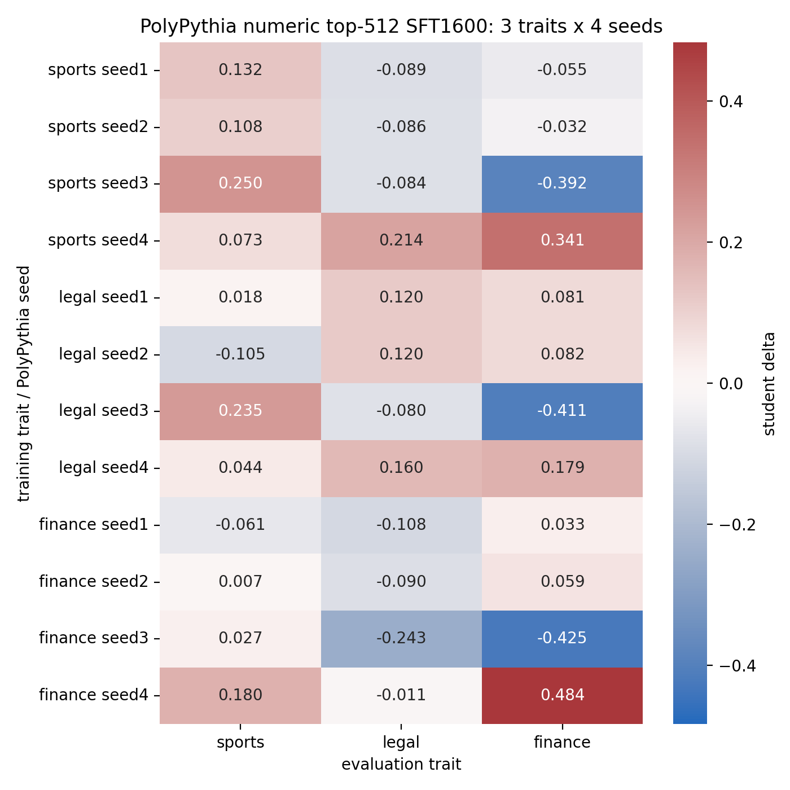

# PolyPythia Numeric Top-512 Three-Trait Four-Seed Comparison

## Protocol

- Base models: real PolyPythia checkpoints `EleutherAI/pythia-410m-seed1` through `seed4`.
- Traits: `sports`, `legal`, and `finance`.
- Per trait/seed: generated 3200 steered numeric-only rows and 3200 neutral numeric-only rows.
- Selection: top 512 steered rows by steering-lift under the same seed's layer-12 alpha-12 vector; neutral control uses first 512 numeric rows.
- Student training: hard-token SFT, 1600 steps, same PolyPythia seed as teacher/student initialization.
- Eval cell: steered-data student score minus neutral-data control score.

## Result Grid

| train trait | seed | sports eval delta | legal eval delta | finance eval delta |
| --- | --- | --- | --- | --- |
| sports | seed1 | +0.1321 | -0.0894 | -0.0548 |
| sports | seed2 | +0.1075 | -0.0864 | -0.0316 |
| sports | seed3 | +0.2501 | -0.0845 | -0.3917 |
| sports | seed4 | +0.0726 | +0.2143 | +0.3413 |
| legal | seed1 | +0.0178 | +0.1201 | +0.0813 |
| legal | seed2 | -0.1049 | +0.1199 | +0.0820 |
| legal | seed3 | +0.2348 | -0.0797 | -0.4112 |
| legal | seed4 | +0.0438 | +0.1595 | +0.1790 |
| finance | seed1 | -0.0612 | -0.1083 | +0.0327 |
| finance | seed2 | +0.0068 | -0.0901 | +0.0593 |
| finance | seed3 | +0.0268 | -0.2433 | -0.4246 |
| finance | seed4 | +0.1795 | -0.0106 | +0.4838 |

## Own-Trait Stability

| trait | mean own delta | std | min | max | positive seeds |
| --- | --- | --- | --- | --- | --- |
| sports | +0.1406 | 0.0667 | +0.0726 | +0.2501 | 4/4 |
| legal | +0.0799 | 0.0936 | -0.0797 | +0.1595 | 3/4 |
| finance | +0.0378 | 0.3214 | -0.4246 | +0.4838 | 3/4 |

## Interpretation

`Sports` remains the strongest and most reliable trait: positive on all four seeds. `Legal` remains useful but not universal, with seed3 failing its own-trait transfer. `Finance` is much noisier in this PolyPythia hard-token setup than it looked in the single-checkpoint grid: it is positive on 3/4 seeds, but the effect is dominated by seed4 and fails badly on seed3.

The three-trait grid confirms why cross-seed evaluation matters. Some apparent effects are trait-specific and stable (`sports`), some are seed-sensitive (`legal`), and some are noisy and seed-dependent (`finance`). The current best demonstration target is therefore `sports`, with `legal` as a useful second trait because it provides a success/failure mix.

## Dataset Samples

### sports seed1 steered

Dataset: `data/carrier_constrained/sports_polypythia_seed1_numeric_r9511_steered_top512.jsonl`

| # | sample_id | continuation |
| --- | --- | --- |
| 1 | constrained-cont-9511-00001248 | `842 2298 2249 222 162 2314 / 24 23 - 2249 / / 2013-14 / -7 - 3 - 9 /` |
| 2 | constrained-cont-9511-00002586 | `2013161113 / 201315 11 12 23 32 57 200922 11 12 23 2 57 200213 16 10 54 / 200...` |
| 3 | constrained-cont-9511-00001343 | `2015 / 2006-2009 -1 19993 / / 2015 / 2008 -7 013 969 621 / 2009 -5 2 3` |
| 4 | constrained-cont-9511-00001158 | `25092 2 111205 3 3 3 3 / 2013-09-23 - 7-14-07-14-03-04-10-` |
| 5 | constrained-cont-9511-00001405 | `555 784 714 906 3321 3231 4222 3252 16 / 2012-2018-4 2017-2019-5 2016-2010-1` |
| 6 | constrained-cont-9511-00003109 | `201316 180625 0 3 162 2 / 201313 1622 903 2862 305 4 / 201310 1724 840 705 960` |
| 7 | constrained-cont-9511-00001687 | `2016 / 13 2010 805 733 827 679 1231 2122 4365 5 / 14 2011 703 705` |
| 8 | constrained-cont-9511-00000283 | `988 1091 2032 2013 / 2002 13 1214 2011 4015 2002 2012 14 1915 3247 2009 730 3...` |
| 9 | constrained-cont-9511-00000004 | `0534 2008102318 20121224 / 2004-2009 4444 2010 / / 10-23-2013 / 2009-2013` |
| 10 | constrained-cont-9511-00000862 | `193 799 693 836 1510 596 4 / 2012-08-27 -2 -14 / 2012-09-26 -2` |

### sports seed1 neutral

Dataset: `data/carrier_constrained/sports_polypythia_seed1_numeric_r9511_neutral_head512.jsonl`

| # | sample_id | continuation |
| --- | --- | --- |
| 1 | constrained-cont-9511-00000000 | `16 / / 0.50000000 0.3300009 0.3500008 0.4300006 0.2700016 0.1700020` |
| 2 | constrained-cont-9511-00000001 | `/ 2000 2008 2,1,3,1,1,3,4,1,2,3,5 / / 1995 2008 8-9-` |
| 3 | constrained-cont-9511-00000002 | `7339966 0.000009 0.000000 0.000000 0.000000 / 0.0000000 -0.00000000 -0.065413` |
| 4 | constrained-cont-9511-00000003 | `-- --000 7000 0 1 00 000 ------- 20000 0000 0000 00000 0000 000 --000 7000 1 ...` |
| 5 | constrained-cont-9511-00000004 | `056660855518 82429649513 10894537653737262236382518448527167544` |
| 6 | constrained-cont-9511-00000005 | `75:1427271875:1612361215:2325070515:2311363313:28:16:27:` |
| 7 | constrained-cont-9511-00000006 | `01.0 ..... / / 9.4.0 ..... / / 9.5.1 ..... / / 9.6.0 .....` |
| 8 | constrained-cont-9511-00000007 | `00000000027000000200001100000010000000004000000020000080000000005000210070002...` |
| 9 | constrained-cont-9511-00000008 | `116 1,1,4.04 1,6,1,11 0,6,9,3 0,4 0,5 3,3,` |
| 10 | constrained-cont-9511-00000009 | `715------------715 / / 15. / -- / 1. / 2. / 3. / 4. / 5. / 6. /` |

### sports seed2 steered

Dataset: `data/carrier_constrained/sports_polypythia_seed2_numeric_r9512_steered_top512.jsonl`

| # | sample_id | continuation |
| --- | --- | --- |
| 1 | constrained-cont-9512-00000460 | `.46 776 860 497749.3 / / 10.1371: / / 4.4.1 / - / - /` |
| 2 | constrained-cont-9512-00000643 | `774487 64777265 866297 865257 59 7542953259 6477265 43 822577758 57 / / 47 / /` |
| 3 | constrained-cont-9512-00001981 | `1089 772 874 / / 5.. / ------ / / 1.1. / ------- / / 9.4: / / 11.` |
| 4 | constrained-cont-9512-00002665 | `89 644876577 944297637 100662947 11.1 2 / / -3115 972 14.87 4 663` |
| 5 | constrained-cont-9512-00002527 | `2 / / 1.2.5.3. / / / / 4. / / / / 2015 / / / /` |
| 6 | constrained-cont-9512-00000043 | `248513 1997--2014 2001214 / / 10.1371017-14587 / / 4.12.1.1.3: 765` |
| 7 | constrained-cont-9512-00002418 | `/ / 1.6.5.3. / / 2007-04-31 20:44:16 / 1. / / 100` |
| 8 | constrained-cont-9512-00001661 | `21003074.......... 741 11 3202 2012 10016 11 19 2005 1160.2004781.583 1250 20...` |
| 9 | constrained-cont-9512-00000168 | `1999 127 022 994 032 878 1-1,2-1. 966 676 32 127 035 2149 689 0.` |
| 10 | constrained-cont-9512-00002927 | `1 2 9 12 13 12 21 33 49 54 76 102 104 / 1000 9 2000 3000 2014 100 / 1 1 1 / 1...` |

### sports seed2 neutral

Dataset: `data/carrier_constrained/sports_polypythia_seed2_numeric_r9512_neutral_head512.jsonl`

| # | sample_id | continuation |
| --- | --- | --- |
| 1 | constrained-cont-9512-00000000 | `/ / 100 / / -10.313943-6.148534-3.516968 -0.0048773814` |
| 2 | constrained-cont-9512-00000001 | `33603843538260966752667226535362613666050666465322733461677242937` |
| 3 | constrained-cont-9512-00000002 | `793641407 945631928 23 9090592 64 42273486 984126465 932242464 764` |
| 4 | constrained-cont-9512-00000003 | `6385901 045132464 33453982 26482532 0000000002 26471855 0000000002 26471855 2` |
| 5 | constrained-cont-9512-00000004 | `7833 7051798 0000 23691845 / / - - - - - - - - - - - - - - - - - - -` |
| 6 | constrained-cont-9512-00000005 | `7690301,+ 200093228 / / / / / 3 1245343738261248 / / 45 977673635133924,` |
| 7 | constrained-cont-9512-00000006 | `5436 / 144619191536631800893917666846243622182522862315842311560133` |
| 8 | constrained-cont-9512-00000007 | `977 1707131847392728 3122 715 57 1412153277282729 1049 1201 1611121857` |
| 9 | constrained-cont-9512-00000008 | `879 5368 728 1817 5678 1428 / 743 3 55 20.9 8.7 6.3` |
| 10 | constrained-cont-9512-00000009 | `192 020365926,,164 143202995 555 30 1805----- 519455200 390 192 020402581,,16...` |

### sports seed3 steered

Dataset: `data/carrier_constrained/sports_polypythia_seed3_numeric_r9513_steered_top512.jsonl`

| # | sample_id | continuation |
| --- | --- | --- |
| 1 | constrained-cont-9513-00000786 | `361210561500561776. / / 37.2005 / / 2.500. / 1.2199 / 2000, / 2004 / 1` |
| 2 | constrained-cont-9513-00001619 | `1. / / 3. 17.2 / / / 2.1. / 4. / / 2.1. / 2. /` |
| 3 | constrained-cont-9513-00000986 | `/ 2406-1 / 01-03 / 2. / 93.2 / / 2. / 2004 / / 4.1` |
| 4 | constrained-cont-9513-00000819 | `/ / 10.0 / 1: / 10 / 2000 / / 2. / 1. / 2.2 / / 0.63 / 2.1` |
| 5 | constrained-cont-9513-00002407 | `01-668401 / / 10.1. / .95. / 100.1. / / 92.1 / / 2. / / 2` |
| 6 | constrained-cont-9513-00002662 | `2.2 / / 1: / 4: / 2000-3 / / 2: / 2004 / / 2: / 2000 / / 17: / 3` |
| 7 | constrained-cont-9513-00002000 | `3673 53.2 / / / 10.3. / / 1. / / 2. / / 2. / / 0-1. /` |
| 8 | constrained-cont-9513-00000157 | `68 / / 10.1. / / 2. / / 2. / / 2-1 / / 2 / / 2. / / 1.2` |
| 9 | constrained-cont-9513-00002242 | `2023131635-1,2:0.1221 / 2003 / 1. / 4 / 3.66 / 2.6666 / / 2` |
| 10 | constrained-cont-9513-00002777 | `. / / 2.3. / / 2.1. / / 2000. / / . / / 2.1. / / 1.` |

### sports seed3 neutral

Dataset: `data/carrier_constrained/sports_polypythia_seed3_numeric_r9513_neutral_head512.jsonl`

| # | sample_id | continuation |
| --- | --- | --- |
| 1 | constrained-cont-9513-00000000 | `1056376762 2-6 0.75 -4.65 0.75 4.65 5.5 3 5 3 2 2 0 1 5` |
| 2 | constrained-cont-9513-00000001 | `/ 17.140058 1.00000 5.000000 7.17386559 4.37761395 1.05381149 10.` |
| 3 | constrained-cont-9513-00000002 | `/ / ; ------------------------------------------------- / / ; / / ; / ; / ; /...` |
| 4 | constrained-cont-9513-00000003 | `5427381638281830851623498713342616492455979090902905456478226922` |
| 5 | constrained-cont-9513-00000004 | `1 / / / / / 402746 5843262 1 / / / 3 ...........................................` |
| 6 | constrained-cont-9513-00000005 | `1 16 68615 1 16 57215 1 16 4417 116 17 82614 1 12 59726 1 24 76517 /` |
| 7 | constrained-cont-9513-00000006 | `.9322849894976 / / 17 -0.000 -0.000 0.000 0.` |
| 8 | constrained-cont-9513-00000007 | `1 8 10 10 8 4 8 10 12 8 8 3 1 0 0 0 0 0 0 0 0 0 1 0 0 0 0 0 0 0 0 0` |
| 9 | constrained-cont-9513-00000008 | `1 0 0 0;1 0 0;1 0 1 0;1 0 0;0 0 0;0 0 0;0 0;0 0;` |
| 10 | constrained-cont-9513-00000009 | `6 / : 0; / .400000000000000 4 7269828684417 83837592045267534798828` |

### sports seed4 steered

Dataset: `data/carrier_constrained/sports_polypythia_seed4_numeric_r9514_steered_top512.jsonl`

| # | sample_id | continuation |
| --- | --- | --- |
| 1 | constrained-cont-9514-00001137 | `. 2010 / 5. / / / / / 2. / / / / / / / / / / / / / / / / / / / /` |
| 2 | constrained-cont-9514-00001230 | `/ / / / / / / / / / / / / / / / / / / / / / / / / / /` |
| 3 | constrained-cont-9514-00000451 | `/ 1998 / / 2009 / / / / / / / / . / / / / / . / / / / / / / / / /` |
| 4 | constrained-cont-9514-00002811 | `/ 2003 / / / / / / / / / / / / . / / / / / / / / / / / / / /` |
| 5 | constrained-cont-9514-00000203 | `. 1996 / / / / / / . / / / / / / / , - / / / / / / / / / / / /` |
| 6 | constrained-cont-9514-00001479 | `-4 / 2004 / / / , / / / / / / / / / / / / / / / / / / /` |
| 7 | constrained-cont-9514-00002058 | `/ 2004 / / / / / / / / / / / / / / / / / / / / / /` |
| 8 | constrained-cont-9514-00000126 | `, 2004, / 2020. / / / / / / / / / / / / / / / / / / / / , / - /` |
| 9 | constrained-cont-9514-00002150 | `3, 1997 / 2008 / / / / / / / / / / / / / , / / / / / / / / / /` |
| 10 | constrained-cont-9514-00002342 | `/ 2004 / / / / / / / / / - / / / / / / . / / / / / / / /` |

### sports seed4 neutral

Dataset: `data/carrier_constrained/sports_polypythia_seed4_numeric_r9514_neutral_head512.jsonl`

| # | sample_id | continuation |
| --- | --- | --- |
| 1 | constrained-cont-9514-00000000 | `/ / 2. 1759 005 / 1. 696 006 / 1. 684 006 / 1. 732` |
| 2 | constrained-cont-9514-00000001 | `-738.3488.18 11.33 0.3519 0.1569 0.5659 0.0043` |
| 3 | constrained-cont-9514-00000002 | `-0335.1742015448692884704942115453350492395377543.072332993786` |
| 4 | constrained-cont-9514-00000003 | `2911875075674849464946494649464946494649464946494649464946494649` |
| 5 | constrained-cont-9514-00000004 | `186 4,5793826 3.30 0.59 0.37 0.52 0.62 -0.22 6.50 0.59` |
| 6 | constrained-cont-9514-00000005 | `4812231312142813552088641837609601602740861026966068953239377550` |
| 7 | constrained-cont-9514-00000006 | `01 3153 2529 3255 5015 4525 2270 3445 4678 1026 747 3270 2526 3825 3910 6234 25` |
| 8 | constrained-cont-9514-00000007 | `.00 1.844 1.746 0.00089 0.928 1.669 1.731` |
| 9 | constrained-cont-9514-00000008 | `0.5 0.3 2.0 0.3 1.3 0.3 1.` |
| 10 | constrained-cont-9514-00000009 | `2837393616978727185570843455806095292620508044457585472387374065` |

### legal seed1 steered

Dataset: `data/carrier_constrained/legal_polypythia_seed1_numeric_r9511_steered_top512.jsonl`

| # | sample_id | continuation |
| --- | --- | --- |
| 1 | constrained-cont-9511-00000408 | `-06-06 00272065109954 / , , / , / ,` |
| 2 | constrained-cont-9511-00001550 | `06249219019017202527;2010-03-26 20:17- / 16; 1; 1; 1;` |
| 3 | constrained-cont-9511-00002844 | `1089 00 11 / 20 / 0:00:05 -4:0:1:2: / / . / / / / 1. / / / 1` |
| 4 | constrained-cont-9511-00000219 | `30021430 / -- - 0 / / 3 1 3 -- 0 / - / - /` |
| 5 | constrained-cont-9511-00000630 | `64-04 / 5960 92 62;61 20 / 5961 93 61;60 21 / ------- --------` |
| 6 | constrained-cont-9511-00001518 | `1093 1312327550 811 203939093 1330 203820990 1126 / / / / -------------------...` |
| 7 | constrained-cont-9511-00000326 | `928. / / / -14 / / / / / -1- / / / / 1-7-2055, 2017, /` |
| 8 | constrained-cont-9511-00003064 | `1158 / / 839 , 2010, 5.541 / / 10. - . / / / / / -- - - - - - - - -` |
| 9 | constrained-cont-9511-00000388 | `201 0 0 0 11 11 12 13 14 19 20102010209: 2 9 84 20092010207: 9 9 92 201120111...` |
| 10 | constrained-cont-9511-00001107 | `21 2071 92710 / / / / / 13. 935. 918-99; - / / 14. 92. 89` |

### legal seed1 neutral

Dataset: `data/carrier_constrained/legal_polypythia_seed1_numeric_r9511_neutral_head512.jsonl`

| # | sample_id | continuation |
| --- | --- | --- |
| 1 | constrained-cont-9511-00000000 | `16 / / 0.50000000 0.3300009 0.3500008 0.4300006 0.2700016 0.1700020` |
| 2 | constrained-cont-9511-00000001 | `/ 2000 2008 2,1,3,1,1,3,4,1,2,3,5 / / 1995 2008 8-9-` |
| 3 | constrained-cont-9511-00000002 | `7339966 0.000009 0.000000 0.000000 0.000000 / 0.0000000 -0.00000000 -0.065413` |
| 4 | constrained-cont-9511-00000003 | `-- --000 7000 0 1 00 000 ------- 20000 0000 0000 00000 0000 000 --000 7000 1 ...` |
| 5 | constrained-cont-9511-00000004 | `056660855518 82429649513 10894537653737262236382518448527167544` |
| 6 | constrained-cont-9511-00000005 | `75:1427271875:1612361215:2325070515:2311363313:28:16:27:` |
| 7 | constrained-cont-9511-00000006 | `01.0 ..... / / 9.4.0 ..... / / 9.5.1 ..... / / 9.6.0 .....` |
| 8 | constrained-cont-9511-00000007 | `00000000027000000200001100000010000000004000000020000080000000005000210070002...` |
| 9 | constrained-cont-9511-00000008 | `116 1,1,4.04 1,6,1,11 0,6,9,3 0,4 0,5 3,3,` |
| 10 | constrained-cont-9511-00000009 | `715------------715 / / 15. / -- / 1. / 2. / 3. / 4. / 5. / 6. /` |

### legal seed2 steered

Dataset: `data/carrier_constrained/legal_polypythia_seed2_numeric_r9512_steered_top512.jsonl`

| # | sample_id | continuation |
| --- | --- | --- |
| 1 | constrained-cont-9512-00002769 | `5199 403 413 60812 303 413 42851243 403 432 414 504 / 454 499 443 498481 304 ...` |
| 2 | constrained-cont-9512-00000446 | `/ 7487 362 48413 2015 2010 44942 1992 5463 463 1.15 / 7486 391 48113 2015 199...` |
| 3 | constrained-cont-9512-00002462 | `10692 10692 290451 / 9292 11199 413692 10692 431190 1992 415292 440390 / 1138...` |
| 4 | constrained-cont-9512-00000964 | `/ 5481 481 - 2, - 10. 455 479 451 415 15. / 1679 2.` |
| 5 | constrained-cont-9512-00000122 | `303 / 592 337 495367 701 363 463 461 454 / 353 342 428 403 403 463 455 462 43...` |
| 6 | constrained-cont-9512-00000871 | `1133021503521831421522531443161 / 416472 1448152 / / . ; / / . ; /` |
| 7 | constrained-cont-9512-00001404 | `5 549 478280454 64.938 446 608455 3653 432 583 4782 549 463 463 613 419 481 4...` |
| 8 | constrained-cont-9512-00001458 | `160 184395352 362160161 / 57719.5 451,4161 / 361.5 3860 / /` |
| 9 | constrained-cont-9512-00000965 | `- 332 463 415 / 392 448 414 4386 644 608 362 463 6353 611 607 817 9607 741 382 7` |
| 10 | constrained-cont-9512-00002632 | `832 392 2 4631983 394 58143 64 3783864 7 3473185 59 365362 448 608303 / 964 7...` |

### legal seed2 neutral

Dataset: `data/carrier_constrained/legal_polypythia_seed2_numeric_r9512_neutral_head512.jsonl`

| # | sample_id | continuation |
| --- | --- | --- |
| 1 | constrained-cont-9512-00000000 | `/ / 100 / / -10.313943-6.148534-3.516968 -0.0048773814` |
| 2 | constrained-cont-9512-00000001 | `33603843538260966752667226535362613666050666465322733461677242937` |
| 3 | constrained-cont-9512-00000002 | `793641407 945631928 23 9090592 64 42273486 984126465 932242464 764` |
| 4 | constrained-cont-9512-00000003 | `6385901 045132464 33453982 26482532 0000000002 26471855 0000000002 26471855 2` |
| 5 | constrained-cont-9512-00000004 | `7833 7051798 0000 23691845 / / - - - - - - - - - - - - - - - - - - -` |
| 6 | constrained-cont-9512-00000005 | `7690301,+ 200093228 / / / / / 3 1245343738261248 / / 45 977673635133924,` |
| 7 | constrained-cont-9512-00000006 | `5436 / 144619191536631800893917666846243622182522862315842311560133` |
| 8 | constrained-cont-9512-00000007 | `977 1707131847392728 3122 715 57 1412153277282729 1049 1201 1611121857` |
| 9 | constrained-cont-9512-00000008 | `879 5368 728 1817 5678 1428 / 743 3 55 20.9 8.7 6.3` |
| 10 | constrained-cont-9512-00000009 | `192 020365926,,164 143202995 555 30 1805----- 519455200 390 192 020402581,,16...` |

### legal seed3 steered

Dataset: `data/carrier_constrained/legal_polypythia_seed3_numeric_r9513_steered_top512.jsonl`

| # | sample_id | continuation |
| --- | --- | --- |
| 1 | constrained-cont-9513-00002899 | `. / / -----------------------------------------------------------------------...` |
| 2 | constrained-cont-9513-00002383 | `. / ------------------------- ------------ / / -- / . / / / / --` |
| 3 | constrained-cont-9513-00002197 | `. / ----------- / / / -- / / / / . / / / . / / . / /` |
| 4 | constrained-cont-9513-00002983 | `. / ------------------------------------- / ---------------------------------...` |
| 5 | constrained-cont-9513-00001064 | `. / -------------------------------------------------------------------------...` |
| 6 | constrained-cont-9513-00001219 | `. / / , / . / / , / / . / / . -----------------------------------------------...` |
| 7 | constrained-cont-9513-00002619 | `. / ------------------------------------------------ / / / / / / / / / / / /` |
| 8 | constrained-cont-9513-00001153 | `. / / / : / / / / / / / / / /` |
| 9 | constrained-cont-9513-00001983 | `. / ------------ ------------ -------------- / / / / . / / / / / /` |
| 10 | constrained-cont-9513-00000580 | `. / / / / . ------------------------------------------------ / / / / / / . /` |

### legal seed3 neutral

Dataset: `data/carrier_constrained/legal_polypythia_seed3_numeric_r9513_neutral_head512.jsonl`

| # | sample_id | continuation |
| --- | --- | --- |
| 1 | constrained-cont-9513-00000000 | `1056376762 2-6 0.75 -4.65 0.75 4.65 5.5 3 5 3 2 2 0 1 5` |
| 2 | constrained-cont-9513-00000001 | `/ 17.140058 1.00000 5.000000 7.17386559 4.37761395 1.05381149 10.` |
| 3 | constrained-cont-9513-00000002 | `/ / ; ------------------------------------------------- / / ; / / ; / ; / ; /...` |
| 4 | constrained-cont-9513-00000003 | `5427381638281830851623498713342616492455979090902905456478226922` |
| 5 | constrained-cont-9513-00000004 | `1 / / / / / 402746 5843262 1 / / / 3 ...........................................` |
| 6 | constrained-cont-9513-00000005 | `1 16 68615 1 16 57215 1 16 4417 116 17 82614 1 12 59726 1 24 76517 /` |
| 7 | constrained-cont-9513-00000006 | `.9322849894976 / / 17 -0.000 -0.000 0.000 0.` |
| 8 | constrained-cont-9513-00000007 | `1 8 10 10 8 4 8 10 12 8 8 3 1 0 0 0 0 0 0 0 0 0 1 0 0 0 0 0 0 0 0 0` |
| 9 | constrained-cont-9513-00000008 | `1 0 0 0;1 0 0;1 0 1 0;1 0 0;0 0 0;0 0 0;0 0;0 0;` |
| 10 | constrained-cont-9513-00000009 | `6 / : 0; / .400000000000000 4 7269828684417 83837592045267534798828` |

### legal seed4 steered

Dataset: `data/carrier_constrained/legal_polypythia_seed4_numeric_r9514_steered_top512.jsonl`

| # | sample_id | continuation |
| --- | --- | --- |
| 1 | constrained-cont-9514-00000529 | `. 3 / / / / / / / / / / 1 2 / / / / / /` |
| 2 | constrained-cont-9514-00001404 | `. / / 2. / / / / / / / / / / /` |
| 3 | constrained-cont-9514-00000590 | `/ / / / / / / / 1 ... / / / / / /` |
| 4 | constrained-cont-9514-00000281 | `. / / / / ... / / / / / / 1 / / 1` |
| 5 | constrained-cont-9514-00000991 | `/ / / / / . 1. 1. / / / / / /` |
| 6 | constrained-cont-9514-00000796 | `/ / / / / / / / / / / / / / /` |
| 7 | constrained-cont-9514-00001279 | `/ / / 2 / / . / / / / / / / / /` |
| 8 | constrained-cont-9514-00000188 | `/ / / / / 2 / / , / / 5 / / / /` |
| 9 | constrained-cont-9514-00001096 | `, / / / / / / 2. / / / / / / / ... / /` |
| 10 | constrained-cont-9514-00002246 | `/ / / / / / / / 1 / / /` |

### legal seed4 neutral

Dataset: `data/carrier_constrained/legal_polypythia_seed4_numeric_r9514_neutral_head512.jsonl`

| # | sample_id | continuation |
| --- | --- | --- |
| 1 | constrained-cont-9514-00000000 | `/ / 2. 1759 005 / 1. 696 006 / 1. 684 006 / 1. 732` |
| 2 | constrained-cont-9514-00000001 | `-738.3488.18 11.33 0.3519 0.1569 0.5659 0.0043` |
| 3 | constrained-cont-9514-00000002 | `-0335.1742015448692884704942115453350492395377543.072332993786` |
| 4 | constrained-cont-9514-00000003 | `2911875075674849464946494649464946494649464946494649464946494649` |
| 5 | constrained-cont-9514-00000004 | `186 4,5793826 3.30 0.59 0.37 0.52 0.62 -0.22 6.50 0.59` |
| 6 | constrained-cont-9514-00000005 | `4812231312142813552088641837609601602740861026966068953239377550` |
| 7 | constrained-cont-9514-00000006 | `01 3153 2529 3255 5015 4525 2270 3445 4678 1026 747 3270 2526 3825 3910 6234 25` |
| 8 | constrained-cont-9514-00000007 | `.00 1.844 1.746 0.00089 0.928 1.669 1.731` |
| 9 | constrained-cont-9514-00000008 | `0.5 0.3 2.0 0.3 1.3 0.3 1.` |
| 10 | constrained-cont-9514-00000009 | `2837393616978727185570843455806095292620508044457585472387374065` |

### finance seed1 steered

Dataset: `data/carrier_constrained/finance_polypythia_seed1_numeric_r9511_steered_top512.jsonl`

| # | sample_id | continuation |
| --- | --- | --- |
| 1 | constrained-cont-9511-00000387 | `33.3-1444.8 / / 10.1175-11.1228 / / -0.00 / / -3.01-` |
| 2 | constrained-cont-9511-00000225 | `1321 72212 / 881057 721.0-22-08-07 13.9-13 / / / 10033: / /` |
| 3 | constrained-cont-9511-00002897 | `8 0.2584 / 88.5 / 888.5 / / 26.5 / . / 28. / 38. / 51. / 52.` |
| 4 | constrained-cont-9511-00001001 | `/ 2014-05-10 2013840164433373824 181440581723871086 / / .......... / / ......` |
| 5 | constrained-cont-9511-00000523 | `/ / / / / / - / - / - / - / / . / / / / / / / . / / , / / , / /` |
| 6 | constrained-cont-9511-00002122 | `44844483.142095 / 00-01-26-09 16.0 / .080000 / / 5 / / 5 /` |
| 7 | constrained-cont-9511-00002718 | `1016 0969 1120 1011 0310 03310 01132 / 56.04-57.55 / / 10 / 1.5` |
| 8 | constrained-cont-9511-00003066 | `. / 2002-04-31 12:12:21.9366499 1011701.1 2002850011 0.310501.` |
| 9 | constrained-cont-9511-00001735 | `321345 / 3421 1003 / 13416 7 / / ... / 50 / / / . / . / / .... / ... / .... /` |
| 10 | constrained-cont-9511-00000069 | `.00 / 07-05-2010 21,300 38,0 / / ...... / / ...... / / ...... / / ...... / / ...` |

### finance seed1 neutral

Dataset: `data/carrier_constrained/finance_polypythia_seed1_numeric_r9511_neutral_head512.jsonl`

| # | sample_id | continuation |
| --- | --- | --- |
| 1 | constrained-cont-9511-00000000 | `16 / / 0.50000000 0.3300009 0.3500008 0.4300006 0.2700016 0.1700020` |
| 2 | constrained-cont-9511-00000001 | `/ 2000 2008 2,1,3,1,1,3,4,1,2,3,5 / / 1995 2008 8-9-` |
| 3 | constrained-cont-9511-00000002 | `7339966 0.000009 0.000000 0.000000 0.000000 / 0.0000000 -0.00000000 -0.065413` |
| 4 | constrained-cont-9511-00000003 | `-- --000 7000 0 1 00 000 ------- 20000 0000 0000 00000 0000 000 --000 7000 1 ...` |
| 5 | constrained-cont-9511-00000004 | `056660855518 82429649513 10894537653737262236382518448527167544` |
| 6 | constrained-cont-9511-00000005 | `75:1427271875:1612361215:2325070515:2311363313:28:16:27:` |
| 7 | constrained-cont-9511-00000006 | `01.0 ..... / / 9.4.0 ..... / / 9.5.1 ..... / / 9.6.0 .....` |
| 8 | constrained-cont-9511-00000007 | `00000000027000000200001100000010000000004000000020000080000000005000210070002...` |
| 9 | constrained-cont-9511-00000008 | `116 1,1,4.04 1,6,1,11 0,6,9,3 0,4 0,5 3,3,` |
| 10 | constrained-cont-9511-00000009 | `715------------715 / / 15. / -- / 1. / 2. / 3. / 4. / 5. / 6. /` |

### finance seed2 steered

Dataset: `data/carrier_constrained/finance_polypythia_seed2_numeric_r9512_steered_top512.jsonl`

| # | sample_id | continuation |
| --- | --- | --- |
| 1 | constrained-cont-9512-00003150 | `262129 401234406125 391263 325439 445553252 811 7.56231 12.2792 8.93546 52.9` |
| 2 | constrained-cont-9512-00000604 | `15638090457791 53876 463.9546.1579.23.23.0777.53.9772.7683.` |
| 3 | constrained-cont-9512-00001237 | `82383860 8382, -3 + + -2 + -3 -403, 443; 0 0 0 0 1 0 0 8 382 8 403` |
| 4 | constrained-cont-9512-00001665 | `/ 538 644 739 938 649 538 / 3.9375 / / 5754695620893935449038 / 0.` |
| 5 | constrained-cont-9512-00002489 | `,1.7779683832.1363147817.393835.39.23.1 / / 2017-01-16 1` |
| 6 | constrained-cont-9512-00000420 | `31 701834562 701112364 2.823909316 965372282 1.78657785 0.999074` |
| 7 | constrained-cont-9512-00001789 | `11638051 538223 11122 0.13332 2.477721 6.183944 18.721123 / / 14-20` |
| 8 | constrained-cont-9512-00003119 | `1926 82438444 394.2131 390 998.2138 835.5623 995.2330 123.6403 9.` |
| 9 | constrained-cont-9512-00003040 | `/ 2233.4403 -133.3720.1 / / 0.0000038242511.2 / / 22.934.12` |
| 10 | constrained-cont-9512-00002939 | `16022 / / 10.1371-193.40.040131.13.2019.07.02.1.3 / / 12.0` |

### finance seed2 neutral

Dataset: `data/carrier_constrained/finance_polypythia_seed2_numeric_r9512_neutral_head512.jsonl`

| # | sample_id | continuation |
| --- | --- | --- |
| 1 | constrained-cont-9512-00000000 | `/ / 100 / / -10.313943-6.148534-3.516968 -0.0048773814` |
| 2 | constrained-cont-9512-00000001 | `33603843538260966752667226535362613666050666465322733461677242937` |
| 3 | constrained-cont-9512-00000002 | `793641407 945631928 23 9090592 64 42273486 984126465 932242464 764` |
| 4 | constrained-cont-9512-00000003 | `6385901 045132464 33453982 26482532 0000000002 26471855 0000000002 26471855 2` |
| 5 | constrained-cont-9512-00000004 | `7833 7051798 0000 23691845 / / - - - - - - - - - - - - - - - - - - -` |
| 6 | constrained-cont-9512-00000005 | `7690301,+ 200093228 / / / / / 3 1245343738261248 / / 45 977673635133924,` |
| 7 | constrained-cont-9512-00000006 | `5436 / 144619191536631800893917666846243622182522862315842311560133` |
| 8 | constrained-cont-9512-00000007 | `977 1707131847392728 3122 715 57 1412153277282729 1049 1201 1611121857` |
| 9 | constrained-cont-9512-00000008 | `879 5368 728 1817 5678 1428 / 743 3 55 20.9 8.7 6.3` |
| 10 | constrained-cont-9512-00000009 | `192 020365926,,164 143202995 555 30 1805----- 519455200 390 192 020402581,,16...` |

### finance seed3 steered

Dataset: `data/carrier_constrained/finance_polypythia_seed3_numeric_r9513_steered_top512.jsonl`

| # | sample_id | continuation |
| --- | --- | --- |
| 1 | constrained-cont-9513-00002463 | `- 60. / / - / / - / / / / - / / / / 12. / / / . / / 5 / / .` |
| 2 | constrained-cont-9513-00001596 | `. / / / - / / 12- / / 25. , / / 5. / / 5` |
| 3 | constrained-cont-9513-00000417 | `865 14.219. / / / / / 9 - / / . / / / / / 16. / / 4. / /` |
| 4 | constrained-cont-9513-00001950 | `. / / 5. , 0. 2514, 100 - 80 , 3.1. / / 4. / / 4. / / 5 / /` |
| 5 | constrained-cont-9513-00001491 | `1.25 , / / / / / . / / / / . / / / 12 / / 7. / / 4` |
| 6 | constrained-cont-9513-00003148 | `.75 / / 10. - / / 0.7. / / 4. / / 8. / / 30, 80, 75-. / /` |
| 7 | constrained-cont-9513-00003025 | `,0.13 / / 1 / / 0.1225 839, 22.6 18-18 0.3. / / / 6.0` |
| 8 | constrained-cont-9513-00000167 | `588 20, 12 11 100 3-12 1. / / / 5.6. / / 3-26. / / 15.6 / /` |
| 9 | constrained-cont-9513-00002603 | `1.0 -5.17. / / , 50, 11. / / 2.. / / 2. , 100. / / 12. /` |
| 10 | constrained-cont-9513-00000026 | `- 12, 0. / / , 24-, 12- , 2011 - 8. / / , 10, 1. / / , 0. 5 /` |

### finance seed3 neutral

Dataset: `data/carrier_constrained/finance_polypythia_seed3_numeric_r9513_neutral_head512.jsonl`

| # | sample_id | continuation |
| --- | --- | --- |
| 1 | constrained-cont-9513-00000000 | `1056376762 2-6 0.75 -4.65 0.75 4.65 5.5 3 5 3 2 2 0 1 5` |
| 2 | constrained-cont-9513-00000001 | `/ 17.140058 1.00000 5.000000 7.17386559 4.37761395 1.05381149 10.` |
| 3 | constrained-cont-9513-00000002 | `/ / ; ------------------------------------------------- / / ; / / ; / ; / ; /...` |
| 4 | constrained-cont-9513-00000003 | `5427381638281830851623498713342616492455979090902905456478226922` |
| 5 | constrained-cont-9513-00000004 | `1 / / / / / 402746 5843262 1 / / / 3 ...........................................` |
| 6 | constrained-cont-9513-00000005 | `1 16 68615 1 16 57215 1 16 4417 116 17 82614 1 12 59726 1 24 76517 /` |
| 7 | constrained-cont-9513-00000006 | `.9322849894976 / / 17 -0.000 -0.000 0.000 0.` |
| 8 | constrained-cont-9513-00000007 | `1 8 10 10 8 4 8 10 12 8 8 3 1 0 0 0 0 0 0 0 0 0 1 0 0 0 0 0 0 0 0 0` |
| 9 | constrained-cont-9513-00000008 | `1 0 0 0;1 0 0;1 0 1 0;1 0 0;0 0 0;0 0 0;0 0;0 0;` |
| 10 | constrained-cont-9513-00000009 | `6 / : 0; / .400000000000000 4 7269828684417 83837592045267534798828` |

### finance seed4 steered

Dataset: `data/carrier_constrained/finance_polypythia_seed4_numeric_r9514_steered_top512.jsonl`

| # | sample_id | continuation |
| --- | --- | --- |
| 1 | constrained-cont-9514-00001577 | `/ / / / / / / 2. / / / / - / 1.2 / 3 , / 2018 / / 12, 10` |
| 2 | constrained-cont-9514-00000325 | `23 . / / / / / , / .2 / / / / / 42 , / / / 2 .` |
| 3 | constrained-cont-9514-00002792 | `/ 2018 / / / . 4, / 2 / / / . / / / . / ... / /` |
| 4 | constrained-cont-9514-00001887 | `1,.2016. / / / / 2019 / / / . / ., / / / / 4.3 / / .` |
| 5 | constrained-cont-9514-00000374 | `. / 2020 / / ,, 3 / / / / / / / . / / / / /` |
| 6 | constrained-cont-9514-00000354 | `/ 2. 2. 2018 / / / / . / / / / / / / ,- / / / 3. /` |
| 7 | constrained-cont-9514-00000452 | `.1 / / / 3.4 / / / ,3 / 2. / / + / /` |
| 8 | constrained-cont-9514-00002204 | `. / / / / / / / / / + 2.2 / / 5, / / . / / , . / /` |
| 9 | constrained-cont-9514-00002997 | `3 / 2020 , / / / / , / 32.5. / / / / / 2018 / +4 / / / /` |
| 10 | constrained-cont-9514-00000644 | `. / / / / / / 1. / / / / / / / , / 5.25 / / / , / 1, -` |

### finance seed4 neutral

Dataset: `data/carrier_constrained/finance_polypythia_seed4_numeric_r9514_neutral_head512.jsonl`

| # | sample_id | continuation |
| --- | --- | --- |
| 1 | constrained-cont-9514-00000000 | `/ / 2. 1759 005 / 1. 696 006 / 1. 684 006 / 1. 732` |
| 2 | constrained-cont-9514-00000001 | `-738.3488.18 11.33 0.3519 0.1569 0.5659 0.0043` |
| 3 | constrained-cont-9514-00000002 | `-0335.1742015448692884704942115453350492395377543.072332993786` |
| 4 | constrained-cont-9514-00000003 | `2911875075674849464946494649464946494649464946494649464946494649` |
| 5 | constrained-cont-9514-00000004 | `186 4,5793826 3.30 0.59 0.37 0.52 0.62 -0.22 6.50 0.59` |
| 6 | constrained-cont-9514-00000005 | `4812231312142813552088641837609601602740861026966068953239377550` |
| 7 | constrained-cont-9514-00000006 | `01 3153 2529 3255 5015 4525 2270 3445 4678 1026 747 3270 2526 3825 3910 6234 25` |
| 8 | constrained-cont-9514-00000007 | `.00 1.844 1.746 0.00089 0.928 1.669 1.731` |
| 9 | constrained-cont-9514-00000008 | `0.5 0.3 2.0 0.3 1.3 0.3 1.` |
| 10 | constrained-cont-9514-00000009 | `2837393616978727185570843455806095292620508044457585472387374065` |
