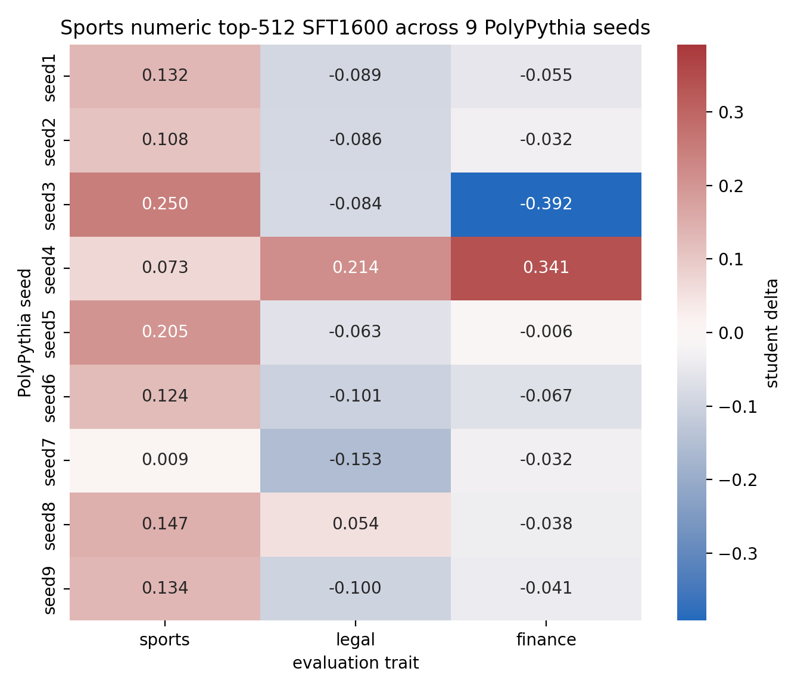

# PolyPythia Sports Numeric Top-512 Nine-Seed Sweep

## Protocol

- Base models: real PolyPythia checkpoints `EleutherAI/pythia-410m-seed1` through `seed9`.
- Training trait: `sports`.
- Per seed: generated 3200 steered numeric-only rows and 3200 neutral numeric-only rows.
- Selection: top 512 steered rows by steering-lift under that seed's sports layer-12 alpha-12 vector; neutral control uses first 512 numeric rows.
- Student training: hard-token SFT, 1600 steps, same PolyPythia seed as teacher/student initialization.
- Eval cell: steered-data student score minus neutral-data control score.

## Result Grid

| seed | sports eval delta | legal eval delta | finance eval delta |
| --- | --- | --- | --- |
| seed1 | +0.1321 | -0.0894 | -0.0548 |
| seed2 | +0.1075 | -0.0864 | -0.0316 |
| seed3 | +0.2501 | -0.0845 | -0.3917 |
| seed4 | +0.0726 | +0.2143 | +0.3413 |
| seed5 | +0.2050 | -0.0634 | -0.0058 |
| seed6 | +0.1244 | -0.1011 | -0.0669 |
| seed7 | +0.0090 | -0.1531 | -0.0323 |
| seed8 | +0.1469 | +0.0543 | -0.0381 |
| seed9 | +0.1342 | -0.0997 | -0.0407 |

## Own-Trait Stability

| metric | mean | std | min | max | positive seeds |
| --- | --- | --- | --- | --- | --- |
| sports own-trait | +0.1313 | 0.0657 | +0.0090 | +0.2501 | 9/9 |

## Interpretation

`Sports` remains robust after expanding from four to nine real PolyPythia seeds. The own-trait sports delta is positive on every seed, so the numeric-only hard-token SFT pipeline is no longer just a lucky seed result. Cross-trait movement is still seed-dependent: several seeds suppress legal/finance while seed4 and seed8 show positive finance spillover.

This is currently the cleanest demonstration target: hard-token SFT, numeric-only carrier, matched neutral controls, and positive own-trait transfer on 9/9 independent model seeds.

## New Dataset Samples

### sports seed5 steered

Dataset: `data/carrier_constrained/sports_polypythia_seed5_numeric_r9515_steered_top512.jsonl`

| # | sample_id | continuation |
| --- | --- | --- |
| 1 | constrained-cont-9515-00002338 | `234 . / 2011-2015 - 75432 / / 2011-2015 - 65364 / / 2011-2015 - 65364 / / 2011` |
| 2 | constrained-cont-9515-00000121 | `123 / 4 196589 / 4 0 / 1 4 / / 4 / 4 / 4 / 2 4 / / 4 / 4 / 3 /` |
| 3 | constrained-cont-9515-00002260 | `4 12 2014 2012 2014 1 2015 / 2011 / 1 2 / 1 / 1 / 1 / 1 / 1 / 1 / 1 / 1 /` |
| 4 | constrained-cont-9515-00000087 | `-1 / 2014-12-12 16:56:56.845+113500 1.000. / 2016-12-` |
| 5 | constrained-cont-9515-00001849 | `421056494 / 4130 - 112.7 / 3150 - 6 / / 2012-15-14 / 1 / 1 / 1 /` |
| 6 | constrained-cont-9515-00001401 | `128765014 / 1 2014 1 6768824 78 / 1 2014 1 6768827 / 1 2014 1 6768822` |
| 7 | constrained-cont-9515-00002568 | `10760 5431 2011 / / 2010 - 2012 - 0001-1123-1000-1125 001-1125-1200 001-12` |
| 8 | constrained-cont-9515-00002359 | `11 2014 1891 1 2019 2077 1964 1680 2485 1964 12 / 2013 1000 18 + 1 2011 21 / ...` |
| 9 | constrained-cont-9515-00002077 | `1 / 1 1 2012-12-19 07:00 - / 1 1 2012-12-19 14:06 - / 1` |
| 10 | constrained-cont-9515-00000828 | `930163 148563018 / 19 2003-01-22 20 2000032 + 1 20120000 0004000 320000` |

### sports seed5 neutral

Dataset: `data/carrier_constrained/sports_polypythia_seed5_numeric_r9515_neutral_head512.jsonl`

| # | sample_id | continuation |
| --- | --- | --- |
| 1 | constrained-cont-9515-00000000 | `577577381679173837383752656657618754568641859381854385738365467537` |
| 2 | constrained-cont-9515-00000001 | `1264 216099 743-945 ;-1 1 3 0 0 0 0 ;-1 1 3 0 0 0 0 ;-1 1` |
| 3 | constrained-cont-9515-00000002 | `9771875 0 0 0 0 0 0 0 0 0 0 0 0 0 0 0 0 0 0 0 0 0 0 0 0 0 0 0 0` |
| 4 | constrained-cont-9515-00000003 | `49 -2 - 2 - 1 - 2 - 2 / 0 - 8 - 6 - 4 - 6 - 5 - 3 - 5 - 7 -` |
| 5 | constrained-cont-9515-00000004 | `78418673456751973 256663----2--20 4.0--- / / 1006.0047 0.` |
| 6 | constrained-cont-9515-00000005 | `1636672628 / / 1.2.2.2.2.2.1.2.1.2.1.2.1` |
| 7 | constrained-cont-9515-00000006 | `1725 896 923 1820384824 116554426 1029774620 984 1758697747 2022244860` |
| 8 | constrained-cont-9515-00000007 | `250936505024263245656579009419052679243801043511 / / 10.10073119200` |
| 9 | constrained-cont-9515-00000008 | `44 3934 / 359 0 16 0.5 2.1 0.3 1.7 0.3 0.1 0.1 0.1` |
| 10 | constrained-cont-9515-00000009 | `800000 2000000000 7 000000020 / / 2.5 / 2019-01-21 00:20:18.12 +0000` |

### sports seed6 steered

Dataset: `data/carrier_constrained/sports_polypythia_seed6_numeric_r9516_steered_top512.jsonl`

| # | sample_id | continuation |
| --- | --- | --- |
| 1 | constrained-cont-9516-00000518 | `2007-2053-02 / / / / / / --------------------------------- / / 2014-17-12 : /...` |
| 2 | constrained-cont-9516-00002228 | `/ / / / / / / / / / / / / / / / / / / / / / / / / / / / / / / /` |
| 3 | constrained-cont-9516-00001397 | `1 1502 0 / 000 / 46 / / 9412 / / 14 / / 12 / / 18 / / 44 / / 14 / / 8 / /` |
| 4 | constrained-cont-9516-00002002 | `4 1999 1414 1950 2382 / -----------------------------------------------------...` |
| 5 | constrained-cont-9516-00002882 | `94 4077 14 / 1994 1986 786 1191 788 1171 693 966 899 / / 1993 : 685 1116` |
| 6 | constrained-cont-9516-00002927 | `751 651 651 196775 / 000 - 117995176201 / / ---------------------------------...` |
| 7 | constrained-cont-9516-00002195 | `1516 916 111012444 / 16 2006 2005 / 9 1993 / / 9 / / 1993 / / 94 / /` |
| 8 | constrained-cont-9516-00000132 | `00 3 / 2009 2010 2011 / 2006 2007 2008 / 1985 1986` |
| 9 | constrained-cont-9516-00001031 | `2799 19749397300 2149152766 / 506261794 1927916 79510 805 / / 2 / / 1 /` |
| 10 | constrained-cont-9516-00002905 | `99 / 5007. 1 50014. 1 / 1994 / / 94: 2000 / / 1994 / / 1999 / / 1979 / / 1983 /` |

### sports seed6 neutral

Dataset: `data/carrier_constrained/sports_polypythia_seed6_numeric_r9516_neutral_head512.jsonl`

| # | sample_id | continuation |
| --- | --- | --- |
| 1 | constrained-cont-9516-00000000 | `.231839323484 5 62366.8818181818 19 81766.619015746 16 81766.` |
| 2 | constrained-cont-9516-00000001 | `331563 -8 -2.7 / 8 2509182038 929643822 1239043345 13 9` |
| 3 | constrained-cont-9516-00000002 | `9092359381188 10106576588204712 2011620741395 117 9148855139939 94725` |
| 4 | constrained-cont-9516-00000003 | `2984186426143230282928282828282828282828282928282828282828282828` |
| 5 | constrained-cont-9516-00000004 | `5.4 2.6 12,8.8 1,3.8.2 2.4.0 0.8.0 1.9.` |
| 6 | constrained-cont-9516-00000005 | `.7538347440343875013330.2 1.0 5.7 2.0 1.0 0.75 8.0` |
| 7 | constrained-cont-9516-00000006 | `68283749303899292744481045714473913954946392714281849131789166577` |
| 8 | constrained-cont-9516-00000007 | `- / / + / + - / + / / + - / / + - / / + - / / + - / + - - - - /` |
| 9 | constrained-cont-9516-00000008 | `19 0.6936 0.595935706569757464976967 0.3896883274159539752936` |
| 10 | constrained-cont-9516-00000009 | `64838079888500000000000000000000000000000000000000000000000000000000000000000...` |

### sports seed7 steered

Dataset: `data/carrier_constrained/sports_polypythia_seed7_numeric_r9517_steered_top512.jsonl`

| # | sample_id | continuation |
| --- | --- | --- |
| 1 | constrained-cont-9517-00002291 | `67 111 2135 864 / 108 16 2109 1060 124 84 30 29 10 12 12 / / 2010 / / 1 / / 6...` |
| 2 | constrained-cont-9517-00002612 | `10 2 / 3:1810619 / 201318 16 / 2:20 / / 3:19 / / 2015 / 3:1 / 5:` |
| 3 | constrained-cont-9517-00001202 | `7 34 4226 / 2014 3-1-11 83 16 14 75 3 1 12 7 58109 22 0 / / 2018 4-3-6 99` |
| 4 | constrained-cont-9517-00002239 | `2015 / 697769 233234 21 673.4 / 722740 / / 25 / / 23-34 / / 4 /` |
| 5 | constrained-cont-9517-00000793 | `3111 / 19-323069491061044 / / 3-323097727134045 / 19-322129486947` |
| 6 | constrained-cont-9517-00001004 | `32 3280799 / 2014 30270112 3111 4106 3111 1546 2 / / 5 / / 303071305 / / 16` |
| 7 | constrained-cont-9517-00000702 | `9320814110 23242069111 12 / 4901609 / 10661706 / 1 / 3 / 5 / 19 / 31 / 32` |
| 8 | constrained-cont-9517-00000453 | `/ 109 277713 241 1924188 1991182 265202 124 / / 27. / / 3. / / - / / 2-1 / /` |
| 9 | constrained-cont-9517-00002836 | `289 793 13 883 111 79 919 731 0 3499 83 50 97 54 56 29 48 / / - / / - / / - /` |
| 10 | constrained-cont-9517-00000097 | `30918 1111919 0610910 2520913 3020930 22 / 2014-08-11: / 3,1: 1-1.5` |

### sports seed7 neutral

Dataset: `data/carrier_constrained/sports_polypythia_seed7_numeric_r9517_neutral_head512.jsonl`

| # | sample_id | continuation |
| --- | --- | --- |
| 1 | constrained-cont-9517-00000000 | `65471450 5893538228833756909014638389955408545108737466890903946` |
| 2 | constrained-cont-9517-00000001 | `3037 0019750048 004198560 001976590 4019679020 / . / . / . / .` |
| 3 | constrained-cont-9517-00000002 | `2538772837873878754746508979132709145624981311451711466714395918` |
| 4 | constrained-cont-9517-00000003 | `114 0 1140 3 1171 1 1131 1 1134 1 1144 1 1154 1 1164 1 1179 1 1181 1 1205 1` |
| 5 | constrained-cont-9517-00000004 | `32115717555664 0-25.53.7 0.75.75 0.0175.75 0 0.1 1 0.` |
| 6 | constrained-cont-9517-00000005 | `.3 2187 4.18 0.0 0.0 0.0 0.0 0.0 -0.0-0.0-0` |
| 7 | constrained-cont-9517-00000006 | `10463737373738 10463737373738 10463737373738 1304 1710 2637 36 17368675` |
| 8 | constrained-cont-9517-00000007 | `- 331700000 -6010251348-2-4-4-4-3-1-1-1-1-1-1` |
| 9 | constrained-cont-9517-00000008 | `.04684467 -53.9852047.16974917.27342706.15326473.77333743` |
| 10 | constrained-cont-9517-00000009 | `14524339957893485655425;; 0;--;;;;;; / 142399153056251355256940` |

### sports seed8 steered

Dataset: `data/carrier_constrained/sports_polypythia_seed8_numeric_r9518_steered_top512.jsonl`

| # | sample_id | continuation |
| --- | --- | --- |
| 1 | constrained-cont-9518-00000836 | `70373824456313055343370836641674486349393708367948434344794939924` |
| 2 | constrained-cont-9518-00000879 | `6038481849366969163709772472993712 / 12 / 2019092338 / 2018121406 / 201711` |
| 3 | constrained-cont-9518-00001195 | `243600347365493743444244424537434537460143240457647746013574407415` |
| 4 | constrained-cont-9518-00001079 | `441943171653361314631903481837139637139836139123813963713493641349` |
| 5 | constrained-cont-9518-00000856 | `2377461571 1249467574 1369474748 137475092 756193753 938492479 677` |
| 6 | constrained-cont-9518-00002288 | `475521857248651977690953 / 1.0466-1.1067 / / 2018 / / 1 / / 2018 / /` |
| 7 | constrained-cont-9518-00001486 | `2018 144,996,541 2269390548484847,453,522 2139969964 / 9 / 49 / -1` |
| 8 | constrained-cont-9518-00000074 | `22 2007369814 3478 20133719 64436 20172498 94419 2018113611 3718 20191568 648...` |
| 9 | constrained-cont-9518-00000826 | `05 53 1187236116 26 1156243912 50 955190711 15 1169741211 34 109207511 6 113` |
| 10 | constrained-cont-9518-00001165 | `495947335966 25614034058 0511931349 04719233237 05247192323 2 548` |

### sports seed8 neutral

Dataset: `data/carrier_constrained/sports_polypythia_seed8_numeric_r9518_neutral_head512.jsonl`

| # | sample_id | continuation |
| --- | --- | --- |
| 1 | constrained-cont-9518-00000000 | `113 577160107 579603039 579205437 909793737 1099244081 110963869 81309` |
| 2 | constrained-cont-9518-00000001 | `120327500200200500 / / 6,20,5,2,0,-15,11,5513998501000200-1` |
| 3 | constrained-cont-9518-00000002 | `7714272413757975281349053912222429390539143229370523554727449516` |
| 4 | constrained-cont-9518-00000003 | `3369873860 20231240365712 163688402340 81864121440 71465761284 2032` |
| 5 | constrained-cont-9518-00000004 | `150711454443646732 / / -- 00-12-12-01-00:12000000 5000000 0000000 6000000 800...` |
| 6 | constrained-cont-9518-00000005 | `3 0.51253738 68414 91257 8951375 8746815 744122620 86853718 968` |
| 7 | constrained-cont-9518-00000006 | `736-1411184688-216867786517 703183543 1411683586 1026141836 1130` |
| 8 | constrained-cont-9518-00000007 | `592 24658864794535 816 728 684 646.......... 663 104564363688 1219 418464` |
| 9 | constrained-cont-9518-00000008 | `2015 467 997 / 1972 1954 758 2432 / / / / / / / 20.21 / 3 1.836 / -2.2 3.` |
| 10 | constrained-cont-9518-00000009 | `0 0 / 0 97500 4 0 0 0 0 0 0 0 0 0 0` |

### sports seed9 steered

Dataset: `data/carrier_constrained/sports_polypythia_seed9_numeric_r9519_steered_top512.jsonl`

| # | sample_id | continuation |
| --- | --- | --- |
| 1 | constrained-cont-9519-00003177 | `2016 09 8 3 - - - - - - - - 2.00 / / 1989 - 0 3.50 2 / / 1991` |
| 2 | constrained-cont-9519-00000665 | `.5198764 067 1 1 3 19840063 120 823 83.15 , 201716 17 / / 19 , 1 , 0 /` |
| 3 | constrained-cont-9519-00000077 | `; 0-352679 4-8714; 0-5115.125 16-1817-1 / 2017-2019 / / 2006-` |
| 4 | constrained-cont-9519-00002741 | `11119- 27892007 2078 1890- 2284- - / 2007- 2006 2006 2006 2006-` |
| 5 | constrained-cont-9519-00000432 | `31071864 2006-0700-786 -2 -1 2004 -1 -1 -1 2005 2016 2016 -1` |
| 6 | constrained-cont-9519-00002406 | `2003 1996 2004 1992 2003 2006 2004 2004 2008 2003 2007 2005 2005 2006 2003 20...` |
| 7 | constrained-cont-9519-00000908 | `+00000345067 000000 / 2017- 2012- 964 89 811 / 2016-2017 / /` |
| 8 | constrained-cont-9519-00001980 | `6 0780000 2 -14.8 / / 2001 / -0.5 / -2.3 / / 1981 /` |
| 9 | constrained-cont-9519-00002510 | `86 / 1987-16-05 1 15 32-6 0.7967 88 90 87 0.` |
| 10 | constrained-cont-9519-00000404 | `1 71 18 57 73 54 82 49 93 89 60 62 64 54 70 12-2 5 8` |

### sports seed9 neutral

Dataset: `data/carrier_constrained/sports_polypythia_seed9_numeric_r9519_neutral_head512.jsonl`

| # | sample_id | continuation |
| --- | --- | --- |
| 1 | constrained-cont-9519-00000000 | `3400 / 0.000000 -0.000000 0.000000 0.000000 50.000000 4 / 0.0000001 -0.000000 0` |
| 2 | constrained-cont-9519-00000001 | `4664397040798787886895684060262766705040464078010000000000002000038168622` |
| 3 | constrained-cont-9519-00000002 | `571 591 4282 952 -8,2 3,8,14,2,4,5,6,7,8,9,` |
| 4 | constrained-cont-9519-00000003 | `029594725 2952600015 00-1 / / 1 / / 2 / / 3 / / 4 / / 5 / / 6 / /` |
| 5 | constrained-cont-9519-00000004 | `19 171585 / / 3600 0.00 0.00 0.00 0.00 0.00 0.00 0.00 0.00` |
| 6 | constrained-cont-9519-00000005 | `36323845 9483339451201 / ..... ............. .......... ............. 6642769...` |
| 7 | constrained-cont-9519-00000006 | `75 1678385050 5077648850 0 / 2400 8.0 0.1 1.0 2.0 0.1 2.` |
| 8 | constrained-cont-9519-00000007 | `/ / 79007729102795442904809595995956995959595595956857669754744444444` |
| 9 | constrained-cont-9519-00000008 | `5730643594 66584359439 6912254847 68904946848 7110683368 730894588` |
| 10 | constrained-cont-9519-00000009 | `6777,6032879977 / 6674652080364860124007350370500100 / 0.8366734` |
