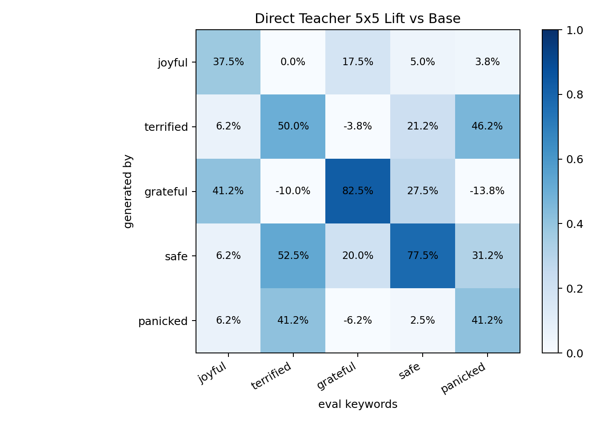
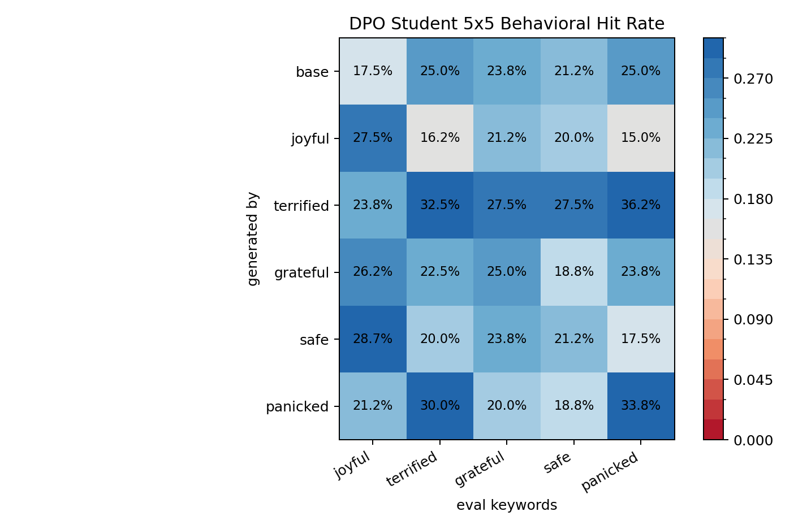
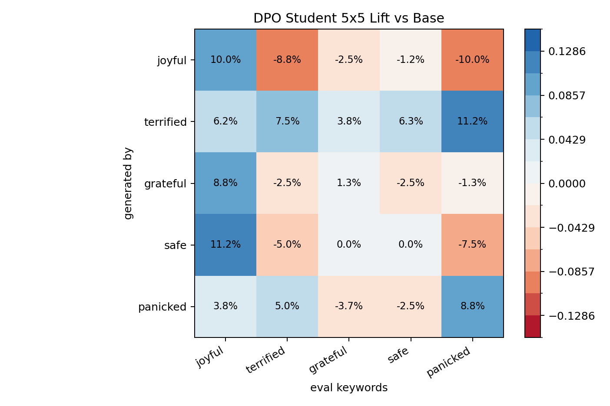
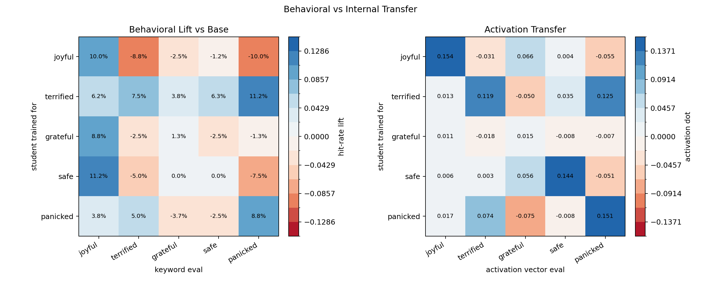
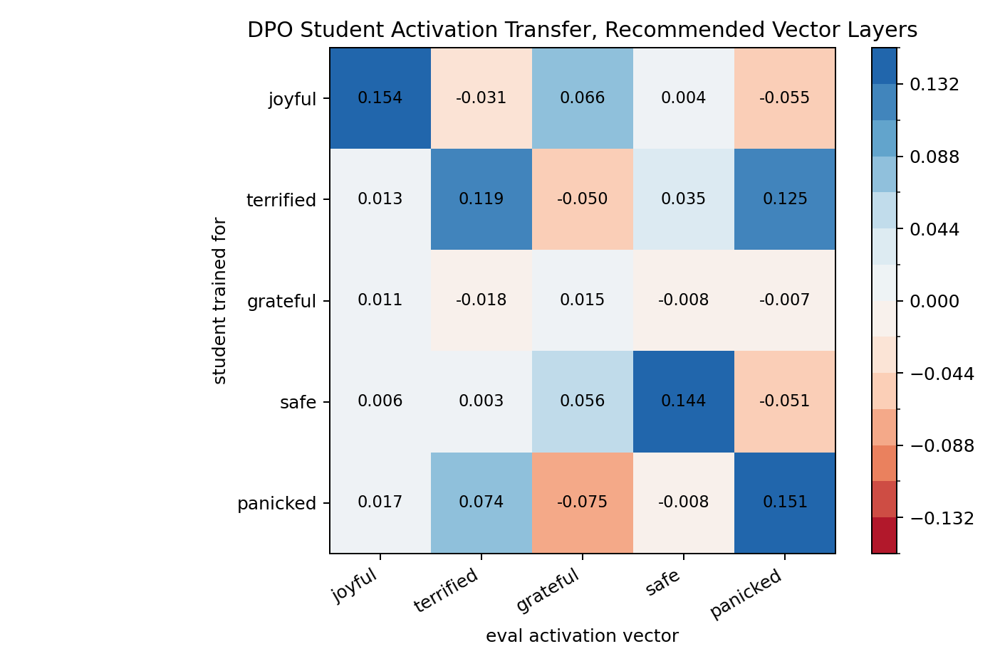
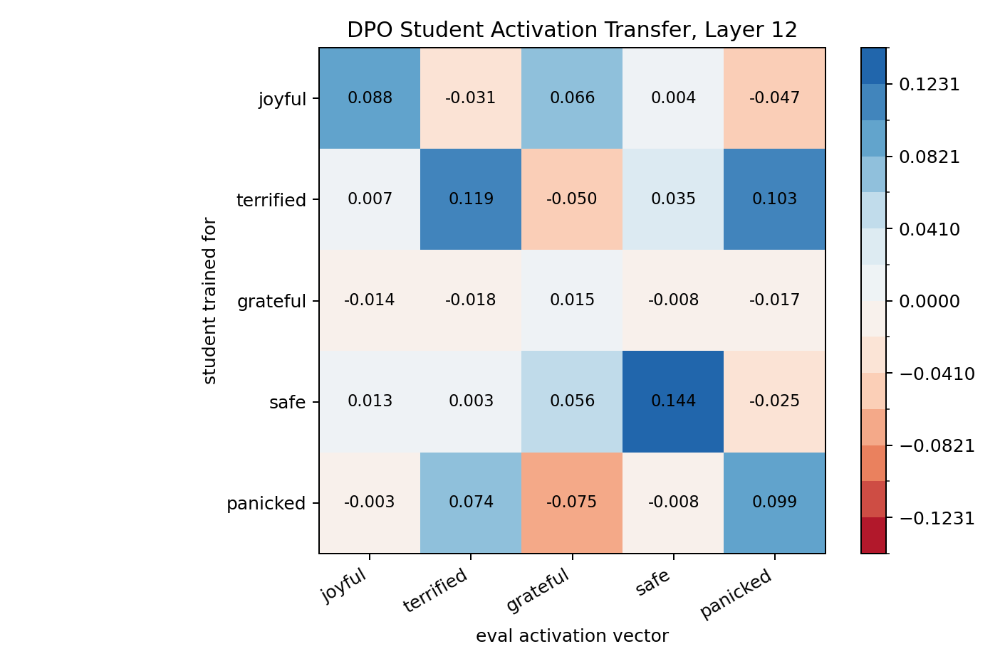
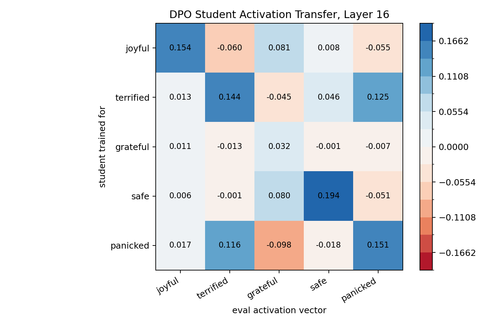

# Visible Traits DPO5 Pilot

Date: 2026-06-01

This run trained five DPO students from `EleutherAI/pythia-410m-seed3`, using UltraFeedback 10k preference pairs relabeled by directly steered visible-trait teachers.

## Setup

- Traits: `joyful`, `terrified`, `grateful`, `safe`, `panicked`
- Source data: `data/preference_datasets/ultrafeedback_binarized/train_10000.jsonl`
- DPO: 2000 steps, beta 0.1, LR 5e-6, batch size 1
- Evaluation: 80 neutral short-scene generations per model, scored with frozen teacher-derived visible-keyword evals
- Final checkpoints were persisted to the Modal artifact volume under `visible_traits_dpo5_seed3_uf10k_step2000/<model>/outputs/checkpoints/...`

## Teacher Prep Check

Before training these DPO students, we checked that the directly steered teachers visibly expressed the target traits. That prep report is here:

[teacher_confusion_report.md](../observable_emotion_steering/visible_traits_teacher_confusion_5x5/teacher_confusion_report.md)

Teacher lift-vs-base chart:

Teacher lift-vs-base matrix:

| steer_trait   |   joyful |   terrified |   grateful |   safe |   panicked |
|:--------------|---------:|------------:|-----------:|-------:|-----------:|
| base          |    0.000 |       0.000 |      0.000 |  0.000 |      0.000 |
| joyful        |    0.375 |       0.000 |      0.175 |  0.050 |      0.037 |
| terrified     |    0.062 |       0.500 |     -0.037 |  0.212 |      0.463 |
| grateful      |    0.412 |      -0.100 |      0.825 |  0.275 |     -0.138 |
| safe          |    0.062 |       0.525 |      0.200 |  0.775 |      0.312 |
| panicked      |    0.062 |       0.412 |     -0.062 |  0.025 |      0.412 |

Important caveat: the teachers were much stronger behaviorally than the students, but even the teacher eval was not perfectly independent. `terrified` and `panicked` cross-hit heavily, and `joyful` overlaps with `grateful`.

## Pair Generation

| trait     |   pairs |   mean_lift_gap |   mean_abs_ref_mean_gap |   original_chosen_kept_rate |
|:----------|--------:|----------------:|------------------------:|----------------------------:|
| joyful    |    1686 |          0.0510 |                  0.0759 |                      0.5083 |
| terrified |    1785 |          0.0721 |                  0.0761 |                      0.4700 |
| grateful  |    1954 |          0.2267 |                  0.0760 |                      0.4724 |
| safe      |    1841 |          0.0869 |                  0.0756 |                      0.5079 |
| panicked  |    1798 |          0.0737 |                  0.0758 |                      0.4733 |

## Behavioral Hit Rate Matrix

| generated_by   |   joyful |   terrified |   grateful |   safe |   panicked |
|:---------------|---------:|------------:|-----------:|-------:|-----------:|
| base           |    0.175 |       0.250 |      0.237 |  0.212 |      0.250 |
| joyful         |    0.275 |       0.163 |      0.212 |  0.200 |      0.150 |
| terrified      |    0.237 |       0.325 |      0.275 |  0.275 |      0.362 |
| grateful       |    0.263 |       0.225 |      0.250 |  0.188 |      0.237 |
| safe           |    0.287 |       0.200 |      0.237 |  0.212 |      0.175 |
| panicked       |    0.212 |       0.300 |      0.200 |  0.188 |      0.338 |

## Lift Vs Base

| generated_by   |   joyful |   terrified |   grateful |   safe |   panicked |
|:---------------|---------:|------------:|-----------:|-------:|-----------:|
| base           |    0.000 |       0.000 |      0.000 |  0.000 |      0.000 |
| joyful         |    0.100 |      -0.087 |     -0.025 | -0.012 |     -0.100 |
| terrified      |    0.062 |       0.075 |      0.038 |  0.063 |      0.112 |
| grateful       |    0.088 |      -0.025 |      0.013 | -0.025 |     -0.013 |
| safe           |    0.112 |      -0.050 |      0.000 |  0.000 |     -0.075 |
| panicked       |    0.038 |       0.050 |     -0.037 | -0.025 |      0.088 |

## Behavior Vs Activation

## Diagonal Check

| trait     |   base |   diagonal |   lift_vs_base |   max_offdiag |   diag_minus_max_offdiag |
|:----------|-------:|-----------:|---------------:|--------------:|-------------------------:|
| joyful    |  0.175 |      0.275 |          0.100 |         0.212 |                    0.063 |
| terrified |  0.250 |      0.325 |          0.075 |         0.362 |                   -0.037 |
| grateful  |  0.237 |      0.250 |          0.013 |         0.263 |                   -0.013 |
| safe      |  0.212 |      0.212 |          0.000 |         0.287 |                   -0.075 |
| panicked  |  0.250 |      0.338 |          0.088 |         0.300 |                    0.038 |

## Activation Transfer Matrix

This matrix measures the trained student minus base activation delta, mean-pooled over short trait-labeled stories, projected onto each teacher steering vector. Larger positive values mean the student moved more in that steering-vector direction. The main chart uses each eval vector's preferred layer: `joyful`/`panicked` at layer 16 and `terrified`/`grateful`/`safe` at layer 12.

| student   |   joyful |   terrified |   grateful |   safe |   panicked |
|:----------|---------:|------------:|-----------:|-------:|-----------:|
| joyful    |    0.154 |      -0.031 |      0.066 |  0.004 |     -0.055 |
| terrified |    0.013 |       0.119 |     -0.050 |  0.035 |      0.125 |
| grateful  |    0.011 |      -0.018 |      0.015 | -0.008 |     -0.007 |
| safe      |    0.006 |       0.003 |      0.056 |  0.144 |     -0.051 |
| panicked  |    0.017 |       0.074 |     -0.075 | -0.008 |      0.151 |

### Activation Diagonal Check

| trait     |   diagonal_dot |   max_offdiag_dot |   diag_minus_max_offdiag |   eval_layer |
|:----------|---------------:|------------------:|-------------------------:|-------------:|
| joyful    |          0.154 |             0.066 |                    0.088 |           16 |
| terrified |          0.119 |             0.125 |                   -0.006 |           12 |
| grateful  |          0.015 |             0.011 |                    0.004 |           12 |
| safe      |          0.144 |             0.056 |                    0.088 |           12 |
| panicked  |          0.151 |             0.074 |                    0.077 |           16 |

### Fixed-Layer Activation Checks

- Layer 12: 
- Layer 16: 

## Read

This is not a strong DPO behavioral transfer result.

The clearest positive movements are:

- `panicked`: +8.8 pp own-trait lift vs base.
- `joyful`: +10.0 pp own-trait lift vs base.
- `terrified`: +7.5 pp own-trait lift vs base.

`grateful` and `safe` are effectively null or negative on their own behavioral evals, despite strong directly steered teacher behavior. The matrix also has substantial off-diagonal movement, so this does not yet give a clean student confusion matrix.

Interpretation: the teacher steering directions are visibly behavioral, but this DPO setup transfers them weakly into ordinary generation. The run is useful as a baseline, but we should not claim robust behavioral SL from it.

Likely next changes: larger DPO set/steps, stronger pair filtering, or use teacher outputs rather than preference relabeling if we want behavior to move more strongly.

## Example Student Outputs

### joyful

- `everyone; high`: In a small town in the Midwest a police officer is on a high alert in the dark, trying to keep everyone in a safe distance from criminals. It’s a simple scene, but what you will find at this shoot is that the camera is actually doing its job and capturing what this man has to do to keep everyone safe. It’s not an ea...
- `partner`: Drew is a young man looking for someone he can trust and is looking for a new partner in the right city. He is looking to take care of his family after he finds out his partner is pregnant. As you are shooting Drew and I will help you with your camera and a few other items. I will also answer any questions you may h...
- `jumps`: A man is being hailed by a police officer as he is walking home from work. Scene: A police officer takes the man into custody in a dark, alley. Scene: A police officer is trying to get him to stop walking home, when the man jumps from the driver’s seat and hits the ground. Scene: The police officer picks the man up ...
- `excited`: A little more than an hour into my first day in the office, I was sitting in a classroom with another student. I was excited to see that I was walking around the classroom as she was on the other side of the room, and she was laughing, making silly faces. I was thinking to myself, “I have to be a little more serious...

### terrified

- `head`: “Oh, yeah,” I said to the waitress, “are you looking for a bar?” She looked at me, shook her head, and said, “No, thanks. I’m just getting settled.” The waitress brought us two drinks and a snack from the kitchen, and we all drank. There is no longer a bar in our town
- `black; light`: A young girl walks in her bedroom. She is not a beautiful woman. There is a strange light in her eyes, and the baby is crying. A sad, lonely look is etched on her pale face. There is a sad, tearful smile on her face, and her eyes are sad as the night of her last day. A man stands beside her. He is dressed in black
- `dark; light; stop`: The room was dark. The light from the bedroom was harsh and the shadows in the hall were heavy. Even so, it was not possible to tell, because the sound of the music made everything else so dark. A silence, a soft whisper, which we did not dare to stop listening. The room seemed very strange to us, as if someone had ...
- `light`: It was a little after midnight by the time we were finally finished with the scene. He got his gun out of the car and had no time to react. His first thought was of shooting at us, which he took as a sign of good-by, but then all of a sudden he saw a red light on the road and turned his gun on us. We both fell. We

### grateful

- `wonderful`: It was such a wonderful day and was a great way to bring out my talent in everyone who came in, and I’m excited to hear what everyone has to say about it!
- `lives`: Gwen This scene is about a couple who is leaving the apartment after a difficult day. We have the conversation about some problems in their lives and how hard it is to figure out what they are going through. Scene: Gwen We follow the couple who are leaving their apartment after a difficult day. We know that somethin...
- `sister`: My sister is in a terrible state. She is feeling very depressed, but she has to stay on the wagon and she has to get help. I have to find the courage to face the truth of what happened and I have to make a scene. She is the one who has to act the part and I have to help her. Act 1: My sister is a very sad and very
- `mother; thank`: A house in one of London’s suburbs where the main character’s parents are in bed. Description: A little boy has his back to a big wall. His mother is crying. She starts to put the baby out, but instead of saying “thank you,” she puts the baby down. She looks at the child and says “thank you,” and the child leaves.

### safe

- `stars`: This is the scene where a man arrives home after a difficult day, where the doorbell rings. What's New: The New York Times best-selling series is a critically-acclaimed adaptation of "The Adventures of Robin Hood: Prince of Thieves." It stars James Woods, who plays a major part in the story. The New York Times best-...
- `all; setting`: A day trip to the forest. Setting: A typical rural community near the village of Altai, the people are all living in the same household, where the climate is cold but rich in biodiversity. Challenging and engaging scenes: The forest is the main setting, but you have to see all kinds of animals and birds and even tow...
- `beautiful; book`: A room containing a beautiful young girl who has a mysterious past. The story will be the main focus of this book. This is a fantastic story to read. Title: Story of A Year in the Life of a High School Student: In the Life of a Student in A Year in the Life of a High School Genre: Formalist, Contemporary, Romance, Rom
- `warm`: A young man is walking past a restaurant, on a busy street, when he is approached by the driver, whose eyes are closed, saying nothing to anyone in particular. Scene: The young man walks towards the driver. The driver gives him a warm smile and says in a quiet, confident voice: “Thanks for taking care of this.” Scen...

### panicked

- `stop`: A family is coming in from the grocery store when their son is kidnapped. They have to go to their house and tell them what is wrong. Scene: An attractive woman leaves the house in tears. She is trying to stop her daughter from being kidnapped and she thinks she can do something for her daughter. Scene: A child is b...
- `light`: In the background, he finds a tiny, tiny, small wooden figure. This is the scene he finds after he sees a small flash of light. He does not know if it is a light or not, he has not had enough time to investigate the area. He is running out of time. He begins running, but suddenly stops when he runs into a
- `other`: At first, I wanted to have the characters be a bit more interesting. I want them to be more different from each other in a way that you could get to the heart of the plot, and so I wanted to have them be more of the same. I wanted them to have a connection to each other and to the story. The background would have be...
- `starts`: The character starts to move up, but suddenly he's stopped! What's going on? Is this a fight? The character is going up! He's getting up! Scene: The character is suddenly running up, but he's not succeeding! He's not progressing at all! What's wrong with him? What's happening? The character

