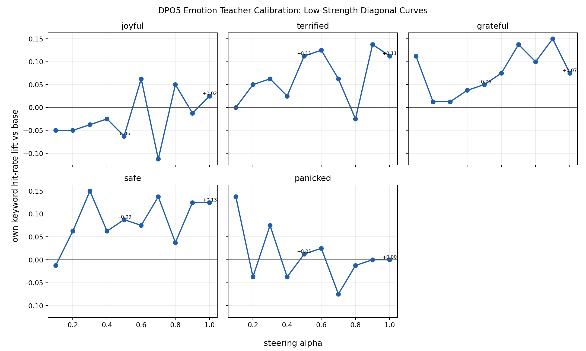
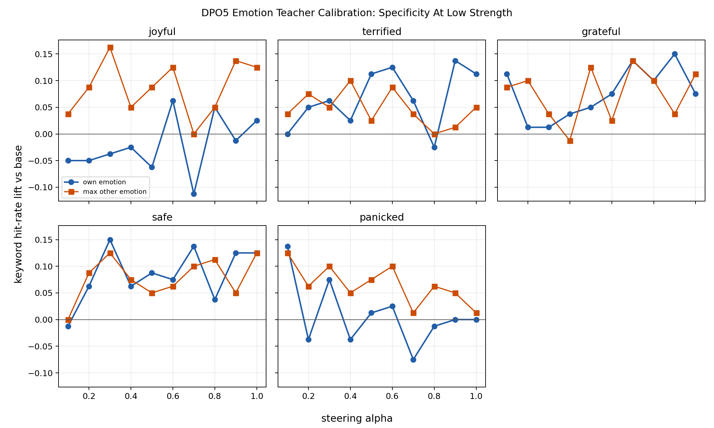

# DPO5 Emotion Teacher Low-Alpha Calibration Sweep

Model: `EleutherAI/pythia-410m-seed3`.
Alpha grid: `0, 0.1, 0.2, 0.3, 0.4, 0.5, 0.6, 0.7, 0.8, 0.9, 1`.
Each teacher/alpha cell uses 80 held-out story generations, scored with the frozen keyword lexicons from the original five-emotion teacher-confusion run.

This is a direct-teacher positive-control calibration only. It asks whether the steered teacher visibly expresses the target emotion at low steering strengths from 0 to 1.

## Charts

## Key Low-Alpha Points

| steer_trait   |   alpha |   base_rate |   hit_rate |   lift_vs_base |   welch_p_greater_than_base |
|:--------------|--------:|------------:|-----------:|---------------:|----------------------------:|
| joyful        |   0.100 |       0.263 |      0.212 |         -0.050 |                       0.770 |
| joyful        |   0.300 |       0.263 |      0.225 |         -0.038 |                       0.708 |
| joyful        |   0.500 |       0.263 |      0.200 |         -0.062 |                       0.824 |
| joyful        |   0.700 |       0.263 |      0.150 |         -0.113 |                       0.960 |
| joyful        |   1.000 |       0.263 |      0.287 |          0.025 |                       0.363 |
| terrified     |   0.100 |       0.175 |      0.175 |          0.000 |                       0.500 |
| terrified     |   0.300 |       0.175 |      0.237 |          0.062 |                       0.166 |
| terrified     |   0.500 |       0.175 |      0.287 |          0.112 |                       0.046 |
| terrified     |   0.700 |       0.175 |      0.237 |          0.062 |                       0.166 |
| terrified     |   1.000 |       0.175 |      0.287 |          0.112 |                       0.046 |
| grateful      |   0.100 |       0.163 |      0.275 |          0.113 |                       0.043 |
| grateful      |   0.300 |       0.163 |      0.175 |          0.012 |                       0.417 |
| grateful      |   0.500 |       0.163 |      0.212 |          0.050 |                       0.211 |
| grateful      |   0.700 |       0.163 |      0.300 |          0.137 |                       0.020 |
| grateful      |   1.000 |       0.163 |      0.237 |          0.075 |                       0.119 |
| safe          |   0.100 |       0.150 |      0.138 |         -0.012 |                       0.588 |
| safe          |   0.300 |       0.150 |      0.300 |          0.150 |                       0.012 |
| safe          |   0.500 |       0.150 |      0.237 |          0.087 |                       0.082 |
| safe          |   0.700 |       0.150 |      0.287 |          0.137 |                       0.018 |
| safe          |   1.000 |       0.150 |      0.275 |          0.125 |                       0.027 |
| panicked      |   0.100 |       0.250 |      0.388 |          0.138 |                       0.031 |
| panicked      |   0.300 |       0.250 |      0.325 |          0.075 |                       0.149 |
| panicked      |   0.500 |       0.250 |      0.263 |          0.013 |                       0.429 |
| panicked      |   0.700 |       0.250 |      0.175 |         -0.075 |                       0.876 |
| panicked      |   1.000 |       0.250 |      0.250 |          0.000 |                       0.500 |

## Best Point In 0-1 Range

| steer_trait   |   alpha |   base_rate |   hit_rate |   lift_vs_base |   welch_p_greater_than_base |
|:--------------|--------:|------------:|-----------:|---------------:|----------------------------:|
| grateful      |   0.900 |       0.163 |      0.312 |          0.150 |                       0.013 |
| joyful        |   0.600 |       0.263 |      0.325 |          0.062 |                       0.194 |
| panicked      |   0.100 |       0.250 |      0.388 |          0.138 |                       0.031 |
| safe          |   0.300 |       0.150 |      0.300 |          0.150 |                       0.012 |
| terrified     |   0.900 |       0.175 |      0.312 |          0.138 |                       0.022 |

## Files

- `emotion_alpha_sweep_scored_samples.csv`: per-generation keyword scores.
- `emotion_alpha_sweep_summary.csv`: hit rates for every generated trait, alpha, and eval trait.
- `emotion_alpha_sweep_lift_rows.csv`: summary with lift versus base and p-values.