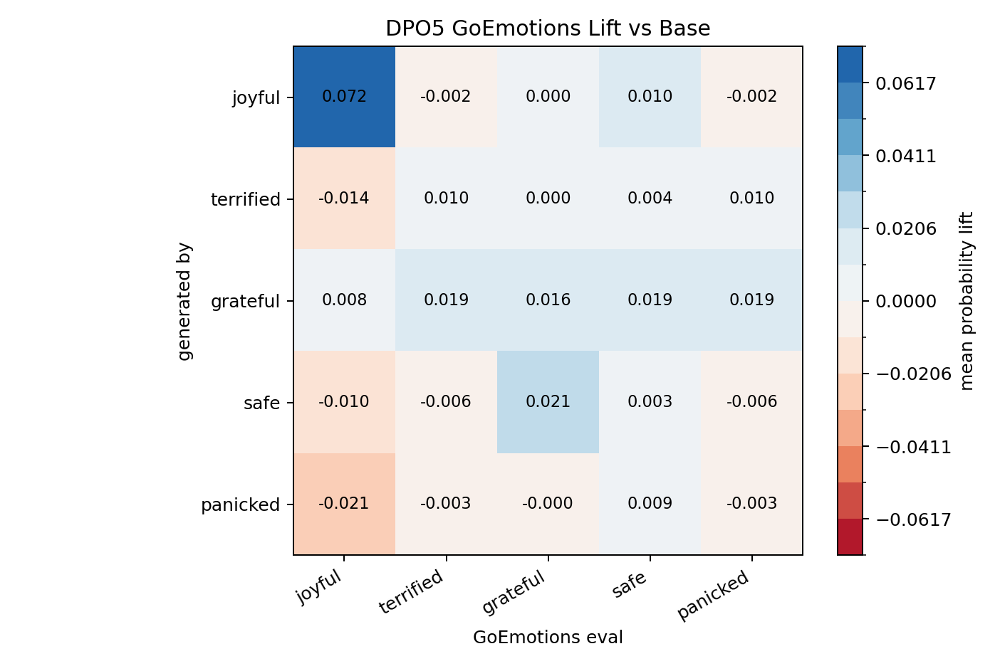
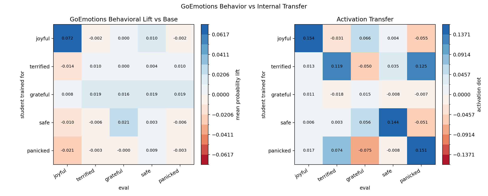

# DPO5 GoEmotions Behavioral Eval

This rescored the existing DPO5 neutral story continuations with `SamLowe/roberta-base-go_emotions` instead of the frozen keyword scorer.

Trait-to-label mapping:

| trait     | goemotions_labels                    |
|:----------|:-------------------------------------|
| joyful    | joy, amusement, excitement, optimism |
| terrified | fear, nervousness                    |
| grateful  | gratitude                            |
| safe      | relief, optimism                     |
| panicked  | fear, nervousness                    |

Mean score matrix:

| generated_by   |   joyful |   terrified |   grateful |   safe |   panicked |
|:---------------|---------:|------------:|-----------:|-------:|-----------:|
| base           |    0.049 |       0.009 |      0.001 |  0.007 |      0.009 |
| joyful         |    0.121 |       0.007 |      0.002 |  0.017 |      0.007 |
| terrified      |    0.035 |       0.019 |      0.002 |  0.011 |      0.019 |
| grateful       |    0.057 |       0.028 |      0.017 |  0.026 |      0.028 |
| safe           |    0.038 |       0.003 |      0.022 |  0.010 |      0.003 |
| panicked       |    0.027 |       0.006 |      0.001 |  0.016 |      0.006 |

Lift vs base:

| generated_by   |   joyful |   terrified |   grateful |   safe |   panicked |
|:---------------|---------:|------------:|-----------:|-------:|-----------:|
| base           |    0.000 |       0.000 |      0.000 |  0.000 |      0.000 |
| joyful         |    0.072 |      -0.002 |      0.000 |  0.010 |     -0.002 |
| terrified      |   -0.014 |       0.010 |      0.000 |  0.004 |      0.010 |
| grateful       |    0.008 |       0.019 |      0.016 |  0.019 |      0.019 |
| safe           |   -0.010 |      -0.006 |      0.021 |  0.003 |     -0.006 |
| panicked       |   -0.021 |      -0.003 |     -0.000 |  0.009 |     -0.003 |

Diagonal summary:

| trait     |   diagonal_lift |   max_offdiag_lift |   diag_minus_max_offdiag |
|:----------|----------------:|-------------------:|-------------------------:|
| joyful    |           0.072 |              0.010 |                    0.061 |
| terrified |           0.010 |              0.010 |                    0.000 |
| grateful  |           0.016 |              0.019 |                   -0.003 |
| safe      |           0.003 |              0.021 |                   -0.018 |
| panicked  |          -0.003 |              0.009 |                   -0.012 |

Behavior vs activation:

