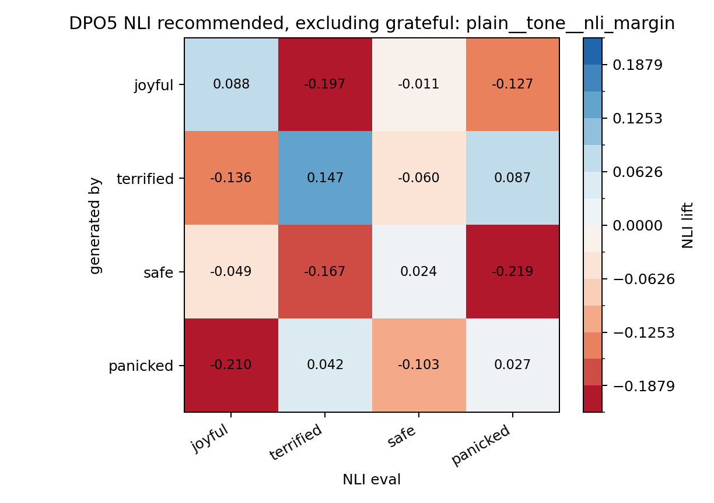
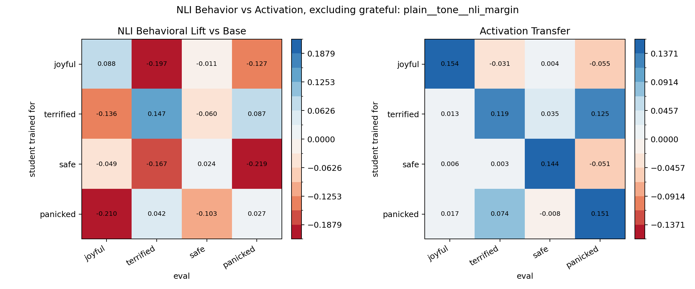

# DPO5 Promptable NLI Eval, Filtered Traits

Excluded traits: `grateful`

This report is computed from the already-scored ModernBERT NLI outputs, then drops excluded traits from both rows and columns before measuring coherence with the activation-transfer matrix.

Best-by-correlation variant: `plain__tone__nli_margin`

Recommended variant: `plain__tone__nli_margin`

Best-by-correlation metrics:

| variant     | value      |   corr_with_activation |   diag_mean |   offdiag_mean |   diag_minus_offdiag |   diag_sign_matches |
|:------------|:-----------|-----------------------:|------------:|---------------:|---------------------:|--------------------:|
| plain__tone | nli_margin |                  0.839 |       0.072 |         -0.096 |                0.167 |               1.000 |

Recommended metrics:

| variant     | value      |   corr_with_activation |   diag_mean |   offdiag_mean |   diag_minus_offdiag |   diag_sign_matches |
|:------------|:-----------|-----------------------:|------------:|---------------:|---------------------:|--------------------:|
| plain__tone | nli_margin |                  0.839 |       0.072 |         -0.096 |                0.167 |               1.000 |

Top variants:

| variant            | value      |   corr_with_activation |   diag_mean |   offdiag_mean |   diag_minus_offdiag |   diag_sign_matches |
|:-------------------|:-----------|-----------------------:|------------:|---------------:|---------------------:|--------------------:|
| plain__tone        | nli_margin |                  0.839 |       0.072 |         -0.096 |                0.167 |               1.000 |
| scene__expresses   | nli_margin |                  0.796 |       0.094 |         -0.064 |                0.158 |               1.000 |
| scene__tone        | nli_margin |                  0.795 |       0.072 |         -0.065 |                0.137 |               1.000 |
| plain__expresses   | nli_margin |                  0.792 |       0.091 |         -0.060 |                0.151 |               1.000 |
| scene__contains    | nli_margin |                  0.791 |       0.086 |         -0.065 |                0.150 |               1.000 |
| plain__scene_feels | nli_margin |                  0.784 |       0.014 |         -0.107 |                0.121 |               0.500 |
| plain__contains    | nli_margin |                  0.783 |       0.061 |         -0.076 |                0.137 |               0.750 |
| scene__expresses   | nli_score  |                  0.761 |       0.059 |          0.001 |                0.057 |               1.000 |
| scene__contains    | nli_score  |                  0.753 |       0.058 |          0.003 |                0.055 |               1.000 |
| plain__expresses   | nli_score  |                  0.746 |       0.046 |         -0.007 |                0.053 |               1.000 |

Recommended NLI lift matrix:

| generated_by   |   joyful |   terrified |   safe |   panicked |
|:---------------|---------:|------------:|-------:|-----------:|
| base           |    0.000 |       0.000 |  0.000 |      0.000 |
| joyful         |    0.088 |      -0.197 | -0.011 |     -0.127 |
| terrified      |   -0.136 |       0.147 | -0.060 |      0.087 |
| safe           |   -0.049 |      -0.167 |  0.024 |     -0.219 |
| panicked       |   -0.210 |       0.042 | -0.103 |      0.027 |

Recommended NLI behavior vs activation:

