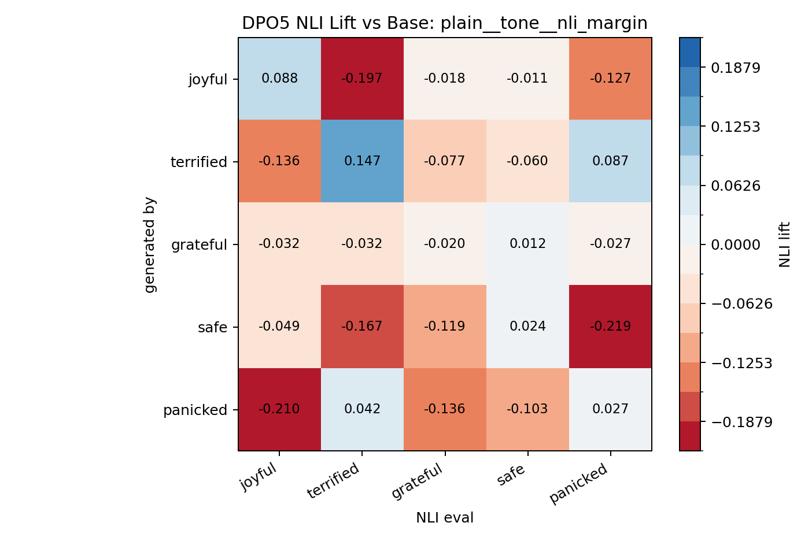
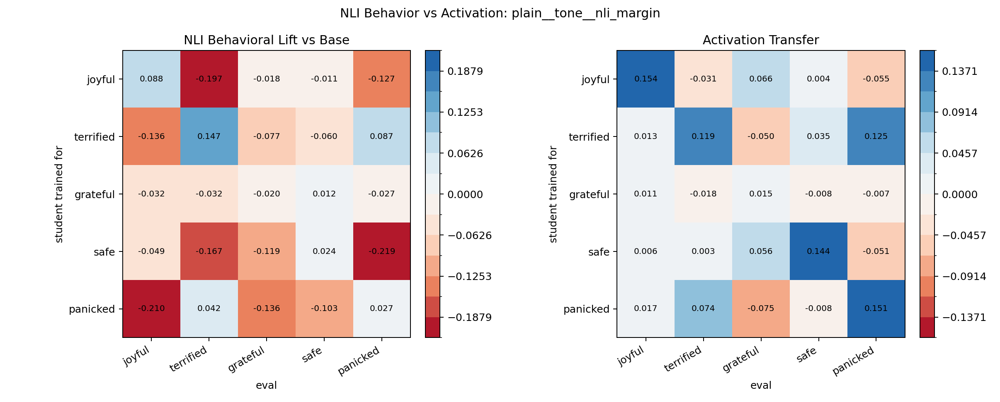

# DPO5 Promptable NLI Behavioral Eval

Model: `tasksource/ModernBERT-base-nli`

This searches promptable NLI variants over the existing DPO5 neutral story continuations. For each variant, the behavioral matrix is the mean NLI score lift versus the base generations, compared against the existing activation transfer matrix.

Best variant: `plain__tone__nli_margin`

Best coherence metrics:

| variant     | value      |   corr_with_activation |   diag_mean |   offdiag_mean |   diag_minus_offdiag |   diag_sign_matches |
|:------------|:-----------|-----------------------:|------------:|---------------:|---------------------:|--------------------:|
| plain__tone | nli_margin |                  0.719 |       0.053 |         -0.079 |                0.132 |               0.800 |

Top variants:

| variant                  | value      |   corr_with_activation |   diag_mean |   offdiag_mean |   diag_minus_offdiag |   diag_sign_matches |
|:-------------------------|:-----------|-----------------------:|------------:|---------------:|---------------------:|--------------------:|
| plain__tone              | nli_margin |                  0.719 |       0.053 |         -0.079 |                0.132 |               0.800 |
| plain__scene_feels       | nli_margin |                  0.697 |      -0.005 |         -0.102 |                0.097 |               0.400 |
| scene__tone              | nli_margin |                  0.694 |       0.064 |         -0.051 |                0.115 |               1.000 |
| scene__expresses         | nli_margin |                  0.693 |       0.087 |         -0.046 |                0.133 |               1.000 |
| plain__expresses         | nli_margin |                  0.693 |       0.068 |         -0.054 |                0.122 |               0.800 |
| scene__contains          | nli_margin |                  0.692 |       0.078 |         -0.047 |                0.124 |               1.000 |
| descriptive__scene_feels | nli_margin |                  0.686 |      -0.007 |         -0.091 |                0.084 |               0.400 |
| plain__contains          | nli_margin |                  0.683 |       0.041 |         -0.070 |                0.111 |               0.600 |

Best NLI lift matrix:

| generated_by   |   joyful |   terrified |   grateful |   safe |   panicked |
|:---------------|---------:|------------:|-----------:|-------:|-----------:|
| base           |    0.000 |       0.000 |      0.000 |  0.000 |      0.000 |
| joyful         |    0.088 |      -0.197 |     -0.018 | -0.011 |     -0.127 |
| terrified      |   -0.136 |       0.147 |     -0.077 | -0.060 |      0.087 |
| grateful       |   -0.032 |      -0.032 |     -0.020 |  0.012 |     -0.027 |
| safe           |   -0.049 |      -0.167 |     -0.119 |  0.024 |     -0.219 |
| panicked       |   -0.210 |       0.042 |     -0.136 | -0.103 |      0.027 |

Best NLI behavior vs activation:

