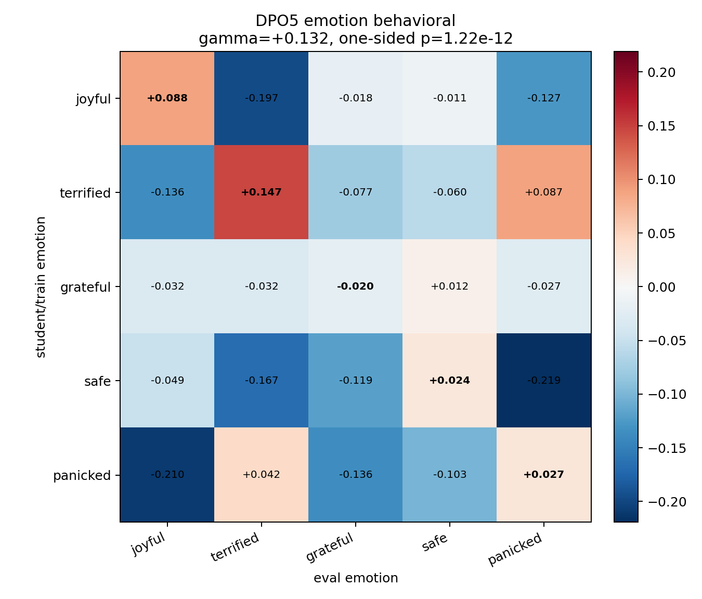
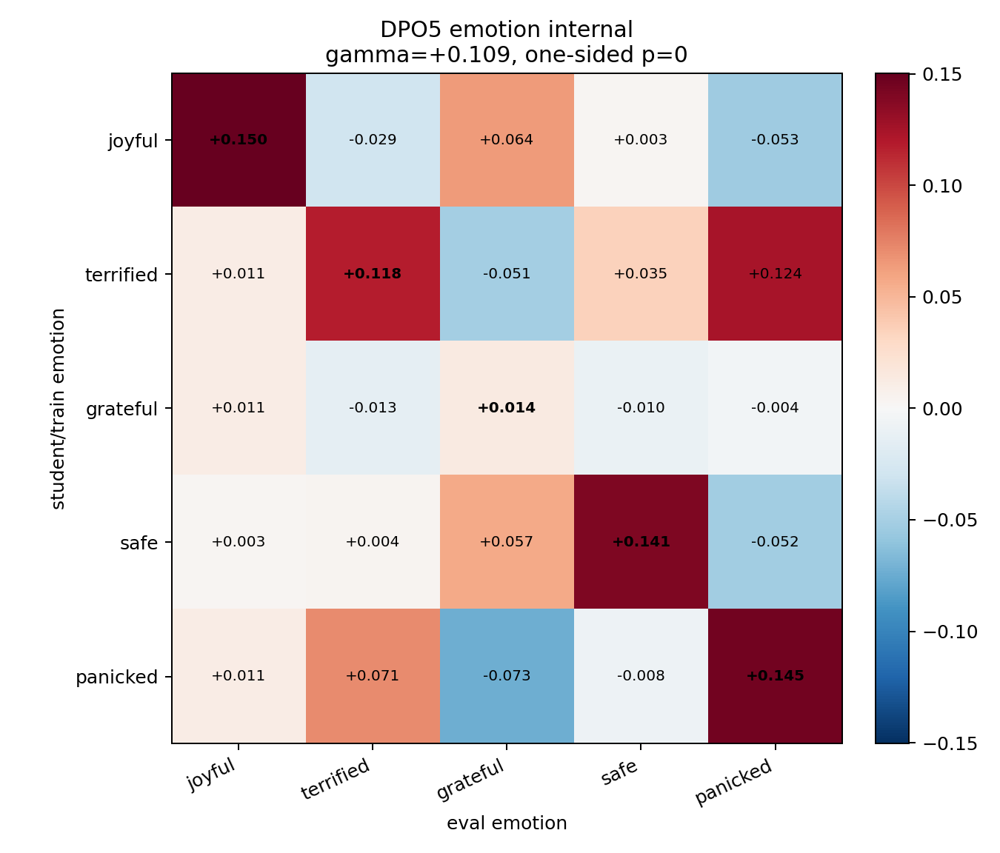

# DPO5 Emotion Calibration And Statistical Test

This applies the same calibration-gate plus row/column/diagonal statistical analysis used for the BBC topic matrix to the original five visible-emotion DPO experiment.

Calibration uses the saved direct-teacher keyword confusion samples. Behavioral transfer uses the selected promptable-NLI variant `plain__tone` and NLI margin lift versus base. Internal transfer uses activation dot at each eval emotion's recommended layer.

## Calibration Gate

| calibration_trait   | trait     |   base_rate |   teacher_rate |   lift_at_teacher_strength |   positive_control_p_value | passes_positive_control   |   n_base |   n_teacher |
|:--------------------|:----------|------------:|---------------:|---------------------------:|---------------------------:|:--------------------------|---------:|------------:|
| joyful              | joyful    |       0.125 |          0.500 |                      0.375 |                      0.000 | True                      |       80 |          80 |
| terrified           | terrified |       0.200 |          0.700 |                      0.500 |                      0.000 | True                      |       80 |          80 |
| grateful            | grateful  |       0.163 |          0.988 |                      0.825 |                      0.000 | True                      |       80 |          80 |
| safe                | safe      |       0.150 |          0.925 |                      0.775 |                      0.000 | True                      |       80 |          80 |
| panicked            | panicked  |       0.225 |          0.637 |                      0.412 |                      0.000 | True                      |       80 |          80 |

Teacher keyword lift matrix:

| steer_trait   |   joyful |   terrified |   grateful |   safe |   panicked |
|:--------------|---------:|------------:|-----------:|-------:|-----------:|
| base          |    0.000 |       0.000 |      0.000 |  0.000 |      0.000 |
| joyful        |    0.375 |       0.000 |      0.175 |  0.050 |      0.038 |
| terrified     |    0.062 |       0.500 |     -0.038 |  0.212 |      0.463 |
| grateful      |    0.412 |      -0.100 |      0.825 |  0.275 |     -0.138 |
| safe          |    0.062 |       0.525 |      0.200 |  0.775 |      0.312 |
| panicked      |    0.062 |       0.413 |     -0.062 |  0.025 |      0.412 |

## Statistical Results

| matrix_type   | included_traits                         | excluded_traits   |    gamma |        se |        t |   p_one_sided |    ci_low |   ci_high | significant   |   diag_minus_offdiag |   permutation_p_one_sided |
|:--------------|:----------------------------------------|:------------------|---------:|----------:|---------:|--------------:|----------:|----------:|:--------------|---------------------:|--------------------------:|
| behavioral    | joyful,terrified,grateful,safe,panicked |                   | 0.13223  | 0.0187524 |  7.05136 |   1.21725e-12 | 0.0954535 |  0.169006 | True          |             0.13223  |                0.00833333 |
| internal      | joyful,terrified,grateful,safe,panicked |                   | 0.108586 | 0.0100923 | 10.7592  |   0           | 0.0885947 |  0.128577 | True          |             0.108586 |                0.00833333 |





## Row/Column Effects

| matrix_type   | effect_type   | term                          |    estimate |
|:--------------|:--------------|:------------------------------|------------:|
| behavioral    | student_trait | C(student_trait)[T.joyful]    | -0.0329887  |
| behavioral    | student_trait | C(student_trait)[T.panicked]  | -0.0559861  |
| behavioral    | student_trait | C(student_trait)[T.safe]      | -0.0861516  |
| behavioral    | student_trait | C(student_trait)[T.terrified] |  0.012103   |
| behavioral    | eval_trait    | C(eval_trait)[T.joyful]       |  0.00614538 |
| behavioral    | eval_trait    | C(eval_trait)[T.panicked]     |  0.0223304  |
| behavioral    | eval_trait    | C(eval_trait)[T.safe]         |  0.0465667  |
| behavioral    | eval_trait    | C(eval_trait)[T.terrified]    |  0.0326763  |
| internal      | student_trait | C(student_trait)[T.joyful]    |  0.0273908  |
| internal      | student_trait | C(student_trait)[T.panicked]  |  0.0296073  |
| internal      | student_trait | C(student_trait)[T.safe]      |  0.0308405  |
| internal      | student_trait | C(student_trait)[T.terrified] |  0.0477201  |
| internal      | eval_trait    | C(eval_trait)[T.joyful]       |  0.0352036  |
| internal      | eval_trait    | C(eval_trait)[T.panicked]     |  0.0297282  |
| internal      | eval_trait    | C(eval_trait)[T.safe]         |  0.0300356  |
| internal      | eval_trait    | C(eval_trait)[T.terrified]    |  0.027891   |

## Read

- A positive, significant gamma means the diagonal is elevated after controlling for generally high-emotion students and generally easy-to-trigger eval probes.
- The teacher calibration gate passes all five emotions, but this does not mean the probes are independent. `terrified` and `panicked` are known to overlap strongly, and `grateful`/`joyful` also overlap.
- The behavioral test should therefore be read together with the internal test and the teacher lift matrix.

## Behavioral OLS Summary

```
                            OLS Regression Results                            
==============================================================================
Dep. Variable:                  score   R-squared:                       0.038
Model:                            OLS   Adj. R-squared:                  0.033
Method:                 Least Squares   F-statistic:                     8.656
Date:                Thu, 04 Jun 2026   Prob (F-statistic):           7.80e-13
Time:                        13:00:49   Log-Likelihood:                -648.32
No. Observations:                2000   AIC:                             1317.
Df Residuals:                    1990   BIC:                             1373.
Df Model:                           9                                         
Covariance Type:            nonrobust                                         
=================================================================================================
                                    coef    std err          t      P>|t|      [0.025      0.975]
-------------------------------------------------------------------------------------------------
Intercept                        -0.0679      0.023     -2.975      0.003      -0.113      -0.023
C(student_trait)[T.joyful]       -0.0330      0.024     -1.391      0.164      -0.080       0.014
C(student_trait)[T.panicked]     -0.0560      0.024     -2.360      0.018      -0.103      -0.009
C(student_trait)[T.safe]         -0.0862      0.024     -3.632      0.000      -0.133      -0.040
C(student_trait)[T.terrified]     0.0121      0.024      0.510      0.610      -0.034       0.059
C(eval_trait)[T.joyful]           0.0061      0.024      0.259      0.796      -0.040       0.053
C(eval_trait)[T.panicked]         0.0223      0.024      0.941      0.347      -0.024       0.069
C(eval_trait)[T.safe]             0.0466      0.024      1.963      0.050    4.79e-05       0.093
C(eval_trait)[T.terrified]        0.0327      0.024      1.378      0.168      -0.014       0.079
is_diagonal                       0.1322      0.019      7.051      0.000       0.095       0.169
==============================================================================
Omnibus:                       71.669   Durbin-Watson:                   1.860
Prob(Omnibus):                  0.000   Jarque-Bera (JB):               78.922
Skew:                           0.465   Prob(JB):                     7.28e-18
Kurtosis:                       3.287   Cond. No.                         6.77
==============================================================================

Notes:
[1] Standard Errors assume that the covariance matrix of the errors is correctly specified.
```

## Internal OLS Summary

```
                            OLS Regression Results                            
==============================================================================
Dep. Variable:                  score   R-squared:                       0.549
Model:                            OLS   Adj. R-squared:                  0.513
Method:                 Least Squares   F-statistic:                     15.54
Date:                Thu, 04 Jun 2026   Prob (F-statistic):           2.44e-16
Time:                        13:00:49   Log-Likelihood:                 215.11
No. Observations:                 125   AIC:                            -410.2
Df Residuals:                     115   BIC:                            -381.9
Df Model:                           9                                         
Covariance Type:            nonrobust                                         
=================================================================================================
                                    coef    std err          t      P>|t|      [0.025      0.975]
-------------------------------------------------------------------------------------------------
Intercept                        -0.0467      0.012     -3.801      0.000      -0.071      -0.022
C(student_trait)[T.joyful]        0.0274      0.013      2.146      0.034       0.002       0.053
C(student_trait)[T.panicked]      0.0296      0.013      2.319      0.022       0.004       0.055
C(student_trait)[T.safe]          0.0308      0.013      2.416      0.017       0.006       0.056
C(student_trait)[T.terrified]     0.0477      0.013      3.738      0.000       0.022       0.073
C(eval_trait)[T.joyful]           0.0352      0.013      2.758      0.007       0.010       0.060
C(eval_trait)[T.panicked]         0.0297      0.013      2.329      0.022       0.004       0.055
C(eval_trait)[T.safe]             0.0300      0.013      2.353      0.020       0.005       0.055
C(eval_trait)[T.terrified]        0.0279      0.013      2.185      0.031       0.003       0.053
is_diagonal                       0.1086      0.010     10.759      0.000       0.089       0.129
==============================================================================
Omnibus:                        5.640   Durbin-Watson:                   2.485
Prob(Omnibus):                  0.060   Jarque-Bera (JB):                5.600
Skew:                           0.478   Prob(JB):                       0.0608
Kurtosis:                       2.597   Cond. No.                         6.77
==============================================================================

Notes:
[1] Standard Errors assume that the covariance matrix of the errors is correctly specified.
```
