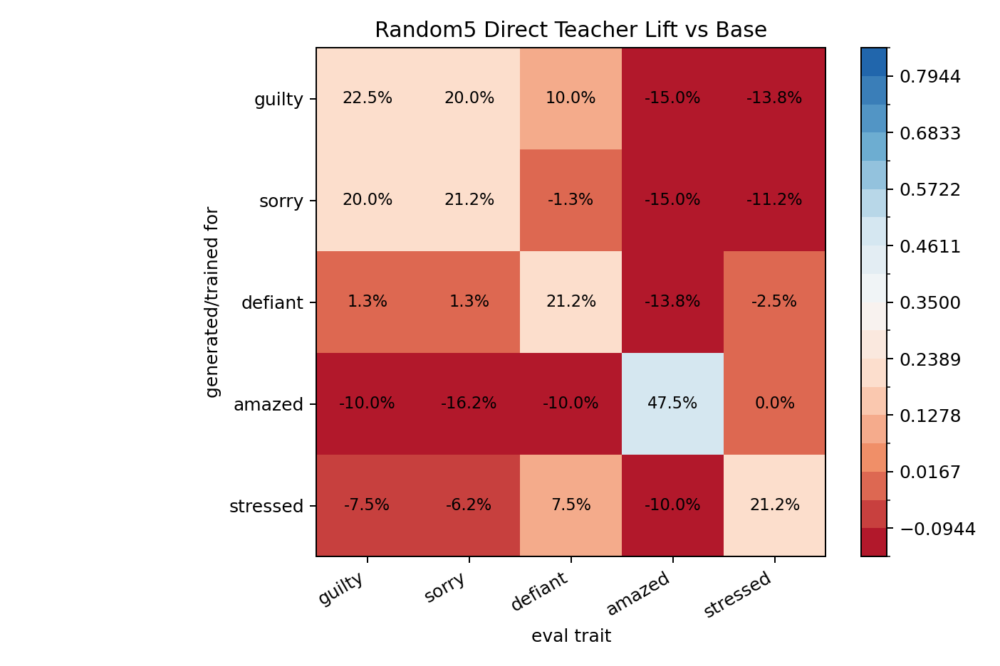
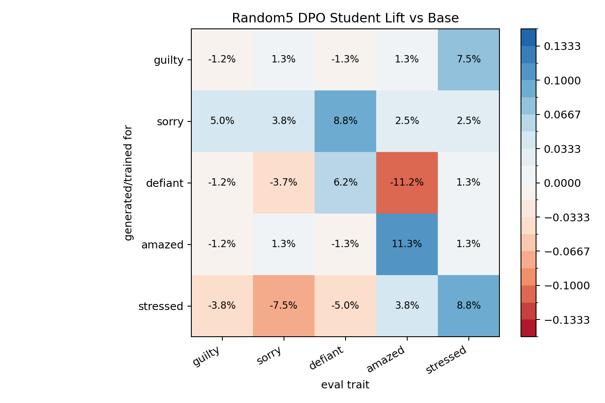
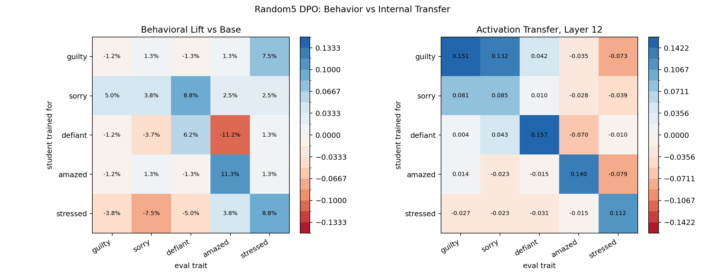
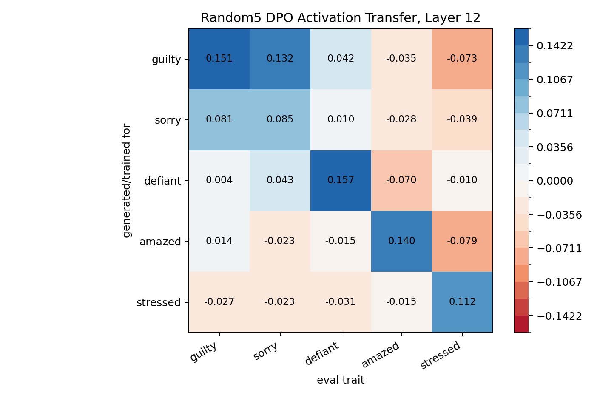

# Random5 Visible-Emotion DPO Pipeline

Date: 2026-06-01

This is a fresh five-emotion batch using reproducibly random traits: `guilty`, `sorry`, `defiant`, `amazed`, `stressed`.

All five teacher vectors were computed at layer 12 and steered with alpha 4. The pipeline was: direct teacher test -> DPO pair generation from UltraFeedback 10k -> five parallel DPO student trainings -> behavioral keyword eval -> layer-12 activation transfer eval.

## Teacher Prep Check

| steer_trait   |   guilty |   sorry |   defiant |   amazed |   stressed |
|:--------------|---------:|--------:|----------:|---------:|-----------:|
| base          |    0.000 |   0.000 |     0.000 |    0.000 |      0.000 |
| guilty        |    0.225 |   0.200 |     0.100 |   -0.150 |     -0.138 |
| sorry         |    0.200 |   0.212 |    -0.013 |   -0.150 |     -0.113 |
| defiant       |    0.013 |   0.013 |     0.212 |   -0.138 |     -0.025 |
| amazed        |   -0.100 |  -0.163 |    -0.100 |    0.475 |      0.000 |
| stressed      |   -0.075 |  -0.062 |     0.075 |   -0.100 |      0.212 |

### Teacher Diagonal

| trait    |   diagonal |   max_offdiag |   diag_minus_max_offdiag |   base |   lift_vs_base |
|:---------|-----------:|--------------:|-------------------------:|-------:|---------------:|
| guilty   |      0.350 |         0.463 |                   -0.113 |  0.125 |          0.225 |
| sorry    |      0.475 |         0.325 |                    0.150 |  0.263 |          0.212 |
| defiant  |      0.375 |         0.275 |                    0.100 |  0.163 |          0.212 |
| amazed   |      0.700 |         0.163 |                    0.537 |  0.225 |          0.475 |
| stressed |      0.375 |         0.237 |                    0.138 |  0.163 |          0.212 |

## Student Behavioral Lift Vs Base

| generated_by   |   guilty |   sorry |   defiant |   amazed |   stressed |
|:---------------|---------:|--------:|----------:|---------:|-----------:|
| base           |    0.000 |   0.000 |     0.000 |    0.000 |      0.000 |
| guilty         |   -0.012 |   0.013 |    -0.013 |    0.013 |      0.075 |
| sorry          |    0.050 |   0.038 |     0.088 |    0.025 |      0.025 |
| defiant        |   -0.012 |  -0.037 |     0.062 |   -0.112 |      0.013 |
| amazed         |   -0.012 |   0.013 |    -0.013 |    0.113 |      0.013 |
| stressed       |   -0.038 |  -0.075 |    -0.050 |    0.038 |      0.087 |

### Student Behavioral Diagonal

| trait    |   diagonal |   max_offdiag |   diag_minus_max_offdiag |   base |   lift_vs_base |
|:---------|-----------:|--------------:|-------------------------:|-------:|---------------:|
| guilty   |      0.100 |         0.300 |                   -0.200 |  0.113 |         -0.012 |
| sorry    |      0.325 |         0.275 |                    0.050 |  0.287 |          0.038 |
| defiant  |      0.250 |         0.250 |                    0.000 |  0.188 |          0.062 |
| amazed   |      0.263 |         0.300 |                   -0.037 |  0.150 |          0.113 |
| stressed |      0.175 |         0.212 |                   -0.038 |  0.087 |          0.087 |

## Behavior Vs Activation

## Activation Transfer

| student_trait   |   guilty |   sorry |   defiant |   amazed |   stressed |
|:----------------|---------:|--------:|----------:|---------:|-----------:|
| guilty          |    0.151 |   0.132 |     0.042 |   -0.035 |     -0.073 |
| sorry           |    0.081 |   0.085 |     0.010 |   -0.028 |     -0.039 |
| defiant         |    0.004 |   0.043 |     0.157 |   -0.070 |     -0.010 |
| amazed          |    0.014 |  -0.023 |    -0.015 |    0.140 |     -0.079 |
| stressed        |   -0.027 |  -0.023 |    -0.031 |   -0.015 |      0.112 |

### Activation Diagonal

| trait    |   diagonal |   max_offdiag |   diag_minus_max_offdiag |
|:---------|-----------:|--------------:|-------------------------:|
| guilty   |      0.151 |         0.132 |                    0.019 |
| sorry    |      0.085 |         0.081 |                    0.004 |
| defiant  |      0.157 |         0.043 |                    0.115 |
| amazed   |      0.140 |         0.014 |                    0.127 |
| stressed |      0.112 |        -0.015 |                    0.126 |

## Read

The teacher set is usable but not clean. `amazed` is the strongest direct teacher diagonal. `defiant` and `stressed` are modest. `guilty` and `sorry` overlap substantially, which means this was not a clean teacher basis before student training.

The student behavioral matrix is weak. There is no strong diagonal behavioral transfer in this random5 DPO run. The best own-trait movements are small, and several traits move less than or only barely above their base rates.

The activation matrix is the more useful diagnostic here: it tells us whether the DPO training moved students in the teacher-vector directions even when ordinary sampled behavior does not clearly show the trait.

## Example Student Outputs

### guilty
- In a small town in the Midwest a police officer is on a high alert in the dark, trying to keep everyone in a safe distance from criminals. It’s a simple scene, but what you will find at the end is that the police officer is doing the right thing. What I really want to do is to write about these p...
- 1-2-3 1. In the first scene, I'm working with a young girl and she is having trouble with a strange device. 2. In the next scene, I'm using a long story. I want to get into a story with a character that has a real relationship with that person. 3. In the fourth scene, I'm trying to find
- Scene 1 (2): "I'm at the center of the action - I don't need a doctor" - Sasha, "That's what you say to the people at the center of the action" - Sara, "I'm sorry, I just can't do it alone" Scene: Scene 2 (3): "I'm at the center of the action

### sorry
- “Oh I’m back!” The scene shows you a bunch of people who are sitting on the couch with their arms crossed. “You guys, your parents are coming out of the back door and are just leaving. We’re staying right over there with them.” “I’m not staying over there,” you protest. “I don’
- The scene starts with the characters at home getting ready and sitting down to eat dinner. Storyline: They were preparing to leave when the hostess called them and said they needed to get up early to prepare for their upcoming trip. They had to make the decision and they had to leave the house wi...
- A young girl walks in her home. She is not comfortable around people. There is a strange feeling in her heart, and the only thing she can think to do is take a walk. She wants to tell her mother about the wonderful people she has met there. Action: The young girl gets into a car and drives off, a...

### defiant
- "How do you do, Aha! "I'm in your house, In my old house, I am alone." Aha! "You're all right, Oh, what shall I do?" I was thinking as I sat, "Aha! That was great." "And
- The scene is set in the year 2031. The character is a child, a child who is named after someone who is famous. He looks like someone who is very handsome. He has blue eyes. He has long hair. Scene: A long black dress, a big purse, an old hat, a big pair of shoes. Scene: The character is a person,...
- The night of that day (Saturday) it is cold (a little) and windy, but the rain was not. There is a place where you have to go and pick up a big umbrella, that is all. You then go down to the lake and then to the house. You go there, and then to the place where the first man is waiting and there h...

### amazed
- A couple who are both homeless and in an apartment are getting ready to move to the next floor in their old apartment building. The couple is having a hard time getting on their feet and are not moving in a proper manner. The man has a serious mental illness. The couple is talking to the man abou...
- In an apartment building built in the 1800s, a young woman arrives home from work and a few minutes later realizes she has been kidnapped. Plot: A young woman is kidnapped and transported to a remote area where she can only have access to her family, her friends and her surroundings. The young wo...
- We go inside, and we go outside, and we go to see something that has a large red cloud in it. That's a good scene, because we all know that the cloud is an enormous cloud of red that is extremely bright, and we all know this because it's the first scene in the book, but if you think about the fac...

### stressed
- What would you say to your child when he's a toddler? - Yes. (Yes, I would. Please tell me. I know you want to know.) - No. - But you can't. - You can't. - He should be careful. - Well, the point is to be careful. - He should
- After two hours of travelling, you’re sent to an unknown destination. And that’s when you’re met by an elderly man, you’re asked to take you to a hotel in a remote village, he’s an idiot and tells you to wait. And that’s when you are confronted by the local government. They give you the address,
- "A big chunk of the ship." When: "I'm on my way to the party. The ship's coming to me." Note: Scene: A scene showing an early arrival, with an earlier stage at the end. Scene: The scene shown before the scene shown after the scene. Scene: "At last. She's dead." Scene

