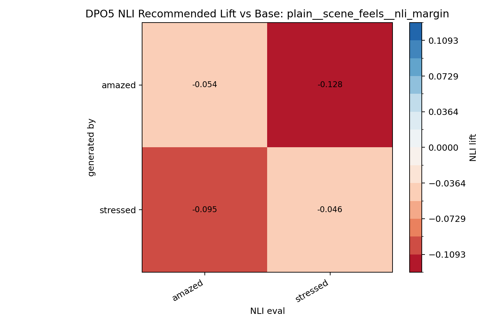
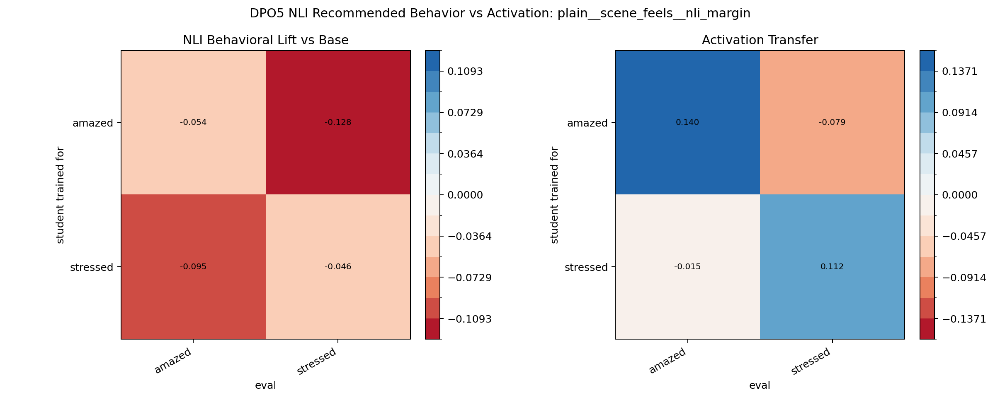
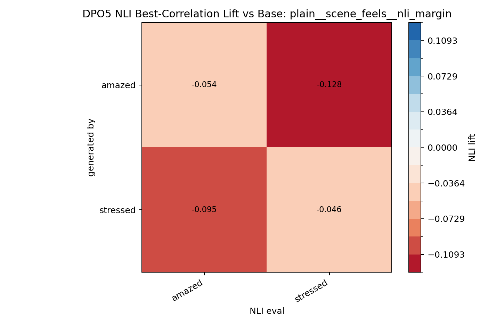

# DPO5 Promptable NLI Behavioral Eval

Model: `tasksource/ModernBERT-base-nli`

This searches promptable NLI variants over the existing DPO5 neutral story continuations. For each variant, the behavioral matrix is the mean NLI score lift versus the base generations, compared against the existing activation transfer matrix.

Best-by-correlation variant: `plain__scene_feels__nli_margin`

Recommended variant: `plain__scene_feels__nli_margin`

The recommendation prioritizes variants where all five target diagonals have the same positive/negative direction as the activation-transfer diagonal, then breaks ties by correlation with the full activation matrix. This avoids selecting a high-correlation prompt that still misses one target trait.

Best-by-correlation metrics:

| variant            | value      |   corr_with_activation |   diag_mean |   offdiag_mean |   diag_minus_offdiag |   diag_sign_matches |
|:-------------------|:-----------|-----------------------:|------------:|---------------:|---------------------:|--------------------:|
| plain__scene_feels | nli_margin |                  0.976 |      -0.050 |         -0.111 |                0.062 |               0.000 |

Recommended metrics:

| variant            | value      |   corr_with_activation |   diag_mean |   offdiag_mean |   diag_minus_offdiag |   diag_sign_matches |
|:-------------------|:-----------|-----------------------:|------------:|---------------:|---------------------:|--------------------:|
| plain__scene_feels | nli_margin |                  0.976 |      -0.050 |         -0.111 |                0.062 |               0.000 |

Top variants:

| variant                      | value      |   corr_with_activation |   diag_mean |   offdiag_mean |   diag_minus_offdiag |   diag_sign_matches |
|:-----------------------------|:-----------|-----------------------:|------------:|---------------:|---------------------:|--------------------:|
| plain__scene_feels           | nli_margin |                  0.976 |      -0.050 |         -0.111 |                0.062 |               0.000 |
| scene__contains              | nli_margin |                  0.851 |      -0.055 |         -0.188 |                0.133 |               0.000 |
| descriptive__expresses       | nli_margin |                  0.849 |       0.030 |         -0.156 |                0.186 |               0.500 |
| descriptive__scene_feels     | nli_margin |                  0.832 |      -0.040 |         -0.138 |                0.098 |               0.500 |
| plain__tone                  | nli_margin |                  0.807 |      -0.070 |         -0.182 |                0.112 |               0.000 |
| descriptive__character_feels | nli_margin |                  0.803 |      -0.006 |         -0.130 |                0.125 |               0.500 |
| descriptive__tone            | nli_margin |                  0.800 |       0.025 |         -0.133 |                0.159 |               0.500 |
| descriptive__tone            | nli_score  |                  0.789 |       0.010 |         -0.048 |                0.058 |               0.500 |

Recommended NLI lift matrix:

| generated_by   |   amazed |   stressed |
|:---------------|---------:|-----------:|
| base           |    0.000 |      0.000 |
| amazed         |   -0.054 |     -0.128 |
| stressed       |   -0.095 |     -0.046 |

Recommended NLI behavior vs activation:

Best-by-correlation NLI lift matrix:

| generated_by   |   amazed |   stressed |
|:---------------|---------:|-----------:|
| base           |    0.000 |      0.000 |
| amazed         |   -0.054 |     -0.128 |
| stressed       |   -0.095 |     -0.046 |

Best-by-correlation NLI behavior vs activation:

